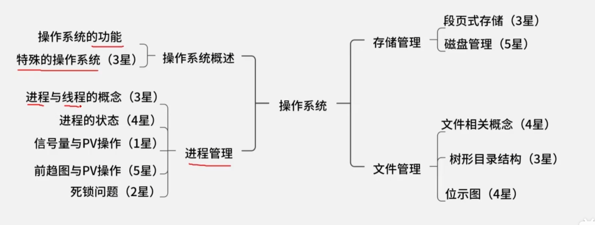
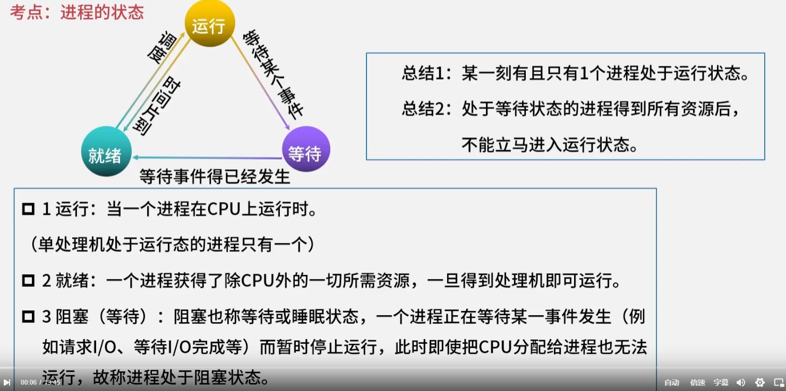
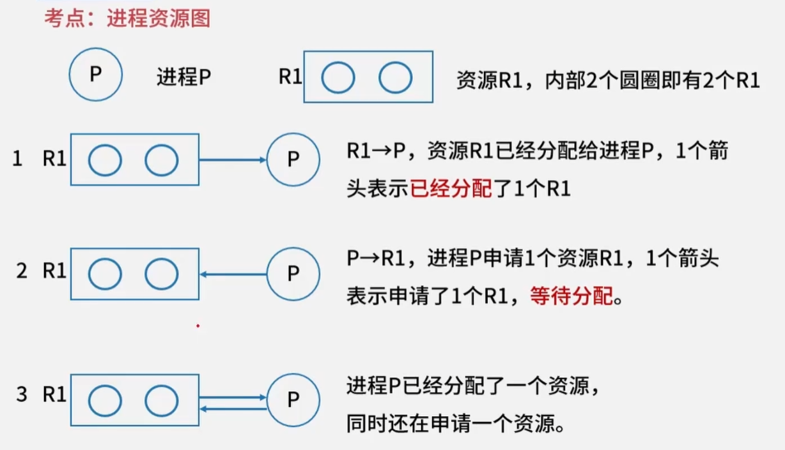
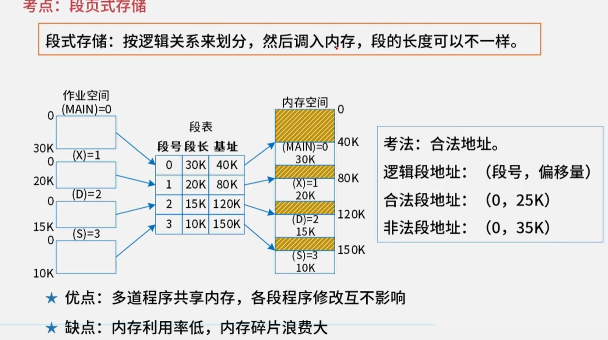

## 操作系统

### 操作系统的功能

1. 管理系统的硬件、软件、数据资源
2. 控制系统运行
3. 人机接口
4. 应用软件与硬件的接口

层级：硬件->操作系统->语言处理程序->应用程序

管理功能：进程管理、设备管理、存储管理、文件管理、作业管理

### 特殊的操作系统

| 分类           | 特点                                                         |
| -------------- | ------------------------------------------------------------ |
| 批处理操作系统 | 单道批：一次一个作业入内存，作业由程序、数据、作业操作说明书组成 多道批：一次多个作业入内存，特点L：多道，宏观并行微观串行 |
| 分时操作系统   | 采用时间片轮转的方式为多个用户提供服务，每个用户都感觉独占系统 特点：多路行，及时性，独立性、交互性 |
| 实时操作系统   | 实时控制系统和实时信息系统 交互能力要求不高，可靠性要求高 规定时间内相应并处理 |
| 网络操作系统   | 方便有效共享网络资源，提高服务软件和有关协议的集合 主要的网络操作系统：Unix、Linux、WindowsServer |
| 分布式操作系统 | 任意两台计算机可以通过通信交换信息 是网络操作系统更高级形式，具有透明性、可靠性和高性能等特点 |
| 微机操作系统   | Windows：图像用户界面，多任务、多线程操作系统 Linux：免费和自由传播的类Unix操作系统，多用户、多任务、多线程、多CPU的操作系统 |
| 嵌入式操作系统 | 运行在智能芯片环境中 特点：微型化，可定制（针对硬件变化配置），实时性，可靠性，易移植性（HAL和BSP支持） |

### 进程管理

程序与进程的区别

​	进程是程序的一次执行过程，没有程序就没有进程。

​	程序是静态的概念，进程是动态概念，由创建而生成，完成任务后因撤销而消亡。

进程是程序在已过数据集合上运行的过程，它是系统进行资源分配和调度的已过独立单位。进程由程序块、数据块、进程控制块（PCB）组成。

PCB是进程存在的唯一标志。内容包括进程标识符、状态、位置信息、队列指针（链接同一状态的进程）、优先级、现场保护区等。

进程与线程的资源共享

​	父资源，父子用，子资源，自己用。

### 进程的状态

进程状态：运行、阻塞、就绪

注：单处理机同时间只能有一个进程为运行态，进程只能由就绪态进入运行态

### 信号量S、PV操作、前驱图

信号量S是一组特殊的变量，正数可以表示资源数量，负数可以表示等待队列长度

P操作：申请/锁定资源

V操作：释放/解锁资源

互斥模型：（打印机问题）

- S=初始资源数，为正数
- 先P操作，后V操作
- 不同类型进程直接也可以互斥
- 互斥资源同一时刻只允许一个进程使用

同步模型：（单缓冲区的生产者、消费者问题）

- S初始值为0
- 先V操作，后P操作
- 同一信号量的PV操作可以在不同进程

前驱图本质就是**同步**模型图

- 前驱图中有几条线就有几个信号量，且初始值都为0
- 对于节点，入线就是V操作，出线就是P操作

### 死锁问题

死锁的四大条件：

- 互斥
- 保持和等待
- 不剥夺
- 环路等待

死锁的处理

- 死锁的预防（打破四大条件、有序资源分配法、静态资源分配）
- 死锁的避免（银行家算法：可利用资源向量Available、最大需求矩阵Max、分配矩阵Allocation、需求矩阵Need）
- 死锁的检测和解除
- 鸵鸟策略（不予理睬）

系统可能发生死锁的最大资源量：进程最大资源需求量-进程个数

系统不可能发生死锁的最小资源量：进程最大资源需求量-进程个数+1

### 进程资源图

阻塞节点：当前资源不足以支持进程执行的节点

非阻塞节点：当前资源足以支持进程执行的节点

系统可化简：非阻塞节点执行完成后会私服所有资源，资源可再分配

系统死锁：无论怎样分配资源，都无法化简系统，就是死锁

注：对于资源，要看还剩多少；对于进程，要看还需要多少

### 存储管理

页式存储：

- 将程序和内存划分为大小相同的块，以页为单位将程序调入内存。
- 用页表记录程序和内存的地址映射
- 地址计算：逻辑地址(程序)=页号+页内地址；物理地址(内存)=页帧号+页内地址；只需要根据页表，映射页号和页帧号
- 优点：利用率高，碎片少，分配管理简单
- 缺点：增加系统开销；可能发生抖动现象

状态位：0-不在内存，1-在内存

访问位：0-未访问，1-已访问

修改位：0-未修改，1-已修改

页表淘汰规则：

- 必须在内存
- 未访问优先淘汰
- 未修改优先淘汰

段式存储：

- 按逻辑关系划分，调入内存
- 段长度可能都不同
- 段表映射逻辑地址(程序)和物理地址(内存)：段号+段长(数据长度)+基址(起始偏移量)
- 优点：多道程序共享内存，各程序修改互不影响
- 缺点：内存利用率低，内存碎片浪费大

段页式存储：

- 先分段，再分页；页大小相同，段大小不同

### 磁盘管理

磁盘由多个盘面组成，每个盘面上都有磁道，不同盘面的磁道组成柱面。

磁盘的存取时间=寻道时间(磁头径向移动时间)+等待时间(旋转延迟时间)+读取时间(传输时间)

寻道时间可以算法控制，等待时间和读取时间无算法可言。

移臂调度算法：(移动磁头的算法)

- 先来先服务(FCFS)：按照请求顺序移动磁头
- 最短寻道时间优先(SSTF)：优先移动到离当前磁头最近的磁道。磁道排序后，按最近依次移动
- 扫描算法(SCAN)：磁头来回移动，先扫到哪个就是哪个
- 循环扫描(CSCAN)：磁头单向移动，到头后，返回起始点继续

### 设备管理

层次：

- 用户
- 设备无关程序
- 设备驱动程序
- 中断处理程序
- 硬件

### 文件管理

文件：具有符号名、在逻辑上具有完整意义的一组相关信息项的集合。

逻辑结构：有结构的记录式文件（索引），无结构的流式文件（文本）

物理结构：连续结构、链接结构、索引结构、多个物理块的索引表

文件目录：

- 基本信息：文件名、物理地址、长度、块数等
- 存储控制信息：文件的存储权限，读写权限等
- 使用信息：建立日期、访问日期、打开文件的进程数等

目录结构：

- 一级目录结构：线性结构，查找速度慢、不允许重名和文件共享
- 二级目录结构：主文件目录（MFD）+用户目录（UFD）
- 三级目录结构：树形目录结构

### 树形目录结构

绝对目录：从盘符开始的路径

相对路径：当前目录开始路径

全文件名：绝对路径+文件名

### 索引文件结构

直接索引：索引节点指向的物理块，就是对应文件的逻辑块

一级间接索引:索引节点指向的物理块，存储了对应文件逻辑块的物理地址

二级间接索引：

三级间接索引：

根据索引计算文件的最大长度：（最高索引指向的文件地址-最低索引指向文件地址）*数据块大小

### 位示图

位示图(bitmap)是磁盘物理块上存放信息bit的表格，一般为n*n的表格。

### 文件权限

文件权限一般为4块：文件类型+所属用户权限(u)+所属组权限(g)+其它用户权限(o)

文件类型：d:代表为目录，-:代表为普通文件，l:代表为链接文件

权限：读权限（r 4），写权限（w 2），执行权限(x 1)

 - 查看文件所有者：ls -ahl
 - chown <用户名> <文件名>：修改文件所有者，或chown <用户名>:<用户组> <文件名>
 - chgrp <用户组> <文件名>：修改文件所在组，-R该目录下文件都修改
 - chmod <操作> <文件名>：修改文件权限，以+/-/=，为u/g/o/a变更r/w/x权限，或以4/2/1(读/写/运行)修改，如：chmod 751 <文件或目录>
 - ls -attr：显示档案隐藏属性。 -a将隐藏文件的属性也秀出来，-d如果连接的是目录，仅显示目录本身的属性，而非目录内的文件名， -R连同子目录的数据也一并列出来

