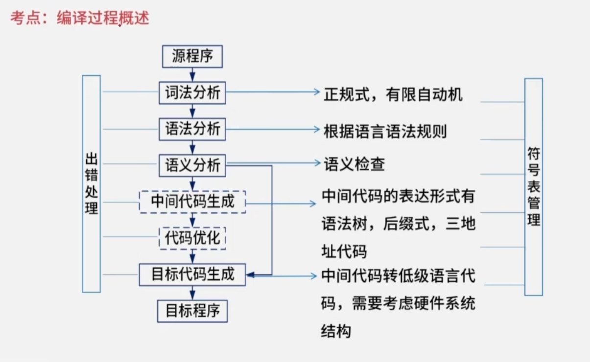

## 程序设计语言与语言处理程序基础

### 编译型语言和解释型语言

注：中间代码生成和代码优化都是可做可不做的

程序控制结构：顺序结构、调节结构、循环结构

函数的调用方式：

- 传值：传入数值，可以是变量、常量或表达式。不影响原方法的值
- 传址：只能传入地址。会影响原方法的值

### 编译过程

- 词法分析：从左到右诸葛扫描**源程序**的字符，识别关键字、标识符、常数、运算符和分隔符。输出**记号流**
- 语法分析：根据语法规则将单词符号分解成各类语法单位，并分析源程序是否有语法上的错误。输出**语法树**
- 语义分析：进行类型分析和检查，主要检测源程序是否存在静态语义错误。是否类型不合法等

程序错误：

- 动态错误：发送在程序运行时。比如：除零异常、数组下标越界等
- 静态错误：编译时错误。比如：缺少结束标点，括号不匹配

中间代码：

- 后缀式
- 语法树
- 三地址码
- 四元式：运算符，运算对象1，运算对象2，运算结果

### 文法（语法）

一个形式文法是由一个有序的四元组组成：G=（V,T,S,P）

V:非终结符有穷非空集合。是一个占位符，语法成分或语法变量

T:终结符有穷非空集合。是语言的组成部分，是最终结果。V∩T=∅

S:起始符。是语言的开始符号。是一个特殊的非终结符

P:产生式的有穷集合。用终结符替代非终结符的规则。

正则闭包：$A^+$=$A^1∪A^2∪A^3……∪A^n$(即所有幂的组合)

闭包：$A^*$=$A^0∪A^1∪A^2∪A^3……∪A^n$（在正则闭包基础上加上空）

文法的类型：

- 0型文法：也叫短语文法或无限制文法。只要求产生式左边至少包含一个非终结符。（最灵活的文法，广泛应用与编译器的各个阶段）
- 1型文法：也叫上下文有关文法。追加规则：产生式左边长度小于等于右边长度。（常用于描述上下文有关语言，也用于描述自然语言处理）
- 2型文法：也叫上下文无关文法。追加规则：产生式左边必须是非终结符。
- 3型文法：也叫正规文法或正则文法。追加规则：产生式右边最多两个字符，如果有二个字符必须是（终结符+非终结符）的格式，如果是一个字符，那么必须是终结符。（最简单的文法，最严格的限制，正则语言可以使用有限自动机来识别和生成）

### 正规式与正规集

正规式（Regular Expression）与正规集（Regular Set）是形式语言与自动机理论中的核心概念，两者构成了描述词法单元（即编程语言中的单词符号，如标识符、常数、运算符等）的形式化基础。其定义及相互关系可结构化阐述如下。

 正规集的定义

正规集是一种**语言**，即一个**字符串的集合**。在编译原理的上下文中，它特指能被某类有限自动机（Finite Automaton）所识别（或接受）的所有字符串构成的集合1。例如，所有由字母开头的字母数字串（标识符）、所有十进制整数、所有由特定字符组成的运算符（如 `+`, `-`, `*`, `/`）等，各自构成一个正规集。程序设计语言中的合法单词集合，本质上就是正规集1。

正规式的定义

正规式（又称正则表达式）是一种**代数表达式**，用于**表示**正规集。它通过一组递归定义的运算符（并、连接、闭包）来形式化地描述字符串集合的模式。其形式定义通常基于一个给定的字母表 Σ：

1. **基础规则**：
   - **ε**（空串）是一个正规式，它表示仅包含空串的集合 `{ε}`。
   - 对于任意 **a ∈ Σ**，`a` 是一个正规式，它表示仅包含单个字符 `a` 的集合 `{a}`。
2. **归纳规则**：假设 `r` 和 `s` 是表示正规集 `L(r)` 和 `L(s)` 的正规式，那么：
   - **并（`|` 或 `+`）**：`(r|s)` 是一个正规式，表示集合 `L(r) ∪ L(s)`。
   - **连接（`.`常省略）**：`(rs)` 是一个正规式，表示集合 `L(r)L(s)`（即所有由 `L(r)` 中一个字符串后接 `L(s)` 中一个字符串构成的字符串集合）。
   - **闭包（`*`）**：`(r*)` 是一个正规式，表示集合 `(L(r))*`（即 `L(r)` 中字符串的零次或多次重复连接所构成的所有字符串的集合）。

正规式与正规集的等价关系

正规式与正规集之间存在一一对应的等价关系：**一个正规式唯一地确定一个正规集；反之，一个正规集可以由多个彼此等价的正规式来表示**1。这种等价性使得我们可以用简洁的代数表达式（正规式）来精确描述复杂的字符串集合（正规集）。例如，正规式 `(a|b)*` 表示的正规集是所有由字符 `a` 和 `b` 组成的任意长度（包括空串）的字符串集合。

 在词法分析中的应用

在编译器的词法分析阶段，正规式是描述各类词法单元模式的**标准工具**。为一种程序设计语言构建词法分析器（或称扫描器）的典型步骤如下：

1. **为每类词法单元定义正规式**：例如，标识符可定义为 `letter(letter|digit)*`，整数常数为 `digit digit*`（或 `digit+`）。
2. **合并为总正规式**：通过**或运算（`|`）** 将语言中所有词法单元的正规式连接起来，形成一个覆盖整个单词表的单一正规式1。
3. **转换为有限自动机**：利用算法（如Thompson构造法）将该总正规式转换为一个等价的**非确定有限自动机（NFA）**。
4. **确定化与最小化**：通过子集构造法将NFA转化为等价的**确定有限自动机（DFA）**，再对DFA进行状态最小化优化，以获得一个状态数最少、效率最高的识别器1。
5. **驱动词法分析**：最终的最小化DFA可以很容易地用程序（如二维数组表示的状态转移表）实现，从而高效地扫描源代码字符流，识别出一个个词法单元。

 与有限自动机的关联

正规式、正规集与有限自动机构成了形式语言中**正则语言**的三大等价描述模型：

1. **描述能力等价**：一个语言是正规集（正则语言），当且仅当它能被某个正规式描述，也当且仅当它能被某个有限自动机（DFA或NFA）识别。
2. **转换算法完备**：存在标准的算法可以在正规式、NFA、DFA三者之间进行相互转换。**NFA更易于人工根据正规式构造，而DFA则更易于程序实现**。通过“NFA确定化”和“DFA最小化”算法，可以获得一个状态数最少、识别效率最高的DFA用于词法分析1。

**结论**：正规式是用于**描述**词法模式的语法形式，正规集是这些模式所对应的**字符串集合**。它们是编译器词法分析阶段的理论基石，通过将其转化为确定有限自动机，为高效、准确的词法分析器实现提供了清晰且可自动化的路径。

### 有限自动机

#### 有限自动机的定义与核心模型

有限自动机（Finite Automaton, FA）是一种用于描述和识别**正则语言**（即正规集）的抽象计算模型。它是一个具有有限数量状态的系统，根据输入的符号序列，按照既定的规则在状态之间进行转移，最终根据停止时的状态是否属于“接受状态”来决定是否接受该输入串。在编译原理、形式语言理论和文本处理等领域，有限自动机是词法分析器的理论基础和实现工具23。

其形式化定义通常以一个**五元组** (Q, Σ, δ, q₀, F) 给出，其中各元素的含义如下表所示：

| 符号   | 含义                     | 说明与示例                                                   |
| :----- | :----------------------- | :----------------------------------------------------------- |
| **Q**  | 有限状态集合             | 自动机所有可能状态的集合，例如 Q = {q₀, q₁, q₂}。            |
| **Σ**  | 有限输入字母表           | 自动机可以接收的输入符号的集合，例如 Σ = {a, b}。            |
| **δ**  | 状态转移函数             | 定义了在当前状态和输入符号下，自动机将转移到哪个（或哪些）状态。这是区分不同类型FA的关键。 |
| **q₀** | 初始状态                 | q₀ ∈ Q，是自动机开始处理输入字符串时的起始状态。             |
| **F**  | 接受状态（终止状态）集合 | F ⊆ Q。当自动机处理完整个输入串后，若其最终状态落在F中，则**接受**该输入串；否则拒绝。一个DFA允许没有终止状态，但这样的自动机不接受任何字符串。 |

根据状态转移函数 **δ** 的不同性质，有限自动机主要分为两大类：**确定有限自动机（DFA）** 和 **非确定有限自动机（NFA）**。它们在定义能力和描述语言上是等价的，但在构造方式和运行机制上存在差异。

##### 1. 确定有限自动机（DETERMINISTIC FINITE AUTOMATON, DFA）

DFA是最基本、最直观的有限自动机模型。其核心特征是“确定性”，即对于任何一个状态和输入符号，下一步的状态是**唯一确定**的。

- **形式化定义**：对于一个DFA，其状态转移函数 δ 是一个**单值映射**：δ: Q × Σ → Q。这意味着给定当前状态和输入符号，有且只有一个下一个状态。
- **特点**：
  - 初态只有一个（q₀）。
  - 状态转移是单值的。
  - 不允许空转移（ε-转移），即不能在不消耗输入符号的情况下改变状态。

##### 2. 非确定有限自动机（NONDETERMINISTIC FINITE AUTOMATON, NFA）

NFA是DFA的推广，其核心特征是“非确定性”。这意味着在某个状态下，对于同一个输入符号（或空串），可能有**多个**可能的下一个状态，甚至可以不消耗输入符号就发生转移。

- **形式化定义**：对于一个NFA，其状态转移函数 δ 是一个**多值映射**：δ: Q × (Σ ∪ {ε}) → 2^Q（即映射到Q的幂集，一个状态集合）。这允许：
  1. 同一输入符号对应多个后继状态。
  2. 存在 ε-转移。
- **特点**：
  - 初态可以是一个集合（即可以有多个初始状态）。
  - 状态转移是多值的。
  - 允许 ε-转移。
- **与DFA的等价性及转换**：尽管NFA的定义更灵活、更易于人工根据正规式设计（例如使用Thompson构造法），但**任何NFA都可以转化为一个接受相同语言的DFA**。这通过“子集构造法”实现，其基本思想是将NFA的一组可能状态（一个状态集合）映射为DFA的一个**新状态**。证明DFA和NFA等价的算法，核心就是消除NFA在初态数量、转移函数单值性和ε-转移这三方面与DFA的差异。

##### 3. 有限自动机的应用与化简

- **在词法分析中的应用**：编译器词法分析器的核心就是一个DFA。首先用正规式描述各类单词（如标识符、关键字、常数），然后将这些正规式转化为一个NFA，再通过子集构造法确定化为DFA，最后对DFA进行最小化，得到最简状态机用于高效识别源代码中的词素。
- **DFA的最小化（化简）**：对于给定的DFA，可能存在多个等价的状态（即从这些状态出发，对于任何后续输入串，接受性完全相同）。最小化算法通过合并这些等价状态，得到一个状态数最少的、功能等价的DFA。这能显著减小状态转移表的规模，提高识别效率。一个经典的化简算法是“划分法”，它首先将状态划分为接受状态和非接受状态两个组，然后不断细分这些组，直到组内的状态在所有输入符号下都转移到相同的组内。

**总结**：有限自动机是一个由五元组定义的、状态有限的抽象机器。DFA以其确定性便于实现，NFA以其灵活性便于设计。二者在描述正则语言的能力上等价，并且存在系统的算法（子集构造法、最小化算法）进行相互转换和优化，这使其成为连接形式化描述（正规式）和实际识别程序（词法分析器）的关键桥梁。

### 表达式

前缀表达式：运算符在前面

中缀表达式：运算符在中间

后缀表达式（逆波兰式）：运算符在最后。使用栈处理

