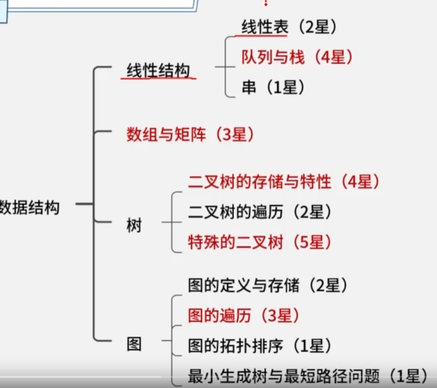

## 数据结构



### 线性表

数组存储：静态分配的连续内存，灵活性差。读取快，查询、新增、删除慢

链表存储：不连续的内存，内存友好，但需要更多空间。查询、读取慢，新增、删除快

- 头指针：指向头节点的指针变量
- 头结点：首节点前的节点，存放链表首地址。方便删除、插入操作
- 首节点：第一个有效节点。
- 尾节点：最后一个有效节点。
- 尾指针：指向尾节点的指针变量。

链表的节点实际上是结构体变量，包括数据部分和存地址的指针变量。

链表类型：单向链表、循环链表、双向链表

队列：先进先出

栈：先进后出

### 串

串是仅由字符构成的有限序列，是一种线性表。

空串：没有任何字符的串。

空白串：由空白字符组成的串。

子串：由串中任意长度的连续字符组成的序列。

子序列：不改变字符的相对位置，由串中字符组成的序列。

串比较：先比较串长度，长度长的较大，其次按字符顺序比较ASCII码，字符码值大的较大。

串相等：两个串部件长度相等，每个位置上的字符也相等。

### 数组和矩阵

一维数组：

二维数组：按行存储、按列存储

多维数组：

注：下标一般从0 开始

稀疏矩阵：使用三元组表（行号，列号，元素值）表示。顺序存储使用**三元组顺序表**，链表存储使用**十字链表**。

#### 二叉树：定义、结构与性质详解

二叉树是数据结构中一种非常重要且应用广泛的树形结构。它在计算机科学的诸多领域，如数据存储、算法设计（尤其是排序和搜索）、表达式解析、文件系统组织以及编译器设计中都扮演着核心角色。理解二叉树的精确定义是掌握其后续所有特性和算法的基础。

##### 一、 二叉树的精确定义

根据数据结构的标准定义，**二叉树**是满足以下两个条件的有限节点集合：

1. **可以为空**：该集合可以是一个没有任何节点的空树。
2. **若不为空，则它由根节点及互不相交的左子树和右子树组成，且左、右子树本身又都是二叉树**。

这个定义是递归的，它清晰地刻画了二叉树的层次和分支结构。每个节点最多有两个“孩子”，通常称为**左孩子**和**右孩子**。这种“最多两个分支”的限制，是二叉树与普通树最根本的区别。

为了更清晰地理解二叉树的结构组成，我们可以将其核心要素总结如下表：

| 组成部分      | 描述                                                         | 备注                                                     |
| :------------ | :----------------------------------------------------------- | :------------------------------------------------------- |
| **节点**      | 树的基本构成单位，用于存储数据元素和维持结构。               | 包含数据域和至多两个指针域 。                            |
| **根节点**    | 树的顶端节点，是访问整棵树的起点。                           | 一棵树有且仅有一个根节点。                               |
| **子树**      | 一个节点及其后代构成的树。                                   | 二叉树中，每个节点都拥有0个、1个或2个子树（左/右子树）。 |
| **父/子节点** | 若节点A直接连接到节点B，且A在上B在下，则A是B的父节点，B是A的子节点。 | 根节点没有父节点；叶子节点没有子节点。                   |
| **度**        | 一个节点拥有的子节点数。                                     | 二叉树的节点度 ≤ 2。                                     |
| **叶子节点**  | 度为0的节点，即没有子节点的节点。                            | 也称为终端结点。                                         |
| **深度/高度** | **深度**：从根节点到该节点的唯一路径上的边数（根深度为0或1，定义各异）。**高度**：从该节点到最远叶子节点的最长路径上的边数。 | 树的高度等于根节点的高度。                               |

##### 二、 二叉树的五种基本形态

基于定义，二叉树可以呈现以下五种基本形态，这体现了其结构的灵活性 34：

1. **空二叉树**。
2. **仅有根节点的二叉树**。
3. **只有根节点和左子树**（右子树为空）。
4. **只有根节点和右子树**（左子树为空）。
5. **具有根节点、左子树和右子树**。

##### 三、 两种特殊的二叉树

在众多二叉树形态中，有两种结构规整、性质鲜明的特殊类型：

1. **满二叉树**
   - **定义**：一棵深度为 `k` 的二叉树，如果其第 `1` 至第 `k` 层的所有节点都达到了最大数量，则称为满二叉树。
   - **特点**：深度为 `k` 的满二叉树，其节点总数为 `2^k - 1`。每一层的节点数都是上一层的两倍，所有叶子节点都出现在最底层。
2. **完全二叉树**
   - **定义**：深度为 `k` 的二叉树，其前 `k-1` 层是满的，且第 `k` 层的所有节点都**连续集中在最左边**。满二叉树是特殊的完全二叉树。
   - **重要性**：完全二叉树非常适合用**数组（顺序存储）** 来实现，因为可以通过下标公式方便地计算父子节点位置，从而节省指针的存储空间。

##### 四、 二叉树的主要性质（基于定义推导）

二叉树的定义蕴含了一系列重要的数学性质，这些性质是进行算法分析和设计的基础：

1. **性质1**：在二叉树的第 `i` 层上，至多有 `2^(i-1)` 个节点（`i≥1`）。
   - *推导*：由定义，每个节点最多有2个子节点，因此节点数逐层以2为倍数增长。
2. **性质2**：深度为 `k` 的二叉树，至多有 `2^k - 1` 个节点（`k≥1`）。
   - *推导*：对性质1中从第1层到第k层的最大节点数求和：`∑(i=1 to k) 2^(i-1) = 2^k - 1`。
3. **性质3**：对任何一棵二叉树，如果其叶子节点数为 `n0`，度为2的节点数为 `n2`，则 `n0 = n2 + 1`。
   - *推导*：设节点总数为 `n`，度为1的节点数为 `n1`。则有 `n = n0 + n1 + n2`。从分支数角度看，总分支数 `B = n - 1`（除根节点外，每个节点都有一个分支指向它）。同时，分支均由度为1或2的节点射出，故 `B = n1 + 2*n2`。联立两式可得 `n0 = n2 + 1`。
4. **性质4**：具有 `n` 个节点的完全二叉树，其深度 `k` 为 `⌊log₂n⌋ + 1`（向下取整）。
   - *推导*：由性质2，深度为 `k-1` 和 `k` 的满二叉树节点数范围是：`2^(k-1) - 1 < n ≤ 2^k - 1`，由此可推出 `k = ⌊log₂n⌋ + 1`。
5. **性质5**：对于一棵有 `n` 个节点的完全二叉树，如果按从上到下、从左到右的顺序对所有节点从1开始编号，则对任意节点 `i`（`1 ≤ i ≤ n`）有：
   - 如果 `i > 1`，则其父节点编号为 `⌊i/2⌋`。
   - 其左孩子节点编号为 `2*i`（如果 `2*i ≤ n`）。
   - 其右孩子节点编号为 `2*i + 1`（如果 `2*i + 1 ≤ n`）。
   - *应用*：此性质是**顺序存储**完全二叉树的理论基础。

##### 五、 二叉树的存储结构

二叉树的定义逻辑上清晰，在计算机中主要有两种物理存储方式：

1. **顺序存储**
   - **适用**：主要用于**完全二叉树**。
   - **方法**：用一组连续的存储单元（数组）按层序编号依次存放节点。对于非完全二叉树，需要空出不存在节点的位置，会造成空间浪费 36。
2. **链式存储**
   - **适用**：所有类型的二叉树，是最常用的存储方式。
   - **方法**：每个节点包含一个数据域和两个指针域，分别指向其左孩子和右孩子。

##### 六、 定义的应用：以表达式二叉树为例

二叉树的结构非常适合表示具有二元操作符的算术表达式，这直接体现了其定义中“根与左右子树”的递归结构 2。

- **规则**：表达式中的每个操作符作为一个根节点，其左、右子树分别是该操作符的左、右操作数（可以是数字或子表达式）。
- **示例**：表达式 `(a + b) * (c - d)` 对应的二叉树为：


```
        *
       / \
      +   -
     / \ / \
    a  b c  d
```

综上所述，二叉树的定义——“一个根节点加上两棵互不相交的二叉树左子树和右子树”——虽然简洁，却奠定了其整个理论体系的基石。从这个递归定义出发，可以自然地推导出其形态、性质、存储方式以及广泛的应用场景。无论是简单的数据组织，还是复杂的算法如哈夫曼编码、二叉搜索树、堆排序和线段树，其本质都建立在这一清晰而强大的结构定义之上。

#### 二叉树遍历：递归、迭代与层序遍历详解

二叉树遍历是访问树中所有节点，且每个节点仅访问一次的过程。根据访问根节点、左子树、右子树的先后顺序，主要分为**前序遍历**、**中序遍历**、**后序遍历**三种深度优先遍历（DFS），以及**层序遍历**这一广度优先遍历（BFS）。掌握这些遍历方法对于操作二叉树数据结构至关重要。

##### 一、 四种核心遍历方式的定义与访问顺序

下表清晰对比了四种基本遍历方式的定义与节点访问顺序：

| 遍历方式     | 定义（递归描述）                                        | 节点访问顺序（简称） | 典型应用场景                                                 |
| :----------- | :------------------------------------------------------ | :------------------- | :----------------------------------------------------------- |
| **前序遍历** | 1. 访问根节点。 2. 前序遍历左子树。 3. 前序遍历右子树。 | **根 -> 左 -> 右**   | 复制整个树结构；获取前缀表达式（波兰式）。                   |
| **中序遍历** | 1. 中序遍历左子树。 2. 访问根节点。 3. 中序遍历右子树。 | **左 -> 根 -> 右**   | 对二叉搜索树（BST）进行排序输出。                            |
| **后序遍历** | 1. 后序遍历左子树。 2. 后序遍历右子树。 3. 访问根节点。 | **左 -> 右 -> 根**   | 释放二叉树内存；计算表达式树的值；获取后缀表达式（逆波兰式）。 |
| **层序遍历** | 从根节点开始，逐层、从左到右访问所有节点。              | **按层从左到右**     | 按层级打印树结构；寻找最短路径（如二叉树的最小深度）。       |

##### 二、 递归实现（最直观的方法）

递归实现直接对应遍历的递归定义，代码简洁易懂，是理解遍历逻辑的基础。

```
// 二叉树节点的链式存储结构定义 [ref_3][ref_6]
typedef struct TreeNode {
    int val;
    struct TreeNode *left;
    struct TreeNode *right;
} TreeNode;

// 1. 前序遍历 (递归)
void preorderTraversal_Recursive(TreeNode* root) {
    if (root == NULL) return; // 递归基：空树
    printf("%d ", root->val); // 访问根节点
    preorderTraversal_Recursive(root->left); // 递归遍历左子树
    preorderTraversal_Recursive(root->right); // 递归遍历右子树
} // [ref_4][ref_5]

// 2. 中序遍历 (递归)
void inorderTraversal_Recursive(TreeNode* root) {
    if (root == NULL) return;
    inorderTraversal_Recursive(root->left); // 递归遍历左子树
    printf("%d ", root->val); // 访问根节点
    inorderTraversal_Recursive(root->right); // 递归遍历右子树
} // [ref_3][ref_6]

// 3. 后序遍历 (递归)
void postorderTraversal_Recursive(TreeNode* root) {
    if (root == NULL) return;
    postorderTraversal_Recursive(root->left); // 递归遍历左子树
    postorderTraversal_Recursive(root->right); // 递归遍历右子树
    printf("%d ", root->val); // 访问根节点
} // [ref_4][ref_5]
```

**递归的优缺点**：

- **优点**：代码简洁，逻辑清晰，与数学定义完美对应。
- **缺点**：递归深度受限于函数调用栈，对于深度很大的树可能导致栈溢出。

##### 三、 迭代实现（使用栈模拟递归）

迭代法通过显式地使用栈来模拟递归调用栈的过程，避免了递归可能带来的栈溢出问题，是更工程化的实现方式。

**前序遍历迭代法**：核心是“访问根节点后，先右后左入栈”，以保证出栈时是“根->左->右”的顺序。

```
// 前序遍历 (迭代，使用栈)
void preorderTraversal_Iterative(TreeNode* root) {
    if (root == NULL) return;
    TreeNode* stack[100]; // 简易栈实现
    int top = -1;
    stack[++top] = root; // 根节点入栈

    while (top >= 0) {
        TreeNode* node = stack[top--]; // 弹出栈顶节点
        printf("%d ", node->val); // 访问

        // 先右后左入栈，保证左子树先被访问
        if (node->right != NULL) stack[++top] = node->right; // [ref_4]
        if (node->left != NULL) stack[++top] = node->left;
    }
}
```

**中序遍历迭代法**：需要借助指针`cur`进行遍历，核心思想是“一路向左到底，然后处理节点，再转向右子树” 。

```
// 中序遍历 (迭代，使用栈)
void inorderTraversal_Iterative(TreeNode* root) {
    TreeNode* stack[100];
    int top = -1;
    TreeNode* cur = root;

    while (cur != NULL || top >= 0) {
        // 1. 一路向左，将经过的节点全部入栈
        while (cur != NULL) {
            stack[++top] = cur;
            cur = cur->left;
        }
        // 2. 弹出栈顶节点并访问（此时它是“最左”的节点）
        cur = stack[top--];
        printf("%d ", cur->val); // 访问
        // 3. 转向右子树
        cur = cur->right; // [ref_3][ref_6]
    }
}
```

**后序遍历迭代法**：可以利用前序遍历的变体（根->右->左），然后反转结果得到（左->右->根）。更经典的方法是记录上一个访问的节点，以判断右子树是否已处理 。

```
// 后序遍历 (迭代，使用栈和prev指针)
void postorderTraversal_Iterative(TreeNode* root) {
    if (root == NULL) return;
    TreeNode* stack[100];
    int top = -1;
    TreeNode* cur = root;
    TreeNode* prev = NULL; // 记录上一个访问的节点

    while (cur != NULL || top >= 0) {
        // 1. 一路向左到底
        while (cur != NULL) {
            stack[++top] = cur;
            cur = cur->left;
        }
        // 2. 查看栈顶节点
        TreeNode* peekNode = stack[top];
        // 3. 如果右子树存在且未被访问过，则转向右子树
        if (peekNode->right != NULL && peekNode->right != prev) {
            cur = peekNode->right;
        } else {
            // 4. 否则，弹出栈顶节点并访问
            printf("%d ", peekNode->val);
            prev = peekNode; // 更新前驱节点
            top--; // [ref_4][ref_5]
        }
    }
}
```

##### 四、 层序遍历实现（使用队列）

层序遍历需要用到**队列**（FIFO）这一数据结构，按层级顺序访问节点。

```
// 层序遍历 (使用队列)
void levelOrderTraversal(TreeNode* root) {
    if (root == NULL) return;
    TreeNode* queue[100]; // 简易队列实现
    int front = 0, rear = 0;
    queue[rear++] = root; // 根节点入队

    while (front < rear) {
        int levelSize = rear - front; // 当前层的节点数
        for (int i = 0; i < levelSize; i++) {
            TreeNode* node = queue[front++]; // 出队
            printf("%d ", node->val); // 访问

            // 将下一层节点从左到右入队
            if (node->left != NULL) queue[rear++] = node->left;
            if (node->right != NULL) queue[rear++] = node->right; // [ref_3][ref_5]
        }
        printf("\n"); // 可选：按层换行
    }
}
```

##### 五、 进阶：MORRIS遍历算法

Morris遍历是一种**空间复杂度为O(1)**的遍历算法，它通过临时修改叶子节点的空指针（线索化）来记录回溯路径，从而无需使用栈或递归栈 26。

**Morris中序遍历算法思想**：

1. 如果当前节点的左孩子为空，则访问当前节点并将其右孩子作为当前节点。
2. 如果当前节点的左孩子不为空：
   - 找到当前节点在中序遍历下的**前驱节点**（即左子树中最右侧的节点）。
   - 如果前驱节点的右孩子为空，将其右孩子指向当前节点（建立线索），然后将当前节点更新为其左孩子。
   - 如果前驱节点的右孩子已经是当前节点（说明左子树已访问完），则断开线索，访问当前节点，然后将当前节点更新为其右孩子。

```
// Morris 中序遍历 (O(1)空间)
void morrisInorderTraversal(TreeNode* root) {
    TreeNode *cur = root, *pre = NULL;
    while (cur != NULL) {
        if (cur->left == NULL) {
            // 情况1：没有左孩子，直接访问并转向右孩子
            printf("%d ", cur->val);
            cur = cur->right;
        } else {
            // 情况2：有左孩子，找到中序前驱节点pre
            pre = cur->left;
            while (pre->right != NULL && pre->right != cur) {
                pre = pre->right;
            }
            if (pre->right == NULL) {
                // 情况2a：建立线索，并继续探索左子树
                pre->right = cur; // 建立线索
                cur = cur->left;
            } else {
                // 情况2b：线索已存在，说明左子树已访问完
                pre->right = NULL; // 断开线索
                printf("%d ", cur->val); // 访问当前节点
                cur = cur->right; // 转向右子树
            }
        }
    } // [ref_2][ref_6]
}
```

**Morris遍历的优缺点**：

- **优点**：极致节省空间，适合内存严格受限的环境。
- **缺点**：在遍历过程中修改了树的结构（尽管最后会恢复），逻辑较复杂，且只适用于遍历，不能同时进行其他复杂操作。

##### 六、 应用实例：表达式树的求值

遍历是操作二叉树的基础。例如，给定一个表达式二叉树（操作数为叶子节点，操作符为内部节点）：

- **后序遍历**可以用于求值：当访问到一个操作符节点时，它的两个操作数（子树的求值结果）已经计算完毕。

```
// 假设节点值：整数或字符‘+’, ‘-’, ‘*’, ‘/’
int evaluateExpressionTree(TreeNode* root) {
    if (root == NULL) return 0;
    // 如果是叶子节点（操作数），返回其值
    if (root->left == NULL && root->right == NULL) {
        return root->val - '0'; // 简单处理，假设是字符数字
    }
    // 后序遍历：先计算左右子树
    int leftVal = evaluateExpressionTree(root->left);
    int rightVal = evaluateExpressionTree(root->right);
    // 根据操作符计算当前子树的值
    switch (root->val) {
        case '+': return leftVal + rightVal;
        case '-': return leftVal - rightVal;
        case '*': return leftVal * rightVal;
        case '/': return leftVal / rightVal; // 假设除数不为0
        default: return 0;
    }
} // 此例展示了后序遍历如何自然地用于表达式求值
```

总结，二叉树的遍历是理解和操作二叉树的核心。递归法直观，迭代法稳健，层序遍历适用于广度优先的场景，而Morris算法则在空间效率上做到了极致。在实际应用中，应根据具体场景（如树的结构、内存限制、是否需要保留树结构等）选择合适的遍历方法 。

### 二叉排序树（查找二叉树）

二叉树节点的值：左节点值<根节点值<右节点值

插入节点：从根节点开始，根据规则向下查找，直到合适的节点作为它的子节点。

相同的数据，因为插入顺序不同，构建的树也不同。

### 哈夫曼树（最优二叉树）

#### 哈夫曼树的定义

哈夫曼树（Huffman Tree），也称为最优二叉树或最优搜索树，是一种特殊的二叉树。其核心定义围绕**带权路径长度（Weighted Path Length, WPL）** 最小化这一目标展开。

##### 一、 核心概念与定义

要精确定义哈夫曼树，需要先理解以下几个基础概念：

1. **路径与路径长度**：
   - **路径**：从树中一个节点到另一个节点之间的分支序列。
   - **路径长度**：路径上的分支数目（或边数）。在二叉树中，从根节点到某节点的路径长度，即为该节点的**层数（深度）**。
2. **节点的权与带权路径长度**：
   - **节点的权**：赋予树中每个叶子节点的一个有意义的非负数值，通常表示字符出现的频率、信息的重要性等。
   - **节点的带权路径长度**：从树的根节点到该叶子节点的路径长度 `L` 与该节点权值 `W` 的乘积，即 `WPL_node = L * W`。
3. **树的带权路径长度（WPL）**：
   - 树中**所有叶子节点**的带权路径长度之和。它是衡量一棵二叉树“代价”或“效率”的关键指标。
   - 公式：`WPL_tree = Σ (第 i 个叶子节点的权值 W_i * 其路径长度 L_i)`

基于以上概念，哈夫曼树的**正式定义**可以表述为：
**给定 n 个权值 {w₁, w₂, …, wₙ} 作为 n 个叶子节点，构造一棵二叉树。若该树的带权路径长度（WPL）达到最小，则称这样的二叉树为最优二叉树，也称为哈夫曼树**。

换言之，哈夫曼树是**带权路径长度最短**的二叉树。这种“最优”特性使其在数据压缩编码领域具有无可替代的价值。

##### 二、 哈夫曼树的特点与性质

根据定义和构造过程，哈夫曼树具有以下鲜明特点：

1. **没有度为1的节点**：哈夫曼树是一棵严格的二叉树，每个非叶子节点都有且只有两个子节点。这是因为构造过程中，总是由两个节点合并产生一个新的父节点。
2. **n个叶子节点对应 (2n-1) 个总节点**：给定 n 个带权叶子节点，构造出的哈夫曼树总共有 `2n-1` 个节点。
3. **权值越大的节点离根越近**：这是哈夫曼树实现WPL最小的直观体现。为了最小化 `WPL = Σ(W_i * L_i)`，权值 `W_i` 大的节点，其路径长度 `L_i` 应尽可能小，因此被放置在离根节点更近的位置。
4. **不唯一性**：在构造过程中，如果出现权值相同的节点，合并的先后顺序可能不同，从而导致树的结构不同，但它们的WPL是相同的且都是最小值。因此，对于同一组权值，哈夫曼树的形态可能不唯一，但最优的WPL值是唯一的。

为了更清晰地展示哈夫曼树与普通二叉树的区别，下表进行了对比：

| 特性         | 哈夫曼树 (最优二叉树)                     | 普通二叉树 (如完全二叉树、搜索树)          |
| :----------- | :---------------------------------------- | :----------------------------------------- |
| **构造目标** | **最小化树的带权路径长度(WPL)**           | 满足特定结构（如左<根<右）、存储或查找效率 |
| **节点度**   | **没有度为1的节点**（全是度为0或2的节点） | 可能有度为1的节点                          |
| **权值分布** | **权值大的节点靠近根节点**                | 权值/键值与节点位置无直接优化关系          |
| **应用核心** | **数据压缩（哈夫曼编码）**、最短判定过程  | 数据存储、排序、快速查找                   |

##### 三、 构造哈夫曼树的算法（贪心策略）

哈夫曼树的构造采用经典的**贪心算法**，其步骤清晰且易于实现：

1. **初始化**：将给定的 `n` 个权值看作 `n` 棵独立的二叉树（每棵树只有一个根节点，即叶子节点），构成一个森林 `F`。
2. **选择与合并**：
   - 从森林 `F` 中选出**两棵根节点权值最小的树**作为左右子树。
   - 构造一棵新的二叉树，其根节点的权值为这两棵树根节点权值之和。
   - 将这棵新树加入到森林 `F` 中，同时从 `F` 中删除那两棵被选中的旧树。
3. **重复**：重复步骤2，直到森林 `F` 中只剩下一棵树为止。这棵树就是哈夫曼树。

##### 四、 代码实现（C语言示例）

以下是用C语言实现哈夫曼树构造的代码，清晰地体现了上述算法步骤 ：

```
#include <stdio.h>
#include <stdlib.h>

// 哈夫曼树节点结构定义 [ref_3]
typedef struct HuffmanNode {
    int weight;                 // 权值
    struct HuffmanNode *left;   // 左孩子指针
    struct HuffmanNode *right;  // 右孩子指针
} HuffmanNode;

// 辅助结构：用于森林（最小堆或数组）管理
typedef struct {
    HuffmanNode** nodes;        // 指向节点指针数组的指针
    int size;                   // 当前森林中树的数量
} Forest;

// 函数：从森林中选择并移除两个权值最小的树 [ref_2]
void selectTwoMin(Forest* f, HuffmanNode** min1, HuffmanNode** min2) {
    // 这里使用简单的线性查找演示原理，实际可用最小堆优化 [ref_3]
    int idx1 = 0, idx2 = 1;
    if (f->nodes[idx1]->weight > f->nodes[idx2]->weight) {
        idx1 = 1; idx2 = 0;
    }
    for (int i = 2; i < f->size; i++) {
        if (f->nodes[i]->weight < f->nodes[idx1]->weight) {
            idx2 = idx1;
            idx1 = i;
        } else if (f->nodes[i]->weight < f->nodes[idx2]->weight) {
            idx2 = i;
        }
    }
    *min1 = f->nodes[idx1];
    *min2 = f->nodes[idx2];
    // 移除选中的两棵树（用最后一棵树覆盖）
    f->nodes[idx1] = f->nodes[f->size - 1];
    // 如果idx2指向了被覆盖的位置，需要调整
    if (idx2 == f->size - 1) idx2 = idx1;
    f->nodes[idx2] = f->nodes[f->size - 2];
    f->size -= 2;
}

// 函数：构造哈夫曼树 [ref_4][ref_6]
HuffmanNode* buildHuffmanTree(int weights[], int n) {
    if (n <= 0) return NULL;

    // 1. 初始化：创建n个单独的节点作为初始森林
    Forest forest;
    forest.size = n;
    forest.nodes = (HuffmanNode**)malloc(n * sizeof(HuffmanNode*));
    for (int i = 0; i < n; i++) {
        forest.nodes[i] = (HuffmanNode*)malloc(sizeof(HuffmanNode));
        forest.nodes[i]->weight = weights[i];
        forest.nodes[i]->left = forest.nodes[i]->right = NULL;
    }

    // 2. 重复选择与合并，直到森林中只剩一棵树
    while (forest.size > 1) {
        HuffmanNode *min1, *min2;
        selectTwoMin(&forest, &min1, &min2); // [ref_2]

        // 创建新节点，其权值为两者之和
        HuffmanNode* newNode = (HuffmanNode*)malloc(sizeof(HuffmanNode));
        newNode->weight = min1->weight + min2->weight;
        newNode->left = min1;
        newNode->right = min2; // [ref_5]

        // 将新节点加入森林
        forest.nodes[forest.size] = newNode;
        forest.size++;
    }

    HuffmanNode* root = forest.nodes[0]; // 最后的根节点
    free(forest.nodes);
    return root;
}

// 辅助函数：计算哈夫曼树的WPL (用于验证) [ref_5]
int calculateWPL(HuffmanNode* root, int depth) {
    if (root == NULL) return 0;
    // 如果是叶子节点，贡献其带权路径长度
    if (root->left == NULL && root->right == NULL) {
        return root->weight * depth;
    }
    // 否则，递归计算左右子树
    return calculateWPL(root->left, depth + 1) + calculateWPL(root->right, depth + 1);
}

int main() {
    int weights[] = {5, 2, 4, 7}; // 对应示例中的权值
    int n = sizeof(weights) / sizeof(weights[0]);

    HuffmanNode* huffmanTree = buildHuffmanTree(weights, n);
    printf("哈夫曼树构造完成。\n");
    printf("该树的带权路径长度(WPL)为: %d\n", calculateWPL(huffmanTree, 0));
    // 注意：实际应用中需添加内存释放代码
    return 0;
}
```

##### 五、 核心应用：哈夫曼编码

哈夫曼树最著名的应用是**哈夫曼编码**，它是一种用于数据压缩的**前缀编码**。

- **编码生成**：在构造好的哈夫曼树中，规定指向左孩子的分支代表‘0’，指向右孩子的分支代表‘1’。从根节点到每个叶子节点的路径上遇到的‘0’和‘1’序列，即为该叶子节点对应字符的哈夫曼编码。
- **前缀特性**：由于哈夫曼树中每个字符都是叶子节点，没有一个编码是另一个编码的前缀，这保证了编码解码的无二义性。
- **最优性**：哈夫曼编码是**平均编码长度最短**的二进制前缀编码，其平均长度等于哈夫曼树的WPL除以总权值（总频率）。这正是哈夫曼树最小化WPL特性在信息论中的直接体现。

总结，哈夫曼树是一种通过贪心策略构造的、带权路径长度最小的二叉树。其定义的核心在于“最优”，性质独特，构造算法清晰，并且是产生高效无损压缩编码——哈夫曼编码的理论基础。

图是计算机科学中用于表示复杂关系的一种非线性数据结构。它由**顶点**（或节点）的集合和连接这些顶点的**边**的集合组成，广泛应用于社交网络、路径规划、网络拓扑等领域 23。

#### 一、 图的定义与基本概念

##### 1. 图的定义

一个图 `G` 可以形式化地定义为二元组 `G = (V, E)`：

- **V (Vertex Set)**：一个**非空**的顶点集合。
- **E (Edge Set)**：一个顶点对（或二元组）的集合，表示顶点之间的关系。每条边 `e ∈ E` 可以表示为 `(u, v)`，其中 `u, v ∈ V` 。

##### 2. 图的基本类型与术语

根据边的性质，图可以分为以下几类：

| 类型         | 描述                                                         | 特点                         |
| :----------- | :----------------------------------------------------------- | :--------------------------- |
| **无向图**   | 边没有方向，`(u, v)` 和 `(v, u)` 表示同一条边。              | 边表示双向关系，如好友关系。 |
| **有向图**   | 边有方向，`<u, v>` 表示从 `u` 指向 `v` 的弧。                | 边表示单向关系，如网页链接。 |
| **简单图**   | 无自环（顶点到自身的边）且无平行边（两顶点间多条同向边）。   | 最常见的研究模型。           |
| **完全图**   | 任意两个不同顶点之间都恰有一条边。无向完全图有 `n(n-1)/2` 条边。 | 边数达到最大。               |
| **连通图**   | （针对无向图）图中任意两个顶点都是连通的（存在路径）。       | 非连通图由多个连通分量组成。 |
| **强连通图** | （针对有向图）图中任意两个顶点都是双向可达的。               | 要求更高。                   |

其他重要概念还包括**顶点的度**（与该顶点关联的边数）、**路径**、**环**、**子图**、**生成树**等 。

#### 二、 图的存储结构

图的存储结构需要高效地表示顶点和边的关系。主要有以下两种方式：

##### 1. 邻接矩阵

使用一个 `n x n` 的二维数组（矩阵）`matrix` 来表示 `n` 个顶点的图。

- **无权图**：`matrix[i][j] = 1` 表示顶点 `i` 到 `j` 有边，`0` 表示无边 。
- **带权图**：`matrix[i][j]` 存储边的权值，用一个特殊值（如 `INF`）表示无边 。

**特点** ：

- **优点**：实现简单，直观；可以快速判断任意两个顶点间是否有边。
- **缺点**：空间复杂度为 `O(n²)`，稀疏图空间浪费大；添加或删除顶点操作成本高。

##### 2. 邻接表

为每个顶点建立一个单链表，链表中存储与该顶点**直接相邻**的所有顶点（对于有向图，通常存储出边邻接点）。

**特点**：

- **优点**：空间复杂度为 `O(|V| + |E|)`，特别适合存储稀疏图；易于找到某个顶点的所有邻接点。
- **缺点**：判断任意两个顶点间是否有边，需要遍历链表，效率较低。

##### 3. 存储结构对比

| 特性                     | 邻接矩阵                     | 邻接表                     |
| :----------------------- | :--------------------------- | :------------------------- |
| **空间复杂度**           | `O(                          | V                          |
| **查边 (u, v) 是否存在** | `O(1)`                       | `O(deg(u))` 或 `O(deg(v))` |
| **遍历顶点所有邻接点**   | `O(                          | V                          |
| **适用场景**             | 稠密图，频繁判断任意两点关系 | 稀疏图，频繁遍历邻接点     |
| **添加/删除顶点**        | 代价高（需调整矩阵大小）     | 相对容易                   |

#### 三、 图的遍历算法

图的遍历是指从图中某一顶点出发，按照某种规则访问图中所有顶点，且每个顶点仅被访问一次。两种最基础的遍历算法是**深度优先搜索**和**广度优先搜索**。

##### 1. 深度优先遍历

深度优先遍历沿着图的边深入探索，直到无法继续，然后回溯到上一个顶点，选择另一条未探索的路径继续 46。

**算法思想（递归实现）**：

1. 从起始顶点 `v` 开始，访问 `v` 并标记为已访问。
2. 依次检查 `v` 的每一个未访问过的邻接顶点 `w`。
3. 递归地对 `w` 进行深度优先遍历。
4. 当 `v` 的所有邻接顶点都被访问后，回溯。

##### 2. 广度优先遍历

广度优先遍历以“层次”的方式访问顶点，先访问起始顶点的所有邻接点，再访问这些邻接点的邻接点，以此类推 46。

**算法思想（队列辅助实现）**：

1. 从起始顶点 `v` 开始，访问 `v` 并标记，然后将 `v` 入队。
2. 当队列非空时，取出队首顶点 `u`。
3. 依次访问 `u` 的所有未访问的邻接顶点 `w`，访问后标记并入队。
4. 重复步骤2和3，直到队列为空。

##### 3. 遍历算法对比与应用

| 特性                     | 深度优先遍历 (DFS)                             | 广度优先遍历 (BFS)                     |
| :----------------------- | :--------------------------------------------- | :------------------------------------- |
| **数据结构**             | 栈（递归或显式栈）                             | 队列                                   |
| **访问顺序**             | 类似树的先序遍历                               | 类似树的层次遍历                       |
| **空间复杂度**           | `O(                                            | V                                      |
| **时间复杂度（邻接表）** | `O(                                            | V                                      |
| **典型应用**             | 拓扑排序、连通分量检测、寻找路径、解决迷宫问题 | 最短路径（无权图）、广播网络、层次分析 |

**应用场景示例**：

- **社交网络好友推荐（BFS）**：从你的账号出发，BFS可以逐层发现一度好友、二度好友等，适合寻找最短社交距离。
- **迷宫求解（DFS）**：探索迷宫时，DFS适合尝试一条路走到黑，如果遇到死路再回溯，常用于寻找一条可行路径。
- **检查图的连通性（DFS/BFS）**：从一个顶点出发进行遍历，如果能访问所有顶点，则图是连通的（无向图）34。

#### 图的拓扑排序

拓扑排序是针对**有向无环图**（Directed Acyclic Graph, DAG）的顶点进行线性排序，使得对于图中的每一条有向边 `(u, v)`，顶点 `u` 在排序中都出现在顶点 `v` 之前。它反映了顶点之间的依赖关系，常用于任务调度、课程安排等场景。

##### 算法思想与步骤（KAHN算法）

Kahn算法基于**入度**的概念，使用队列实现，是一种广度优先的策略。

**核心步骤**：

1. **初始化**：计算图中每个顶点的入度（指向该顶点的边的数量）。
2. **入队**：将所有入度为0的顶点加入一个队列（或栈）。
3. **处理队列**：
   a. 从队列中取出一个顶点 `u`，并将其输出到拓扑序列中。
   b. 遍历顶点 `u` 的所有邻接顶点 `v`，将 `v` 的入度减1（相当于“移除”边 `(u, v)`）。
   c. 如果某个邻接顶点 `v` 的入度减为0，则将其加入队列。
4. **循环**：重复步骤3，直到队列为空。
5. **检查**：如果输出的顶点数等于图中顶点总数，则排序成功；否则，说明图中存在环，无法进行拓扑排序。

------

#### 最小生成树

最小生成树（Minimum Spanning Tree, MST）是在一个**连通无向带权图**中，找到一棵包含所有顶点的树，使得树上所有边的权值之和最小。它常用于网络设计、电路布线等需要以最小成本连接所有节点的问题。

两种经典算法对比如下：

| 特性           | **Prim算法**                                                 | **Kruskal算法**                                              |
| :------------- | :----------------------------------------------------------- | :----------------------------------------------------------- |
| **核心思想**   | 从一个顶点开始，逐步扩张生成树，每次添加当前生成树到外界顶点的最小权边。 | 按边权从小到大排序，依次选择不构成环的边加入生成树，直到边数达到 `n-1`。 |
| **数据结构**   | 优先队列（最小堆）存储候选边。                               | 并查集（Union-Find）判断边是否会形成环。                     |
| **适用图**     | 稠密图（边多）。                                             | 稀疏图（边少）。                                             |
| **时间复杂度** | `O(                                                          | E                                                            |


------

#### 最短路径

最短路径算法用于寻找图中两个顶点之间权值之和最小的路径。根据图的特点（有无负权边、单源还是全源），有多种经典算法 。

##### 1. 单源最短路径

**Dijkstra算法**：适用于**边权非负**的图，求解从一个源点到其他所有顶点的最短路径 46。

- **核心思想**：贪心策略。维护一个到源点距离已知最短的顶点集合 `S`，每次从未确定集合 `V-S` 中选择距离源点最近的顶点加入 `S`，并松弛其邻接边。
- **数据结构**：优先队列（最小堆）高效选择最近顶点。
- **限制**：**不能处理含有负权边的图**，因为其贪心选择的前提是当前最短路径是全局最短的，负权边会破坏这个性质。

**Bellman-Ford算法**：可处理**含有负权边**的图，并能检测**负权环**。通过对所有边进行 `|V|-1` 轮松弛操作来求解。时间复杂度为 `O(|V|*|E|)`，高于Dijkstra，但适用性更广 46。

##### 2. 多源最短路径

**Floyd-Warshall算法**：动态规划算法，用于求解**所有顶点对**之间的最短路径。它能处理负权边（但不能有负权环）46。

- **核心思想**：定义 `dist[k][i][j]` 为从 `i` 到 `j` 只经过前 `k` 个顶点的最短路径长度。通过三重循环逐步松弛。
- **代码关键**：使用一个二维数组 `dist` 进行状态转移：`dist[i][j] = min(dist[i][j], dist[i][k] + dist[k][j])`。

**算法对比总结**：

| 算法               | 适用图类型           | 求解问题           | 时间复杂度                      | 核心思想                  |
| :----------------- | :------------------- | :----------------- | :------------------------------ | :------------------------ |
| **Dijkstra**       | 边权非负             | 单源最短路径       | `O((|V|+|E|) log |V|)` (二叉堆) | 贪心，每次选择最近顶点    |
| **Bellman-Ford**   | 可有负权边，检测负环 | 单源最短路径       | `O(|V|*|E|)`                    | 动态规划，松弛所有边V-1轮 |
| **Floyd-Warshall** | 可有负权边（无负环） | 所有顶点对最短路径 | `O(|V|³)`                       | 动态规划，中间顶点过渡    |

**应用场景**：

- **Dijkstra**：地图导航（道路长度非负）、网络路由协议（如OSPF）。
- **Bellman-Ford**：金融套利检测（汇率转换可能存在负权环）、带负权的网络流。
- **Floyd-Warshall**：城市交通网络中心性分析、任意两点间最短距离预计算。

总结，图是一种强大的数据结构，其定义清晰，存储结构（邻接矩阵和邻接表）各有优劣，需根据具体应用选择。深度优先和广度优先遍历是图算法的基础，它们以不同的策略探索图的结构，是解决路径查找、连通性分析、拓扑排序等更复杂问题的基石 236。

