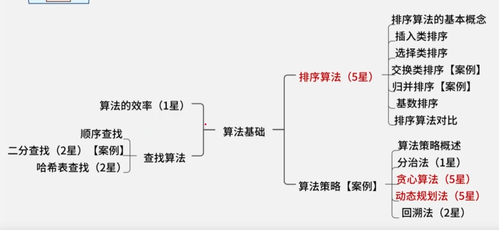

## 算法



### 查找算法

在计算机科学中，查找算法用于在数据集合（如数组、链表、树、图等）中定位特定元素。根据数据结构是否有序、是否动态变化以及性能要求，有多种经典的查找算法可供选择。本文将详细介绍几种核心的查找算法，并通过具体的代码示例和场景分析进行说明。

#### 一、查找算法概述

查找算法的核心目标是在一个数据集合中，以尽可能高的效率找到目标元素或确认其不存在。算法的效率通常用**时间复杂度**来衡量，而算法的选择则高度依赖于数据的**存储结构**和**有序性**。

根据数据集合的特点，查找算法可分为以下几类：

| 算法类型     | 典型算法                          | 前提条件                         | 平均时间复杂度 | 适用场景                             |
| :----------- | :-------------------------------- | :------------------------------- | :------------- | :----------------------------------- |
| **无序查找** | 顺序（线性）查找                  | 无要求                           | O(n)           | 数据量小、无序或无法建立索引         |
| **有序查找** | 二分查找、插值查找、斐波那契查找  | 数据**有序**（升序或降序）       | O(log n)       | 静态有序数据集合，查找频繁           |
| **树形查找** | 二叉搜索树、平衡树（AVL，红黑树） | 数据组织为特定树结构             | O(log n)       | 动态数据集，需要频繁插入、删除和查找 |
| **哈希查找** | 哈希表                            | 设计良好的哈希函数和冲突处理机制 | O(1)           | 对查找速度要求极高，内存充足         |

其中，对于**静态有序数组**，二分查找及其变种（插值查找、斐波那契查找）是最常用且高效的选择 25。

#### 二、顺序查找（Sequential Search）

**顺序查找**，又称线性查找，是最直观的查找方法。它从数据结构的一端开始，按顺序扫描每个元素，直到找到目标值或遍历完所有元素。

- **核心思想**：逐个比较，穷举遍历 3。
- **优点**：实现简单，对数据无任何要求（无序、有序均可）。
- **缺点**：效率低，当数据量 `n` 很大时，最坏和平均情况都需要比较 `n` 次。
- **时间复杂度**：O(n) 23。
- **空间复杂度**：O(1)。

#### 三、二分查找（Binary Search）

**二分查找**是处理**有序数组**的最高效算法之一。它采用分治策略，每次比较都将搜索范围缩小一半 45。

- **核心思想**：
  1. 确定数组的中间元素 `mid`。
  2. 将目标值 `target` 与 `arr[mid]` 比较。
  3. 若相等，查找成功。
  4. 若 `target < arr[mid]`，则在左半部分 (`left` 到 `mid-1`) 继续查找。
  5. 若 `target > arr[mid]`，则在右半部分 (`mid+1` 到 `right`) 继续查找。
  6. 重复此过程，直到找到或搜索区间为空 (`left > right`) 5。
- **前提条件**：**数组必须是有序的**（通常是升序）25。
- **时间复杂度**：O(log n)，效率远高于顺序查找 5。
- **空间复杂度**：迭代实现为 O(1)，递归实现为 O(log n)（调用栈深度）。

#### 四、插值查找（Interpolation Search）

**插值查找**是二分查找的优化变种，适用于数据**分布均匀且有序**的情况 2。它不像二分查找那样总是从中间开始，而是根据目标值在整个范围中的可能位置进行“插值”估算。

- **核心公式**：`mid = left + (target - arr[left]) * (right - left) // (arr[right] - arr[left])` 2。
- **工作原理**：假设数组值线性增长，通过比例直接估算 `target` 的位置。
- **优点**：对于分布均匀的数据，平均查找次数比二分查找更少，接近 O(log log n)。
- **缺点**：对数据分布敏感。如果数据分布不均匀（如 `[1, 2, 100, 1000, 10000]` 中找 `2`），性能可能退化到 O(n)。
- **时间复杂度**：平均 O(log log n)，最坏 O(n) 2。

#### 五、斐波那契查找（Fibonacci Search）

**斐波那契查找**是另一种基于黄金分割原理的查找算法，同样是二分查找的变体 26。它使用斐波那契数列来分割数组，避免使用除法运算。

- **核心思想**：
  1. 找到大于或等于数组长度 `n` 的最小斐波那契数 `F(k)`。
  2. 将原数组扩展至长度为 `F(k)-1`（用最后一个元素填充）。
  3. 通过斐波那契数进行分割：`mid = low + F(k-1) - 1`。
  4. 比较 `target` 与 `arr[mid]`，根据比较结果在前 `F(k-1)-1` 个元素或后 `F(k-2)-1` 个元素中继续查找，并更新斐波那契数列的索引 。
- **优点**：只涉及加减运算，在某些硬件上可能比二分查找的乘除运算更快。
- **缺点**：实现相对复杂，需要预计算或存储斐波那契数列。
- **时间复杂度**：O(log n) 。

#### 六、算法对比与选择建议

下表总结了上述四种基于比较的查找算法的关键特性：

| 特性           | **顺序查找**             | **二分查找**               | **插值查找**                             | **斐波那契查找**           |
| :------------- | :----------------------- | :------------------------- | :--------------------------------------- | :------------------------- |
| **前提条件**   | 无                       | **必须有序**               | 有序且**分布均匀**                       | **必须有序**               |
| **时间复杂度** | O(n)                     | O(log n)                   | 平均 O(log log n)，最坏 O(n)             | O(log n)                   |
| **空间复杂度** | O(1)                     | O(1) (迭代)                | O(1)                                     | O(1)                       |
| **优点**       | 简单通用，无需排序       | 效率高，稳定               | 均匀数据下极快                           | 避免乘除运算               |
| **缺点**       | 效率低                   | 要求有序数组               | 对数据分布敏感                           | 实现复杂，需额外空间存数列 |
| **适用场景**   | 小数据量、无序数据、链表 | **静态有序数组**的标准查找 | 大规模、**均匀分布**的有序数据（如字典） | 对乘除运算成本敏感的环境   |

**选择指南**：

1. **数据无序且量小**：直接使用**顺序查找**，简单有效。
2. **数据有序，是静态数组（很少插入删除）**：**二分查找**是首选，稳定且高效，实现简单。
3. **数据有序且数值分布非常均匀**：可以尝试**插值查找**，可能获得更好的平均性能。
4. **需要考虑硬件运算特性**：在乘除法开销大的环境中，可考虑**斐波那契查找**。
5. **数据动态变化（频繁增删）**：应使用**二叉搜索树（BST）**、**平衡树（如AVL树、红黑树）** 或**跳表**，它们能在 O(log n) 时间内支持查找、插入和删除。
6. **对查找速度有极致要求，内存充足**：**哈希表**是理想选择，可实现接近 O(1) 的查找时间复杂度。

在实际应用中，二分查找及其变种是处理有序静态数据集最核心的工具，理解其原理和变体有助于在特定场景下做出最优选择。

### 排序算法

#### 排序算法详解

排序算法是计算机科学中将一组数据按照特定顺序（升序或降序）重新排列的算法。它们在数据处理、数据库索引、信息检索等众多领域有广泛应用。根据操作方式和性能特点，排序算法可以分为多个类别。

#### 一、排序算法分类概览

| 分类维度       | 类别       | 代表算法                             | 核心特点                                     |
| :------------- | :--------- | :----------------------------------- | :------------------------------------------- |
| **时间复杂度** | O(n²)      | 冒泡、选择、插入排序                 | 简单直观，适用于小规模数据                   |
|                | O(n log n) | 归并、快速、堆排序                   | 高效，适用于大规模数据                       |
|                | O(n)       | 计数、基数、桶排序                   | 特定条件下（如整数范围小）效率极高           |
| **稳定性**     | 稳定排序   | 冒泡、插入、归并、计数、基数排序     | 相等元素的相对位置在排序后不变               |
|                | 不稳定排序 | 选择、快速、堆排序                   | 相等元素的相对位置可能改变                   |
| **额外空间**   | 原地排序   | 冒泡、选择、插入、希尔、堆、快速排序 | 空间复杂度为O(1)或很小                       |
|                | 非原地排序 | 归并、计数、基数、桶排序             | 需要额外内存空间                             |
| **操作方式**   | 比较排序   | 冒泡、选择、插入、归并、快速、堆排序 | 通过比较元素大小决定顺序，理论下限O(n log n) |
|                | 非比较排序 | 计数、基数、桶排序                   | 利用数据特定属性，可突破O(n log n)限制       |

#### 二、常见排序算法原理与实现

##### 1. 冒泡排序 (BUBBLE SORT)

- **核心思想**：重复遍历列表，比较相邻元素，如果顺序错误就交换它们，直到没有需要交换的元素为止 5。每一轮遍历会将最大（或最小）的元素“冒泡”到正确位置。
- **时间复杂度**：最好O(n)（已有序），平均和最坏O(n²)。
- **稳定性**：稳定。
- **适用场景**：教学、数据量极小或近乎有序的简单场景。

**Python 代码示例**：

```
def bubble_sort(arr):
    """
    冒泡排序算法实现 [ref_3][ref_5]。
    :param arr: 待排序列表
    :return: 排序后的列表（原地修改）
    """
    n = len(arr)
    for i in range(n - 1):  # 进行 n-1 轮比较 [ref_3]
        swapped = False  # 优化：若本轮无交换，说明已有序，可提前结束
        for j in range(n - 1 - i):  # 每轮将最大元素“冒泡”到最后
            if arr[j] > arr[j + 1]:  # 比较相邻元素 [ref_5]
                arr[j], arr[j + 1] = arr[j + 1], arr[j]  # 交换
                swapped = True
        if not swapped:  # 本轮无交换，提前结束 [ref_3]
            break
    return arr

###### 示例
data = [64, 34, 25, 12, 22, 11, 90]
sorted_data = bubble_sort(data.copy())
print(f"冒泡排序结果: {sorted_data}")
```

##### 2. 选择排序 (SELECTION SORT)

- **核心思想**：将数组分为已排序和未排序两部分，每轮从未排序部分中选出最小（或最大）元素，将其放到已排序部分的末尾 4。不断重复直到所有元素排序完毕。
- **时间复杂度**：最好、平均、最坏均为O(n²)。
- **稳定性**：不稳定（例如 `[5a, 5b, 2]` 排序后 `5a` 和 `5b` 的相对位置可能改变）。
- **适用场景**：数据量小，且对稳定性无要求，交换成本高的场景。

**Python 代码示例**：

```
def selection_sort(arr):
    """
    选择排序算法实现 [ref_4]。
    :param arr: 待排序列表
    :return: 排序后的列表（原地修改）
    """
    n = len(arr)
    for i in range(n - 1):  # 需要进行 n-1 轮选择
        min_idx = i  # 假设当前位置是最小值索引 [ref_4]
        for j in range(i + 1, n):  # 在未排序部分查找更小值
            if arr[j] < arr[min_idx]:
                min_idx = j
        if min_idx != i:  # 如果找到更小的，交换
            arr[i], arr[min_idx] = arr[min_idx], arr[i]
    return arr

###### 示例
data = [64, 34, 25, 12, 22, 11, 90]
sorted_data = selection_sort(data.copy())
print(f"选择排序结果: {sorted_data}")
```

##### 3. 插入排序 (INSERTION SORT)

- **核心思想**：将数组视为已排序和未排序两部分，逐个将未排序部分的元素插入到已排序部分的正确位置 5。类似于整理扑克牌。
- **时间复杂度**：最好O(n)（已有序），平均和最坏O(n²)。
- **稳定性**：稳定。
- **适用场景**：小规模数据或基本有序的数据，在线算法（数据流输入）。

**Python 代码示例**：

```
def insertion_sort(arr):
    """
    插入排序算法实现 [ref_5]。
    :param arr: 待排序列表
    :return: 排序后的列表（原地修改）
    """
    n = len(arr)
    for i in range(1, n):  # 从第二个元素开始，视为待插入元素 [ref_5]
        key = arr[i]  # 当前待插入的元素
        j = i - 1
        # 将比 key 大的元素向后移动，为 key 腾出位置 [ref_5]
        while j >= 0 and arr[j] > key:
            arr[j + 1] = arr[j]
            j -= 1
        arr[j + 1] = key  # 插入 key 到正确位置
    return arr

###### 示例
data = [64, 34, 25, 12, 22, 11, 90]
sorted_data = insertion_sort(data.copy())
print(f"插入排序结果: {sorted_data}")
```

##### 4. 希尔排序 (SHELL SORT)

- **核心思想**：是插入排序的改进版。它通过将整个待排序序列分割成若干子序列（按增量间隔），分别进行直接插入排序，然后逐步缩小增量，直至增量为1，对整个序列进行一次插入排序 5。这使得元素可以大跨步移动，提高了效率。
- **时间复杂度**：取决于增量序列，最坏可优于O(n²)，在O(n log n)到O(n²)之间。
- **稳定性**：不稳定。
- **适用场景**：中等规模数据，比简单插入排序高效。

**Python 代码示例**：

```
def shell_sort(arr):
    """
    希尔排序算法实现（使用希尔增量序列）[ref_5]。
    :param arr: 待排序列表
    :return: 排序后的列表（原地修改）
    """
    n = len(arr)
    gap = n // 2  # 初始增量
    while gap > 0:
        for i in range(gap, n):  # 从第gap个元素开始，对其所在子序列进行插入排序
            temp = arr[i]
            j = i
            while j >= gap and arr[j - gap] > temp:  # 子序列内的插入排序
                arr[j] = arr[j - gap]
                j -= gap
            arr[j] = temp
        gap //= 2  # 缩小增量
    return arr

###### 示例
data = [64, 34, 25, 12, 22, 11, 90]
sorted_data = shell_sort(data.copy())
print(f"希尔排序结果: {sorted_data}")
```

##### 5. 归并排序 (MERGE SORT)

- **核心思想**：采用分治法。将数组递归地分成两半，分别对两半进行排序，然后将两个有序的子数组合并成一个有序数组 2。
- **时间复杂度**：最好、平均、最坏均为O(n log n)。
- **稳定性**：稳定。
- **适用场景**：需要稳定排序的大规模数据，链表排序，外部排序（数据量太大无法全部加载到内存）。

**Python 代码示例**：

```
def merge_sort(arr):
    """
    归并排序算法实现（递归版）[ref_2]。
    :param arr: 待排序列表
    :return: 排序后的新列表
    """
    if len(arr) <= 1:
        return arr
    # 分：找到中间点，分割数组
    mid = len(arr) // 2
    left_half = arr[:mid]
    right_half = arr[mid:]
    # 治：递归排序左右两半
    left_sorted = merge_sort(left_half)
    right_sorted = merge_sort(right_half)
    # 合：合并两个有序子数组
    return merge(left_sorted, right_sorted)

def merge(left, right):
    """合并两个有序列表 [ref_2]"""
    result = []
    i = j = 0
    while i < len(left) and j < len(right):
        if left[i] <= right[j]:  # 稳定性的关键：相等时取左边元素
            result.append(left[i])
            i += 1
        else:
            result.append(right[j])
            j += 1
    # 将剩余元素追加到结果
    result.extend(left[i:])
    result.extend(right[j:])
    return result

###### 示例
data = [64, 34, 25, 12, 22, 11, 90]
sorted_data = merge_sort(data.copy())
print(f"归并排序结果: {sorted_data}")
```

##### 6. 快速排序 (QUICK SORT)

- **核心思想**：采用分治法。选择一个元素作为“基准”，将数组分为两部分：小于基准的放左边，大于基准的放右边。然后递归地对左右两部分进行快速排序 3。
- **时间复杂度**：平均O(n log n)，最坏O(n²)（如已排序数组且基准选择不当）。
- **稳定性**：不稳定。
- **适用场景**：大规模数据排序的通用首选，平均性能优异。

**Python 代码示例**：

```
def quick_sort(arr):
    """
    快速排序算法实现（递归版）[ref_3]。
    :param arr: 待排序列表
    :return: 排序后的列表（原地修改）
    """
    def _quick_sort(low, high):
        if low < high:
            # pi 是分区操作后基准元素的正确位置索引
            pi = partition(low, high)
            # 递归排序基准左右两边的子数组
            _quick_sort(low, pi - 1)
            _quick_sort(pi + 1, high)

    def partition(low, high):
        """
        分区函数：选择最右元素为基准，将小于基准的移到左边，大于基准的移到右边。
        """
        pivot = arr[high]  # 选择最右侧元素作为基准 [ref_3]
        i = low - 1  # 指向小于基准的子数组的末尾
        for j in range(low, high):
            if arr[j] <= pivot:  # 当前元素小于等于基准
                i += 1
                arr[i], arr[j] = arr[j], arr[i]  # 交换到左侧区域
        # 将基准元素放到正确位置
        arr[i + 1], arr[high] = arr[high], arr[i + 1]
        return i + 1

    _quick_sort(0, len(arr) - 1)
    return arr

###### 示例
data = [64, 34, 25, 12, 22, 11, 90]
sorted_data = quick_sort(data.copy())
print(f"快速排序结果: {sorted_data}")
```

##### 7. 堆排序 (HEAP SORT)

- **核心思想**：利用堆这种数据结构（一种近似完全二叉树）。首先将数组构建成最大堆（父节点值 >= 子节点值），此时堆顶（根节点）是最大元素。将其与堆末尾元素交换，然后缩小堆范围并重新调整堆，重复此过程直到堆大小变为1 3。
- **时间复杂度**：最好、平均、最坏均为O(n log n)。
- **稳定性**：不稳定。
- **适用场景**：需要O(n log n)时间复杂度且空间复杂度为O(1)的场景，或者需要随时获取最大/最小元素的场景。

**Python 代码示例**：

```
def heap_sort(arr):
    """
    堆排序算法实现 [ref_3]。
    :param arr: 待排序列表
    :return: 排序后的列表（原地修改）
    """
    n = len(arr)

    # 构建最大堆
    for i in range(n // 2 - 1, -1, -1):  # 从最后一个非叶子节点开始向上调整
        heapify(arr, n, i)

    # 逐个提取堆顶元素（最大值）并放到数组末尾
    for i in range(n - 1, 0, -1):
        arr[0], arr[i] = arr[i], arr[0]  # 将堆顶（最大值）与末尾交换
        heapify(arr, i, 0)  # 调整剩余元素为最大堆，堆大小减1
    return arr

def heapify(arr, n, i):
    """
    调整以 i 为根的子树为最大堆 [ref_3]。
    :param arr: 堆数组
    :param n: 堆的大小
    :param i: 当前根节点索引
    """
    largest = i  # 初始化最大值为根
    left = 2 * i + 1
    right = 2 * i + 2

    # 如果左子节点存在且大于根
    if left < n and arr[left] > arr[largest]:
        largest = left
    # 如果右子节点存在且大于当前最大值
    if right < n and arr[right] > arr[largest]:
        largest = right
    # 如果最大值不是根，则交换并递归调整受影响的子树
    if largest != i:
        arr[i], arr[largest] = arr[largest], arr[i]
        heapify(arr, n, largest)

###### 示例
data = [64, 34, 25, 12, 22, 11, 90]
sorted_data = heap_sort(data.copy())
print(f"堆排序结果: {sorted_data}")
```

#### 三、非比较排序算法简介

当数据具有特定属性时，非比较排序算法可以突破基于比较的排序算法O(n log n)的时间下限，达到线性时间复杂度O(n)。

1. **计数排序 (Counting Sort)**
   - **原理**：适用于数据范围不大的整数排序。统计每个元素出现的次数，然后根据计数结果将元素放回原数组 3。
   - **时间复杂度**：O(n + k)，其中k是数据范围。
   - **稳定性**：稳定。
   - **适用场景**：整数排序，且数据范围k远小于数据量n。
2. **基数排序 (Radix Sort)**
   - **原理**：按照数字的位数（或字符的位）从低位到高位（或反之）依次进行稳定排序（通常使用计数排序作为子程序）3。
   - **时间复杂度**：O(d * (n + k))，其中d是最大位数，k是基数（如10进制为10）。
   - **稳定性**：稳定。
   - **适用场景**：整数或字符串排序，位数或长度相对固定。
3. **桶排序 (Bucket Sort)**
   - **原理**：将数据分到有限数量的有序桶里，每个桶再单独排序（可能使用其他排序算法），最后按顺序连接所有桶。
   - **时间复杂度**：平均O(n + k)，最坏O(n²)。
   - **适用场景**：数据均匀分布在一个范围内。

#### 四、算法选择与总结

选择排序算法时，需要综合考虑数据规模、数据特性、稳定性要求和空间限制。

| 数据规模             | 数据特性          | 稳定性要求 | 推荐算法                     | 理由                               |
| :------------------- | :---------------- | :--------- | :--------------------------- | :--------------------------------- |
| **小规模 (n < 100)** | 任意              | 是         | **插入排序**                 | 简单稳定，对近乎有序数据效率高     |
|                      | 任意              | 否         | **选择排序** 或 **冒泡排序** | 实现简单，交换次数选择排序更少     |
| **中等规模**         | 基本有序          | 是/否      | **希尔排序**                 | 插入排序的改进，性能提升明显       |
| **大规模**           | 通用              | 是         | **归并排序**                 | 稳定且保证O(n log n)               |
|                      | 通用              | 否         | **快速排序**                 | 平均性能最好，常数因子小           |
|                      | 内存受限          | 否         | **堆排序**                   | 原地排序，O(n log n)最坏时间复杂度 |
| **特定情况**         | 整数，范围小      | 是         | **计数排序**                 | O(n + k)，线性时间                 |
|                      | 多位数整数/字符串 | 是         | **基数排序**                 | O(d * n)，线性时间扩展             |
|                      | 均匀分布          | 是         | **桶排序**                   | 平均线性时间                       |

在实践中，编程语言的标准库排序函数（如Python的`list.sort()`和`sorted()`，Java的`Arrays.sort()`）通常采用高度优化的混合排序算法（如Timsort，结合了归并排序和插入排序），以适应各种实际情况，在大多数场景下都是最优选择。理解这些基础算法的原理，有助于在特殊需求或性能调优时做出正确决策。

### 算法策略

**算法策略**是解决特定问题或优化特定任务时所遵循的系统性方法、规则或步骤的集合。它是计算机算法的核心思想，指导如何高效、准确地处理数据或逻辑。一个优秀的算法策略不仅能解决问题，还能在时间（时间复杂度）和空间（空间复杂度）资源消耗上达到平衡。

#### 一、核心算法策略分类与对比

算法策略可以根据其解决问题的核心思想和模式进行分类。下表概述了几种最核心的策略及其特点：

| 策略名称                                            | 核心思想                                                     | 典型应用场景                                                 | 优点                                                         | 缺点                                                         | 关键考量                                                   |
| :-------------------------------------------------- | :----------------------------------------------------------- | :----------------------------------------------------------- | :----------------------------------------------------------- | :----------------------------------------------------------- | :--------------------------------------------------------- |
| **分治策略 (Divide and Conquer)**                   | 将原问题分解为若干个规模较小、结构相似的子问题，递归求解子问题，然后合并子问题的解得到原问题的解 6。 | 归并排序、快速排序、二分查找、汉诺塔、大规模计算（如MapReduce）。 | 结构清晰，易于并行化；能有效解决复杂问题。                   | 递归可能带来栈溢出风险；分解与合并过程可能引入额外开销。     | 如何划分子问题，以及如何高效合并结果。                     |
| **动态规划 (Dynamic Programming, DP)**              | 将原问题分解为相互重叠的子问题，通过记忆化（自顶向下）或制表法（自底向上）保存子问题的解，避免重复计算，从而高效求解 6。 | 背包问题、最长公共子序列、最短路径（Floyd-Warshall）、编辑距离、股票买卖最佳时机。 | 能有效解决具有最优子结构和重叠子问题的复杂优化问题。         | 状态定义和转移方程设计需要技巧；可能占用较多存储空间。       | 确定状态、状态转移方程、边界条件。                         |
| **贪心策略 (Greedy)**                               | 在每一步选择中都采取当前状态下**局部最优**的选择，期望通过一系列局部最优最终达到全局最优 6。 | 霍夫曼编码、最小生成树（Prim, Kruskal）、单源最短路径（Dijkstra，仅限非负权图）、活动选择问题。 | 通常高效、简单、直观。                                       | **不保证能得到全局最优解**，只在具有贪心选择性质的问题中有效。 | 验证问题是否具有贪心选择性质和最优子结构。                 |
| **回溯策略 (Backtracking)**                         | 一种选优搜索法，按选优条件向前搜索。当探索到某一步，发现原先选择并不优或无法达到目标时，就退回一步重新选择（“回溯”），尝试其他路径 6。 | N皇后问题、全排列、组合总和、数独、图的着色、迷宫求解。      | 能系统地搜索问题的所有可能解，适用于解空间很大的约束满足问题。 | 时间复杂度可能非常高（指数级），需要剪枝优化。               | 定义解空间树，设计约束条件和限界函数以进行剪枝。           |
| **递归与递推 (Recursion & Recurrence)**             | **递归**：函数直接或间接调用自身。**递推**：根据已知初始条件和递推关系式，从边界值开始逐步推导出最终结果 6。 | 递归：树的遍历、斐波那契数列（低效版）、分治算法实现。 递推：斐波那契数列（高效迭代）、爬楼梯问题、动态规划的制表法。 | 递归代码简洁，符合思维习惯；递推效率高，避免递归开销。       | 递归可能深度过大导致栈溢出，且存在重复计算风险。             | 递归需明确基线条件和递归条件；递推需确定初始状态和递推式。 |
| **穷举与分支限界 (Brute-Force & Branch and Bound)** | **穷举**：列举所有可能情况，从中找出满足条件的解 6。**分支限界**：在穷举基础上，利用限界函数剪去不可能产生最优解的分支。 | 穷举：密码破解、小规模组合问题。 分支限界：旅行商问题(TSP)、0/1背包问题（求最优解）。 | 穷举简单直接，保证找到解（如果存在）；分支限界能大幅减少搜索空间。 | 穷举时间复杂度极高；分支限界设计复杂。                       | 如何有效生成所有候选解；如何设计紧致的限界函数。           |

#### 二、策略详解与代码实践

##### 1. 分治策略 (DIVIDE AND CONQUER)

分治策略通常遵循三个步骤：**分解** -> **解决** -> **合并**。快速排序是分治策略的经典应用。

**Python 代码示例：快速排序**

```
def quick_sort(arr):
    """
    快速排序 - 分治策略的典型应用 [ref_6]。
    分解：选择基准，将数组分为左右两部分。
    解决：递归地对左右两部分进行快速排序。
    合并：由于原地排序，无需显式合并步骤。
    """
    if len(arr) <= 1:
        return arr
    pivot = arr[len(arr) // 2]  # 选择中间元素作为基准
    left = [x for x in arr if x < pivot]   # 分解：小于基准的子问题
    middle = [x for x in arr if x == pivot] # 等于基准的部分
    right = [x for x in arr if x > pivot]  # 分解：大于基准的子问题
    # 解决与合并：递归解决子问题并合并结果
    return quick_sort(left) + middle + quick_sort(right)

###### 示例
data = [3, 6, 8, 10, 1, 2, 1]
sorted_data = quick_sort(data)
print(f"快速排序（分治）结果: {sorted_data}")
```

##### 2. 动态规划 (DYNAMIC PROGRAMMING)

动态规划适用于具有“重叠子问题”和“最优子结构”的问题。以斐波那契数列为例，对比递归（低效）与动态规划（高效）。

**Python 代码示例：斐波那契数列**

```
def fib_recursive(n):
    """递归解法：存在大量重复计算，时间复杂度O(2^n) [ref_6]"""
    if n <= 1:
        return n
    return fib_recursive(n-1) + fib_recursive(n-2)

def fib_dp(n):
    """
    动态规划解法（制表法）：自底向上，时间复杂度O(n) [ref_6]。
    状态定义：dp[i]表示第i个斐波那契数。
    状态转移方程：dp[i] = dp[i-1] + dp[i-2]。
    边界条件：dp[0]=0, dp[1]=1。
    """
    if n == 0:
        return 0
    dp = [0] * (n + 1)  # 创建DP表
    dp[1] = 1  # 初始化边界条件
    for i in range(2, n + 1):  # 自底向上填表
        dp[i] = dp[i-1] + dp[i-2]  # 状态转移 [ref_6]
    return dp[n]

###### 示例
n = 10
print(f"斐波那契数列第{n}项（递归）: {fib_recursive(n)}") # 效率低
print(f"斐波那契数列第{n}项（动态规划）: {fib_dp(n)}")   # 效率高
```

##### 3. 贪心策略 (GREEDY)

贪心策略的关键在于每一步都做出**当前看来最好的选择**。以“找零钱”问题（硬币无限，求最小数量）为例，在标准硬币体系（如[1,5,10,20,50,100]）下，贪心算法有效。

**Python 代码示例：找零钱（贪心）**

```
def coin_change_greedy(coins, amount):
    """
    找零钱问题的贪心解法（仅在特定面值体系下最优）[ref_6]。
    策略：每次选择面值不超过剩余金额的最大硬币。
    """
    coins.sort(reverse=True)  # 从大到小排序
    count = 0
    result = []
    for coin in coins:
        while amount >= coin:  # 贪心选择：尽可能多用当前最大面值
            amount -= coin
            count += 1
            result.append(coin)
    if amount != 0:  # 如果无法正好凑齐，返回-1（贪心可能失败）
        return -1, []
    return count, result

###### 示例（标准人民币面值，贪心有效）
coins = [1, 5, 10, 20, 50, 100]
amount = 93
min_count, coin_list = coin_change_greedy(coins, amount)
print(f"找零{amount}元，贪心算法需要硬币数: {min_count}, 硬币组合: {coin_list}")
###### 注意：如果硬币体系是[1, 3, 4]，金额为6，贪心会给出[4,1,1]（3个），而最优是[3,3]（2个）。
```

##### 4. 回溯策略 (BACKTRACKING)

回溯法通过试错来寻找解，并在发现当前路径无法得到有效解时进行“回溯”。N皇后问题是经典案例。

**Python 代码示例：N皇后问题**

```
def solve_n_queens(n):
    """
    解决N皇后问题的回溯算法 [ref_6]。
    策略：逐行放置皇后，检查每个位置是否与已放置的皇后冲突（列、主对角线、副对角线）。
    """
    def is_safe(board, row, col):
        """检查在(board[row][col])放置皇后是否安全"""
        # 检查当前列
        for i in range(row):
            if board[i][col] == 'Q':
                return False
        # 检查左上对角线
        for i, j in zip(range(row-1, -1, -1), range(col-1, -1, -1)):
            if board[i][j] == 'Q':
                return False
        # 检查右上对角线
        for i, j in zip(range(row-1, -1, -1), range(col+1, n)):
            if board[i][j] == 'Q':
                return False
        return True

    def backtrack(board, row):
        """回溯函数：在第row行放置皇后"""
        if row == n:  # 所有行都成功放置了皇后
            solutions.append([''.join(r) for r in board.copy()])
            return
        for col in range(n):  # 尝试当前行的每一列
            if is_safe(board, row, col):  # 剪枝：如果安全才放置
                board[row][col] = 'Q'     # 做出选择
                backtrack(board, row + 1) # 进入下一行决策
                board[row][col] = '.'     # 撤销选择，回溯

    solutions = []
    # 初始化棋盘
    board = [['.' for _ in range(n)] for _ in range(n)]
    backtrack(board, 0)
    return solutions

###### 示例：4皇后问题
solutions = solve_n_queens(4)
print(f"4皇后问题共有 {len(solutions)} 种解法:")
for idx, sol in enumerate(solutions):
    print(f"解法 {idx+1}:")
    for row in sol:
        print(row)
    print()
```

#### 三、策略选择与综合应用

在实际问题中，往往需要结合多种策略。例如：

- **动态规划 vs 贪心**：对于“分数背包”问题，贪心（按价值重量比排序）能得到最优解；对于“0/1背包”问题，则必须使用动态规划。
- **回溯 vs 分支限界**：两者都搜索解空间树，但回溯主要找**所有解**，而分支限界通常找**一个最优解**，并利用限界函数剪枝。
- **递归作为实现工具**：分治、回溯、动态规划（记忆化搜索）都常以递归形式实现代码，但其核心思想不同。

选择算法策略的决策流程可参考以下思路：

1. **分析问题特性**：是否存在最优子结构？子问题是否重叠？是否满足贪心选择性质？解空间是否很大且需要搜索？
2. **评估约束条件**：数据规模如何？对时间、空间复杂度有何要求？是否需要精确解或近似解即可？
3. **匹配策略**：
   - 求所有方案 -> **回溯**。
   - 求最优解，且子问题重叠 -> **动态规划**。
   - 求最优解，且具有贪心性质 -> **贪心**（需证明）。
   - 问题可自然分解 -> **分治**。
   - 规模极小或作为其他算法的子过程 -> **穷举/递推**。
4. **实现与优化**：用选定的策略实现算法，并考虑使用记忆化、剪枝、迭代等方式进行优化。

理解这些核心算法策略及其适用场景，是设计和分析高效算法的基础，能够帮助开发者在面对复杂问题时，选择最合适的方法论工具。


