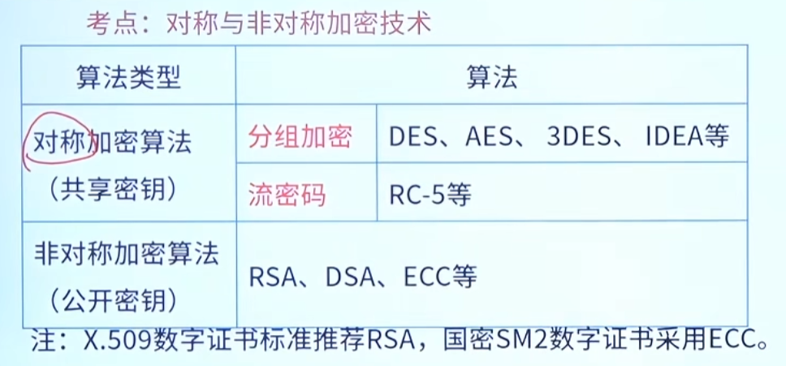

## 信息安全

信息安全的5个基本要素通常被称为 **CIA+2** 模型。除了最核心的CIA三要素外，还增加了**不可否认性**和**真实性**。它们共同构成了现代信息安全体系的基石：

1. **机密性 (Confidentiality)**
   - **含义**：确保信息仅被授权的个人、实体或进程访问和使用，防止未经授权的泄露。
   - **常见手段**：数据加密、访问控制列表（ACL）、身份认证、物理隔离等。
   - **通俗理解**：“不该看的人看不到”。
2. **完整性 (Integrity)**
   - **含义**：保护数据免受未经授权的修改、破坏或丢失，确保信息在存储、传输和处理过程中保持准确和完整。
   - **常见手段**：哈希算法（如SHA-256）、数字签名、校验和、版本控制等。
   - **通俗理解**：“数据没被偷偷篡改过”。
3. **可用性 (Availability)**
   - **含义**：确保授权用户在需要时能够可靠地访问信息和相关资源。
   - **常见手段**：冗余设计、负载均衡、DDoS防护、灾难恢复计划、定期备份等。
   - **通俗理解**：“系统不宕机，需要用的时候随时能用”。
4. **不可否认性 (Non-repudiation)**
   - **含义**：确保信息的发送者不能否认已发送的信息，接收者也不能否认已接收的信息。它为交易或通信提供了法律或审计上的证据。
   - **常见手段**：数字签名、可信时间戳、审计日志、公钥基础设施（PKI）等。
   - **通俗理解**：“做过的事、发过的消息，赖不掉”。
5. **真实性 (Authenticity)**
   - **含义**：确保用户、系统或数据的身份是真实可信的，能够验证声称的身份与实际身份一致。
   - **常见手段**：多因素认证（MFA）、生物识别、证书验证、口令管理等。
   - **通俗理解**：“证明你就是你，而不是冒充者”。
6. 可控性 (Controllability)
   - **含义**：指对信息的传播及内容具有控制能力。确保授权实体（如系统管理员、监管部门）在必要时能够控制信息系统的运行、信息的访问权限，甚至在极端情况下（如系统被恶意利用）能够采取阻断、隔离等措施。
   - **常见手段**：细粒度的访问控制策略、内容过滤系统、网络流量控制、后门检测、应急切断机制等。
   - **通俗理解**：“系统必须掌握在我们自己手里，不能失控，该管的时候能管得住。”
7. 可审查性 (Accountability / Auditability)
   - **含义**：指当系统出现安全问题或发生违规行为时，能够为事件的调查提供可靠的依据和线索。它强调对系统内发生的所有行为进行记录、追踪和审计，确保“事后可查”。
   - **常见手段**：全面的系统日志记录、安全审计系统、行为监控、操作留痕等。
   - **通俗理解**：“雁过留声，人过留名。谁在什么时间做了什么操作，系统里都有记录，出了问题能查到责任人。”

**总结**：这五个要素相辅相成。机密性防泄露，完整性防篡改，可用性防瘫痪，不可否认性防抵赖，真实性防伪造。在实际的信息安全建设中，通常需要根据业务场景在这五个要素之间寻找合适的平衡。国际上的“CIA+2”更侧重于**数据本身和交易过程**的安全；而加入了“可控性”和“可审查性”后，则进一步强调了**系统管理、国家监管以及事后追责**的能力。这两者的加入，使得信息安全体系从单纯的“技术防护”走向了“技术与管理并重”的成熟阶段。


### 一、 加密技术：保障数据的“机密性”



加密技术的核心目标是**保密性**，即通过将原始可读的信息（明文）转换为不可识别的符号序列（密文），防止数据在传输或存储过程中被未授权的第三方窃取或看懂。

1. **对称加密**
   - **原理**：加密和解密使用同一个密钥。
   - **特点**：计算效率高、速度快，非常适合处理大量数据（如视频流、大文件传输）。但密钥的分发和管理较为困难。
   - **常见算法**：AES（高级加密标准）、DES、3DES、Blowfish等。
2. **非对称加密**
   - **原理**：使用一对密钥，即公钥（公开）和私钥（私密）。用公钥加密的数据，只能用对应的私钥解密。
   - **特点**：安全性高，解决了密钥分发问题，但计算复杂、处理速度较慢，通常用于小数据量的加密或密钥交换。
   - **常见算法**：RSA、ECC（椭圆曲线加密）等。
3. **混合加密**
   - 在实际网络通信（如HTTPS）中，通常结合两者的优点：使用非对称加密来安全地交换“对称密钥”，随后使用对称密钥来加密实际传输的大量数据。

### 二、 认证技术：保障数据的“真实性”与“完整性”

认证技术的核心目标是确认“你是谁”、“信息来自哪里”以及“信息是否被篡改”，防止身份伪造、数据篡改和抵赖行为。

1. **身份认证**
   用于验证用户或设备的合法身份，通常基于以下三种因素或其组合：
   - **知识因子**：用户“知道”的秘密，如静态密码、PIN码。
   - **拥有物因子**：用户“拥有”的物品，如智能卡、USB密钥（U盾）、动态令牌（OTP）、手机短信验证码。
   - **生物特征因子**：用户“自身”的特征，如指纹、人脸识别、虹膜识别等。
   - **多因素认证（MFA）**：结合上述两种或以上的因素（如“密码+短信验证码”），大幅提升安全性。
2. **数据完整性与抗抵赖认证**
   - **哈希算法（摘要算法）**：将任意长度的数据转换为固定长度的哈希值。它具有不可逆性和抗碰撞性，常用于验证文件是否被篡改，或在数据库中安全存储用户密码（不存明文存哈希值）。
   - **数字签名**：结合哈希算法和非对称加密。发送方用私钥对数据的哈希值进行签名，接收方用公钥验证。它能确保数据来源真实、内容未被篡改，且发送方无法抵赖。
   - **数字证书（PKI技术）**：由权威的证书颁发机构（CA）签发，将用户的公钥与身份信息绑定，解决公钥信任问题，广泛应用于网银、政府服务和HTTPS网站认证。

### 三、 两者的协同关系

加密和认证在实际场景中通常是紧密结合的：

- **互补性**：加密技术保障信息“不被看懂”，认证技术保障信息“来自正确的人且未被篡改”。
- **技术结合**：数字签名就是两者结合的典型案例，它既用到了非对称加密技术，又实现了身份验证和数据防篡改的认证功能。
- **安全链条**：缺少加密的认证无法保障机密性（信息虽未被篡改但可能被窃听）；缺少认证的加密可能导致“加密了错误对象的数据”（如误把数据加密发给了攻击者）。

数字证书的详细解析：

#### 1. 什么是数字证书？

数字证书是由权威的第三方电子认证机构（CA，Certificate Authority）签发的电子凭证。它的核心作用是将**证书持有者的真实身份**（如个人姓名、企业名称或服务器域名）与**公开密钥（公钥）**进行绑定，并附上CA机构的数字签名，从而确保证书本身的合法性和可信度。

#### 2. 数字证书的核心要素

一份标准的数字证书通常包含以下关键信息：

- **证书持有者信息**：如身份证号、统一社会信用代码等。
- **公开密钥（公钥）**：用于加密数据或验证签名。
- **CA机构标识与数字签名**：证明该证书是由受信任的权威机构签发的。
- **证书有效期**：证书具有明确的有效起止时间，超期后需更新或重新申领。
- **算法标识**：指定使用的加密算法或哈希算法标准。

#### 3. 数字证书的三大核心功能

数字证书基于公钥密码机制（PKI），主要解决网络空间中的三大安全问题：

1. **身份认证（真实性）**：像线下出示身份证一样，在网络中确认操作主体的真实身份，有效防范身份冒充和钓鱼网站。
2. **数据加密传输（机密性）**：发送方使用接收方的“公钥”对数据进行加密，只有持有对应“私钥”的接收方才能解密查看，确保信息在传输中不被窃取。
3. **数字签名防抵赖（完整性与不可否认性）**：持有者用“私钥”对文件或合同进行签名，接收方通过“公钥”验证。这能确认内容在传输中未被篡改，且发送者事后无法否认自己的操作行为。

#### 4. 常见应用场景

数字证书已经渗透到生活和工作的方方面面：

- **网站安全访问（HTTPS）**：浏览器地址栏的“小锁”图标，代表该网站部署了SSL/TLS数字证书，确保用户与网站间的通信加密且网站身份真实。
- **电子合同与文件签署**：在租房、贷款、商务合作中，合规的数字证书签名具备与手写签名、实体盖章同等的法律效力。
- **网上银行与金融交易**：用于大额转账、支付、理财交易中的身份确认，保障资金安全。
- **企业政务与招投标**：网上报税、工商登记、社保缴纳、政府采购投标等，代表企业的法定操作行为。
- **安全邮件与代码签名**：保障重要邮件来源可信、内容保密，以及验证软件/APP供应商的身份防止被恶意篡改。

#### 5. 面临的安全威胁

尽管数字证书极其重要，但也面临一些安全挑战：

- **私钥泄露**：如果用户的私钥保管不当被盗，不法分子可伪造合法操作。
- **中间人攻击（MitM）**：攻击者通过拦截、替换通信双方的公钥，伪装成中间人窃取或篡改信息。
- **证书误签发**：CA机构若审核不严，将证书错误签发给了假冒者，可能导致网络欺诈。

总结来说，数字证书是构建现代数字信任体系的基石，它让虚拟网络中的身份核验、数据加密和电子签约变得像线下办事一样安全、可靠且有法律依据。


### 网络安全协议


网络安全协议是为保障网络通信安全而设计的协议集合。不同的安全需求需要在不同网络层次部署相应的安全协议。

#### OSI模型与安全协议层次对应

| OSI层次 | 主要功能 | 对应安全协议 | 典型端口 |
|---------|---------|-------------|---------|
| 应用层 (7) | 用户接口、应用服务 | HTTPS, SSH, S/MIME, PGP, SHTTP, Kerberos | 443, 22 |
| 表示层 (6) | 数据格式转换、加密 | SSL/TLS (部分功能) | - |
| 会话层 (5) | 会话建立与管理 | SSL/TLS (主要工作层) | - |
| 传输层 (4) | 端到端可靠传输 | SSL/TLS, DTLS | 443 |
| 网络层 (3) | 路由与寻址 | IPsec (AH/ESP) | - |
| 数据链路层 (2) | 帧传输与差错控制 | PPTP, L2TP, PPPoE | - |
| 物理层 (1) | 比特流传输 | 无专门安全协议 | - |

**考试要点**：TCP/IP四层模型与OSI七层模型的对应关系是常考内容。TCP/IP的应用层对应OSI的应用层、表示层和会话层三层。

---

#### 一、网络层安全协议：IPsec

IPsec（Internet Protocol Security）是IP层安全协议，为IP数据包提供加密和认证服务。

##### 1. 核心组件

- **AH（Authentication Header，认证头）**
  - 功能：提供数据源认证和完整性保护
  - 特点：不提供加密功能
  - 适用场景：需要验证但不需要加密的通信

- **ESP（Encapsulating Security Payload，封装安全载荷）**
  - 功能：提供数据源认证、完整性保护和机密性
  - 特点：支持加密和认证双重功能
  - 适用场景：需要完整安全保障的通信

- **IKE（Internet Key Exchange，互联网密钥交换）**
  - 功能：负责密钥协商和安全关联（SA）的建立
  - 协议：使用ISAKMP/Oakley框架

##### 2. 工作模式

| 模式 | 特点 | 应用场景 |
|------|------|---------|
| 传输模式 | 只加密IP包载荷，不改变IP头 | 端到端通信（主机到主机） |
| 隧道模式 | 加密整个IP包，添加新IP头 | VPN、网关到网关通信 |

##### 3. 考试重点

- IPsec工作在**网络层**，对上层应用透明
- AH只提供认证，ESP提供认证+加密
- 隧道模式常用于构建VPN
- IPsec支持**传输模式**和**隧道模式**两种工作方式

---

#### 二、传输层安全协议：SSL/TLS

SSL（Secure Sockets Layer）由Netscape于1994年开发；TLS（Transport Layer Security）是SSL的IETF标准化版本。

##### 1. 协议层次

```
应用层（HTTP、FTP等）
    |
 SSL/TLS层
    |
传输层（TCP）
```

**重要考点**：SSL/TLS位于传输层之上、应用层之下，主要工作在**会话层**。

##### 2. SSL/TLS组成

- **握手协议（Handshake Protocol）**
  - 作用：协商加密算法、交换密钥、身份认证
  - 四个阶段：算法协商 → 服务器认证 → 客户端认证 → 完成握手

- **记录协议（Record Protocol）**
  - 作用：对应用层数据进行分片、压缩、加密、封装
  - 位置：位于传输层协议之上

- **密码规格变更协议（Change Cipher Spec）**
  - 作用：通知对方将切换到新协商的加密算法和密钥

- **警告协议（Alert Protocol）**
  - 作用：传递SSL/TLS警告信息（如关闭通知、错误报告）

##### 3. 默认端口

| 协议 | 端口 | 说明 |
|------|------|------|
| HTTPS | 443 | HTTP over SSL/TLS |
| FTPS | 990 | FTP over SSL/TLS |
| SMTPS | 465 | SMTP over SSL/TLS |
| POP3S | 995 | POP3 over SSL/TLS |

##### 4. SSL握手流程（简化版）

1. 客户端发送Client Hello（支持的SSL版本、加密套件）
2. 服务器返回Server Hello（选定加密套件、服务器证书）
3. 客户端验证服务器证书，发送预备主密钥
4. 双方生成会话密钥，开始加密通信

##### 5. 考试重点

- SSL 3.0 → TLS 1.0 → TLS 1.2 → TLS 1.3（版本演进）
- HTTPS = HTTP + SSL/TLS
- 默认端口443是必考内容
- SSL工作在**会话层**（OSI模型）

---

#### 三、应用层安全协议

应用层安全协议直接为特定应用提供安全服务。

##### 1. HTTPS（HTTP over SSL/TLS）

- **功能**：安全的Web浏览协议
- **端口**：443
- **原理**：HTTP协议通过SSL/TLS层进行加密传输
- **应用**：网银、电商、登录页面等敏感信息传输

##### 2. SSH（Secure Shell）

- **功能**：安全的远程登录和管理协议
- **端口**：22
- **特点**：
  - 替代不安全的Telnet、rlogin等协议
  - 支持公钥认证和密码认证
  - 支持数据压缩和端口转发
- **组件**：SSH传输层、SSH认证、SSH连接

##### 3. S/MIME（Secure Multipurpose Internet Mail Extensions）

- **功能**：安全的电子邮件协议
- **特点**：
  - 支持邮件加密和数字签名
  - 基于X.509公钥证书体系
  - 支持多种邮件格式（不只是ASCII）
- **应用**：企业邮件安全

##### 4. PGP（Pretty Good Privacy）

- **功能**：邮件加密和签名软件
- **特点**：
  - 使用公钥加密和对称加密结合
  - 支持文件加密、邮件加密
  - 基于Web of Trust信任模型
- **与S/MIME区别**：PGP使用个人信任模型，S/MIME使用CA信任模型

##### 5. Kerberos

- **功能**：网络身份认证协议
- **特点**：
  - 基于票据（Ticket）的认证机制
  - 使用对称密钥加密
  - 提供双向认证
- **应用**：Windows域环境、Linux系统认证

---

#### 四、数据链路层安全协议

##### 1. PPTP（Point-to-Point Tunneling Protocol）

- **功能**：点对点隧道协议
- **特点**：微软开发，支持VPN
- **加密**：使用MPPE加密

##### 2. L2TP（Layer 2 Tunneling Protocol）

- **功能**：第二层隧道协议
- **特点**：结合PPTP和L2F优点
- **加密**：本身不提供加密，通常与IPsec配合使用

---

#### 五、协议对比与考点总结

##### 1. 主要安全协议层次对比

| 协议 | 工作层次 | 主要功能 | 端口 | 典型应用 |
|------|---------|---------|------|---------|
| IPsec | 网络层 | IP包加密和认证 | - | VPN |
| SSL | 会话层 | 传输安全 | 443 | HTTPS |
| TLS | 会话层 | 传输安全 | 443 | HTTPS |
| SSH | 应用层 | 远程登录安全 | 22 | 远程管理 |
| HTTPS | 应用层 | Web安全 | 443 | 网银、电商 |
| PGP | 应用层 | 邮件加密 | - | 安全邮件 |
| S/MIME | 应用层 | 邮件安全 | - | 企业邮件 |
| Kerberos | 应用层 | 身份认证 | 88 | 域认证 |

##### 2. SSL vs. TLS对比

| 特性 | SSL | TLS |
|------|-----|-----|
| 开发者 | Netscape | IETF |
| 版本 | SSL 2.0/3.0 | TLS 1.0/1.1/1.2/1.3 |
| 标准 | 私有协议 | 开放标准 |
| 安全性 | 较低 | 更高 |
| 握手过程 | 类似 | 优化改进 |

##### 3. AH vs. ESP对比

| 特性 | AH | ESP |
|------|-----|-----|
| 加密 | 不支持 | 支持 |
| 认证 | 支持 | 支持 |
| 完整性 | 支持 | 支持 |
| 适用场景 | 无需加密 | 需要加密 |

##### 4. 高频考点汇总

1. **SSL/TLS默认端口**：443（HTTPS）
2. **SSH默认端口**：22
3. **IPsec工作层次**：网络层
4. **SSL工作层次**：会话层（OSI）/传输层之上（TCP/IP）
5. **HTTPS组成**：HTTP + SSL/TLS
6. **AH vs. ESP**：AH只认证，ESP认证+加密
7. **隧道模式用途**：构建VPN
8. **Kerberos认证机制**：基于票据的对称密钥认证
9. **S/MIME vs. PGP**：S/MIME使用CA证书，PGP使用Web of Trust
10. **L2TP特点**：本身不加密，需配合IPsec使用

##### 5. 常见考试题型

**题型1**：SSL协议工作在OSI模型的（）层
- 答案：会话层（第5层）

**题型2**：HTTPS使用的端口号是（）
- 答案：443

**题型3**：IPsec的两个核心协议是（）和（）
- 答案：AH（认证头）和ESP（封装安全载荷）

**题型4**：以下哪种协议提供网络层安全？（）
- 答案：IPsec

**题型5**：SSH协议使用的默认端口是（）
- 答案：22

---

#### 六、安全协议选择指南

根据不同的安全需求，应选择相应的安全协议：

| 安全需求 | 推荐协议 | 层次 |
|---------|---------|------|
| Web浏览安全 | HTTPS (HTTP+SSL/TLS) | 应用层 |
| 远程登录安全 | SSH | 应用层 |
| 邮件安全 | S/MIME 或 PGP | 应用层 |
| VPN安全 | IPsec | 网络层 |
| 文件传输安全 | FTPS (FTP+SSL/TLS) | 应用层 |
| 域环境认证 | Kerberos | 应用层 |
| 数据链路加密 | L2TP+IPsec | 数据链路层+网络层 |

