#### 计算机组成

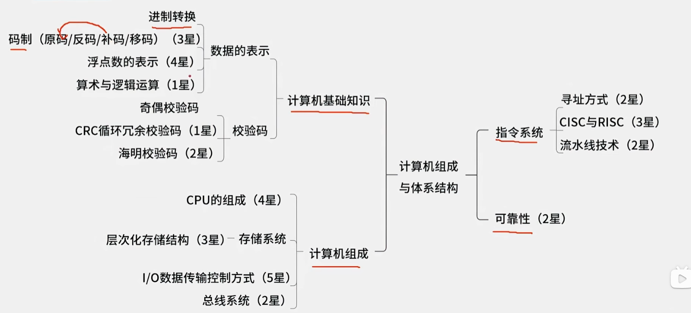

##### 进制

| 进制          | 基数 | 位权   |
| ------------- | ---- | ------ |
| 十进制（D）   | 10   | $10^k$ |
| 二进制（B）   | 2    | $2^k$  |
| 八进制（O）   | 8    | $8^k$  |
| 十六进制（H） | 16   | $16^k$ |

进制转换：

- 短除法：除以基数直到0，从新到上取余数
- 凑位权法：除位权，从高位到低位取商
- 按权展开法/加权法：各位数字用位权表示后相加（小数的位权为负值）
- 分组法/逆分组法：从低到高数位按基数分组，分别计算数值，从高到低取值

##### 码制

| 码制 | 正数           | 负数                       | 定点整数取值                  | 定点整数数码 | 订定小数取值                        | 定点小数数码 |
| ---- | -------------- | -------------------------- | ----------------------------- | ------------ | ----------------------------------- | ------------ |
| 原码 | 原值           | 原值                       | $-(2^{n-1}-1)$~$+(2^{n-1}-1)$ | $2^{n-1}$    | $-(1-2^{-(n-1)})$~$+(1-2^{-(n-1)})$ | $2^n-1$      |
| 反码 | 原值           | 原值符号位不变，其它位取反 | $-(2^{n-1}-1)$~$+(2^{n-1}-1)$ | $2^{n-1}$    | $-(1-2^{-(n-1)})$~$+(1-2^{-(n-1)})$ | $2^n-1$      |
| 补码 | 原值           | 反码符号位不变，其它位+1   | $-2^{n-1}$~$+(2^{n-1}-1)$     | $2^{n}$      | -1.0~$+(1-2^{-(n-1)})$              | $2^n$        |
| 移码 | 原值符号位取反 | 补码符号位取反             | $-2^{n-1}$~$+(2^{n-1}-1)$     | $2^{n}$      | -1.0~$+(1-2^{-(n-1)})$              | $2^n$        |

注：补码和移码，±0编码相同

注：负数补码->原码：符号位不变，数值位从右到左第一个1的左边一位开始取反  

重点：移码和补码可以达到-1.0

##### 浮点数

浮点数表示：$N=(数符)尾数×基数^{(阶符)阶码}$

运输过程：对阶>尾数计算>结果格式化

特点：

1. 对阶时小数向大数对齐
2. 对阶是较小数的尾数右移实现
3. 阶码位数决定表示范围
4. 尾数位数决定有效精度

二进制浮点数格式

| 阶符 | 阶码 | 数符 | 尾数 |
| ---- | ---- | ---- | ---- |


##### 算术逻辑

二进制中 1为真，0为假

- 与：(&,&&,*,·,∩,∧,AND)
- 或：(|,||,＋,∪,∨,OR)
- 非：(!,﹃,~,NOT,-)
- 异或：(XOR,⊕)

优先级：非>与>异或>或

&&或||可以进行短路

##### 校验码

- 奇偶校验：可以校验奇数个错误，不可纠错
- CRC循环冗余校验：可检测任意位数错误，不可纠错。发送方将信息位对多项式循环模2除法余数，得到校验位。接收方根据结石数据和多项式循环模2除法，余数为0则正确
- 海明校验：可检测任意位数错误，可纠错。
  - 计算校验码位数：$2^r>m+r+1$ m=信息位数，，计算校验码位数r
  - 计算校验码位置：校验码位置在$2^n$ n值为 0到r
  - 计算校验位值：信息位值进行凑权，获得使用那些校验位值；对使用了该校验位值的信息位数据进行连续异或，得到校验位值


##### CPU组成

cpu主要由运算器，控制器，寄存器组和内部总线等部件组成。

- 运算器
  - 算术逻辑单元ALU
  - 累加寄存器AC
  - 数据缓冲寄存器DR
  - 状态条件寄存器PSW
- 控制器
  - 程序计数器PC
  - 指令寄存器IR
  - 指令译码器ID
  - 地址寄存器AR
  - 时序部件

##### 层次化存储系统

寄存器 - > cache -> 内存(主存) -> 外存(辅存)

不可能三角：速度越来越慢，存储量越来越大，成本越来越低

内存与外存：存在虚拟存储体系

时间局部性：刚刚被访问数据理解被访问

空间局部性：刚刚被访问数据的临近数据很快被访问

分类：

- 位置分类：内存&外存
- 存取方式：
  - 按内容存取：cache
  - 按地址存取：
    - 随机存取存储器：内存
    - 顺序存取存储器：磁带
    - 直接存取存储器：磁盘
- 工作方式：
  - 随机存取存储器RAM：内存DRAM
  - 只读存储器ROM：BIOS


DRAM：动态随机存取存储器，需要刷新保持数据稳定，集成度高，成本低

SRAM：静态随机存取存储器吗，不需要刷新，集成度低，成本高

EEPROM：电可擦可编程存储器，按bit做读写，更灵活，读取速度远大于写入速度，属于ROM

flash：闪存，按块做读写，更快，属于ROM

##### Cache(高速缓存)

访问命中率：t~3~=h*t~1~+(1-h)*t~2~ ,其中$t~1~$为Cache的周期时间，t~2~为主存的周期时间，h为缓存的访问命中率

Cache与主存直接的地址映射由硬件自动完成。

直接关联映像：Cache与主存区划分为部分相同大小的页，每个主存区的页都只能映射到Cache的**相同页号**区域。设计简单，冲突率高

​	主存标记(7位)+Cache页号(4位)+页内地址(19位)，其中主存标记+Cache页号=主存页号，Cache页号+页内地址=Cache地址

全相连映射：主存的页可以**任意映射**到Cache的任意页中。设计复杂，冲突率低

​	主存页标记(11位)+页内地址(19位)

组相联映射：Cache与主存区划分为部分相同大小的页，每n页设置为一个组。组进行直接映射，组内页则是任意映射。折中办法

​	主存标记(7位)+Cache组号(3位)+组内页号(1位)+页内地址(19位)，主存标记+Cache组号+组内页号=主存页号，Cache组号+组内页号+页内地址=Cache地址

##### 主存编址

编址内容：存储单元的大小、位数。

​	按字编址：32bit

​	按字节编址：8bit

存储单元个数=最大地址-最小地址+1

总容量=存储单元*编址内容

芯片总片数=总容量/每片容量

##### IO数据传输的控制方式

- 程序控制查询方式：分位无条件传送和程序查询两种方式。方法简单，硬件开销小，但I/O能力不高，严重影响CPU的利用率
- 程序中断方式：即完成数据的传输准备后，发起程序中断，CPU无需等待
- DMA方式：为时序主存与外设之间高速批量数据交换而设置
- 通道方式
- I/O处理机

通常将CPU通过总线向微处理器外部（存储器或I/O接口）进行一次访问所需时间称为已过总线周期。

中断处理过程：

- CPU无敌等待也无需查询I/O状态
- 当I/O准备完成后，发出中断请求信号到CPU
- CPU接收中断请求信号后，保存正在执行程序的现场，被打断的当前程序位置为断点。
- 通过中断向量表（保存中断服务程序的入口地址），转入I/O中的服务程序的执行，完成I/O系统的数据传输
- 返回被打断的程序继续执行，恢复现场

##### 总线系统

- 芯片内总线：集成电路芯片内的总线，用户电路板内各元器件的连接
- 系统总线：也叫内总线，用户计算机各部分（CPU，内存，接口等）的连接
- 外总线：又叫通信总线，拥挤计算机与外设或计算机与计算机直接的连接或通信

CPU->主板->主板外

按通信方式可分为：

- 串行总线（数据按位依次传输）
- 并行总线（多位数据同时并行传输）

实现上可分为：

- PCI总线：目前微型机上广泛应用的**内总线**，**并行**传输
- SCSI总线：小型计算机系统接口的并行外总线，官方应用与连接软硬件的磁盘、光盘、扫描仪等

按传输内容：

- 数据总线(Data Bus，DB)：在CPU和RAM之间来回传输需要存储或处理的数据
- 地址总线(Address Bus,AB)：用于来指定在RAM之中存储的数据的地址
- 控制总线(Control Bus,CB)：将微处理控制单元的信号传输到周边设备

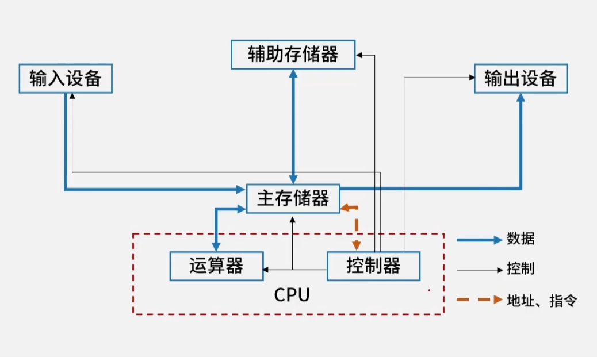

##### 寻址方式

一条指令就是机器语言的一个语句，是一组有意义的二进制代码

指令的基本格式：操作码字段+地址码字段

指令的生命周期：取指->分析->执行

CPU执行指令的过程，会根据时序部件发出的时钟信号就那些操作

在取指阶段读取的是指令；在分析和执行阶段如果需要操作数，则会读取操作数

故CPU据此来区分主存中的二进制编码的指令和数据

寻址方式：

- 立即寻址方式：操作数直接在指令中，速度快，灵活性差
- 主存直接寻址方式：指令中存入的是地址，指向存放操作数的主存
- 主存间接寻址方式：指令中存放的是地址，指向存放了操作数地址的主存
- 寄存器直接寻址方式：指令中存放的是地址，指向存放了操作数的寄存器
- 寄存器间接寻址方式：指令中存放的是地址，指向存放了操作数地址的寄存器

注：主存寻址偶尔**主存**名称会被忽略

##### CISC与RISC

| 指令系统类型                  | 指令                                                         | 寻址方式   | 实现方式                                                     | 其它                           |
| ----------------------------- | ------------------------------------------------------------ | ---------- | ------------------------------------------------------------ | ------------------------------ |
| **C**ISC  （complex 复杂的）  | 数量多，使用频率差别大，<br />**可变长格式**                 | 支持多种   | 微程序控制技术（微码）                                       | 研制周期长                     |
| **R**ISC   （Reduced 精简的） | 数量少，使用频率接近，**定长格式**，<br />大多位单走起指令，操作寄存器，<br />只有Load/Stroe操作内存 | 支持方式少 | 增加了通用寄存器；<br />硬布线逻辑控制为主；<br />适合采用流水线 | 优化编译<br />有效支持高级语言 |

##### 流水线技术

流水线计算：**流水线的总执行时间**，**流水线的吞吐率**，流水线加速比，流水线效率

流水线是指程序执行时多条指令重叠进行操作的准并行处理实现技术，即多条指令的不同部分同时处理，以提高部件的利用率和指令的平均执行速度

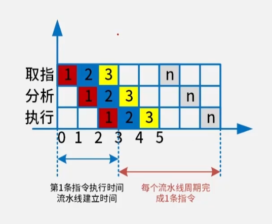

n条指令执行完成的流水线时间：t~max~*(n-1)+(t~1~+t~2~+t~3~)

流水线吞吐率：$TP=\frac{指令条数}{流水线执行时间}$

流水线最大吞吐率：$TP~max~=\lim_{x\to \infty} \frac{n}{(k+n-1)t~max~}=\frac{1}{t~max~}$

##### 可靠性

平均无故障时间：MTTF=1/λ λ为失效率

平均故障修复时间：MTTR=1/μ μ为修复率

平均故障间隔时间：MTBF=MTTF+MTTR

实际应用中，MTTR很小，故一般认为MTBF≈MTTF

可靠性：$\frac{MTTF}{1+MTTF}$

可维护性：$\frac{1}{1+MTTR}$

可用性：$\frac{MTBF}{1+MTBF}$

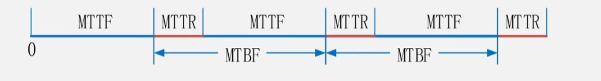

串联部件的可靠性=R~1~×R~2~×R~3~×...×R~i~	即各部件的可靠性乘积

并联部件的可靠性=1-(1-R~1~)×(1-R~2~)×(1-R~3~)×...(1-R~i~)	即1减各部件的失效率乘积

#### 操作系统


##### 操作系统的功能

1. 管理系统的硬件、软件、数据资源
2. 控制系统运行
3. 人机接口
4. 应用软件与硬件的接口

层级：硬件->操作系统->语言处理程序->应用程序

管理功能：进程管理、设备管理、存储管理、文件管理、作业管理

##### 特殊的操作系统

| 分类           | 特点                                                         |
| -------------- | ------------------------------------------------------------ |
| 批处理操作系统 | 单道批：一次一个作业入内存，作业由程序、数据、作业操作说明书组成<br />多道批：一次多个作业入内存，特点L：多道，宏观并行微观串行 |
| 分时操作系统   | 采用时间片轮转的方式为多个用户提供服务，每个用户都感觉独占系统<br />特点：多路行，及时性，独立性、交互性 |
| 实时操作系统   | 实时控制系统和实时信息系统<br />交互能力要求不高，可靠性要求高<br />规定时间内相应并处理 |
| 网络操作系统   | 方便有效共享网络资源，提高服务软件和有关协议的集合<br />主要的网络操作系统：Unix、Linux、WindowsServer |
| 分布式操作系统 | 任意两台计算机可以通过通信交换信息<br />是网络操作系统更高级形式，具有透明性、可靠性和高性能等特点 |
| 微机操作系统   | Windows：图像用户界面，多任务、多线程操作系统<br />Linux：免费和自由传播的类Unix操作系统，多用户、多任务、多线程、多CPU的操作系统 |
| 嵌入式操作系统 | 运行在智能芯片环境中<br />特点：微型化，可定制（针对硬件变化配置），实时性，可靠性，易移植性（HAL和BSP支持） |

##### 进程管理

程序与进程的区别

​	进程是程序的一次执行过程，没有程序就没有进程。

​	程序是静态的概念，进程是动态概念，由创建而生成，完成任务后因撤销而消亡。

进程是程序在已过数据集合上运行的过程，它是系统进行资源分配和调度的已过独立单位。进程由程序块、数据块、进程控制块（PCB）组成。

PCB是进程存在的唯一标志。内容包括进程标识符、状态、位置信息、队列指针（链接同一状态的进程）、优先级、现场保护区等。

进程与线程的资源共享

​	父资源，父子用，子资源，自己用。

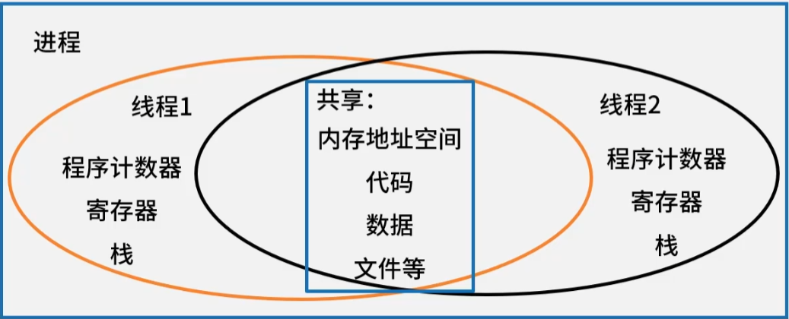

##### 进程的状态

进程状态：运行、阻塞、就绪

注：单处理机同时间只能有一个进程为运行态，进程只能由就绪态进入运行态


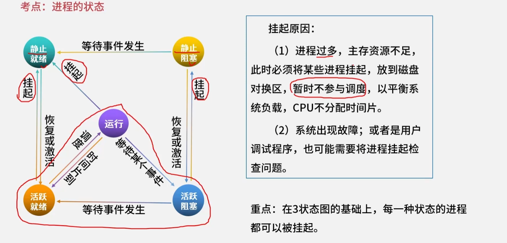

##### 信号量S、PV操作、前驱图

信号量S是一组特殊的变量，正数可以表示资源数量，负数可以表示等待队列长度

P操作：申请/锁定资源

V操作：释放/解锁资源

互斥模型：（打印机问题）

- S=初始资源数，为正数
- 先P操作，后V操作
- 不同类型进程直接也可以互斥
- 互斥资源同一时刻只允许一个进程使用

同步模型：（单缓冲区的生产者、消费者问题）

- S初始值为0
- 先V操作，后P操作
- 同一信号量的PV操作可以在不同进程

前驱图本质就是**同步**模型图

- 前驱图中有几条线就有几个信号量，且初始值都为0
- 对于节点，入线就是V操作，出线就是P操作

##### 死锁问题

死锁的四大条件：

- 互斥
- 保持和等待
- 不剥夺
- 环路等待

死锁的处理

- 死锁的预防（打破四大条件、有序资源分配法、静态资源分配）
- 死锁的避免（银行家算法：可利用资源向量Available、最大需求矩阵Max、分配矩阵Allocation、需求矩阵Need）
- 死锁的检测和解除
- 鸵鸟策略（不予理睬）

系统可能发生死锁的最大资源量：进程最大资源需求量-进程个数

系统不可能发生死锁的最小资源量：进程最大资源需求量-进程个数+1

##### 进程资源图


阻塞节点：当前资源不足以支持进程执行的节点

非阻塞节点：当前资源足以支持进程执行的节点

系统可化简：非阻塞节点执行完成后会私服所有资源，资源可再分配

系统死锁：无论怎样分配资源，都无法化简系统，就是死锁

注：对于资源，要看还剩多少；对于进程，要看还需要多少

##### 存储管理

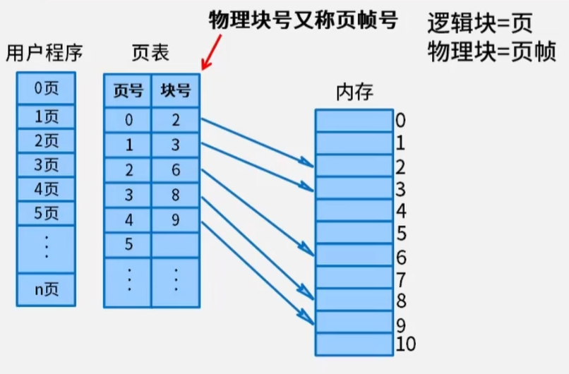

页式存储：

- 将程序和内存划分为大小相同的块，以页为单位将程序调入内存。
- 用页表记录程序和内存的地址映射
- 地址计算：逻辑地址(程序)=页号+页内地址；物理地址(内存)=页帧号+页内地址；只需要根据页表，映射页号和页帧号
- 优点：利用率高，碎片少，分配管理简单
- 缺点：增加系统开销；可能发生抖动现象

状态位：0-不在内存，1-在内存

访问位：0-未访问，1-已访问

修改位：0-未修改，1-已修改

页表淘汰规则：

- 必须在内存
- 未访问优先淘汰
- 未修改优先淘汰


段式存储：

- 按逻辑关系划分，调入内存
- 段长度可能都不同
- 段表映射逻辑地址(程序)和物理地址(内存)：段号+段长(数据长度)+基址(起始偏移量)
- 优点：多道程序共享内存，各程序修改互不影响
- 缺点：内存利用率低，内存碎片浪费大

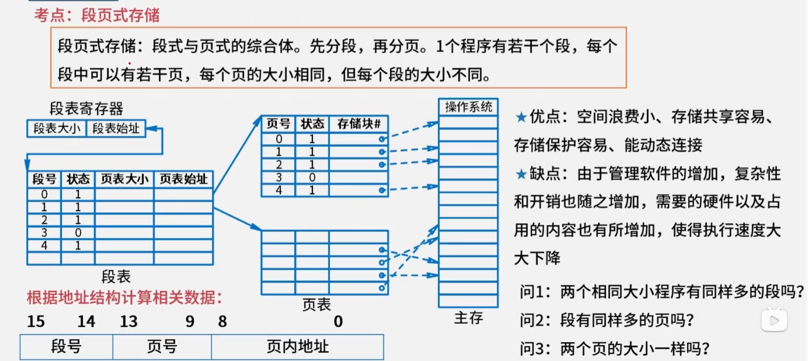

段页式存储：

- 先分段，再分页；页大小相同，段大小不同

##### 磁盘管理

磁盘由多个盘面组成，每个盘面上都有磁道，不同盘面的磁道组成柱面。

磁盘的存取时间=寻道时间(磁头径向移动时间)+等待时间(旋转延迟时间)+读取时间(传输时间)

寻道时间可以算法控制，等待时间和读取时间无算法可言。

移臂调度算法：(移动磁头的算法)

- 先来先服务(FCFS)：按照请求顺序移动磁头
- 最短寻道时间优先(SSTF)：优先移动到离当前磁头最近的磁道。磁道排序后，按最近依次移动
- 扫描算法(SCAN)：磁头来回移动，先扫到哪个就是哪个
- 循环扫描(CSCAN)：磁头单向移动，到头后，返回起始点继续

##### 设备管理

层次：

- 用户
- 设备无关程序
- 设备驱动程序
- 中断处理程序
- 硬件

##### 文件管理

文件：具有符号名、在逻辑上具有完整意义的一组相关信息项的集合。

逻辑结构：有结构的记录式文件（索引），无结构的流式文件（文本）

物理结构：连续结构、链接结构、索引结构、多个物理块的索引表

文件目录：

- 基本信息：文件名、物理地址、长度、块数等
- 存储控制信息：文件的存储权限，读写权限等
- 使用信息：建立日期、访问日期、打开文件的进程数等

目录结构：

- 一级目录结构：线性结构，查找速度慢、不允许重名和文件共享
- 二级目录结构：主文件目录（MFD）+用户目录（UFD）
- 三级目录结构：树形目录结构

##### 树形目录结构

绝对目录：从盘符开始的路径

相对路径：当前目录开始路径

全文件名：绝对路径+文件名

##### 索引文件结构

直接索引：索引节点指向的物理块，就是对应文件的逻辑块

一级间接索引:索引节点指向的物理块，存储了对应文件逻辑块的物理地址

二级间接索引：

三级间接索引：

根据索引计算文件的最大长度：（最高索引指向的文件地址-最低索引指向文件地址）*数据块大小

##### 位示图

位示图(bitmap)是磁盘物理块上存放信息bit的表格，一般为n*n的表格。

##### 文件权限

文件权限一般为4块：文件类型+所属用户权限(u)+所属组权限(g)+其它用户权限(o)

文件类型：d:代表为目录，-:代表为普通文件，l:代表为链接文件

权限：读权限（r 4），写权限（w 2），执行权限(x 1)

 - 查看文件所有者：ls -ahl
 - chown <用户名> <文件名>：修改文件所有者，或chown <用户名>:<用户组> <文件名>
 - chgrp <用户组> <文件名>：修改文件所在组，-R该目录下文件都修改
 - chmod <操作> <文件名>：修改文件权限，以+/-/=，为u/g/o/a变更r/w/x权限，或以4/2/1(读/写/运行)修改，如：chmod 751 <文件或目录>
 - ls -attr：显示档案隐藏属性。 -a将隐藏文件的属性也秀出来，-d如果连接的是目录，仅显示目录本身的属性，而非目录内的文件名， -R连同子目录的数据也一并列出来

#### 程序设计语言与语言处理程序基础

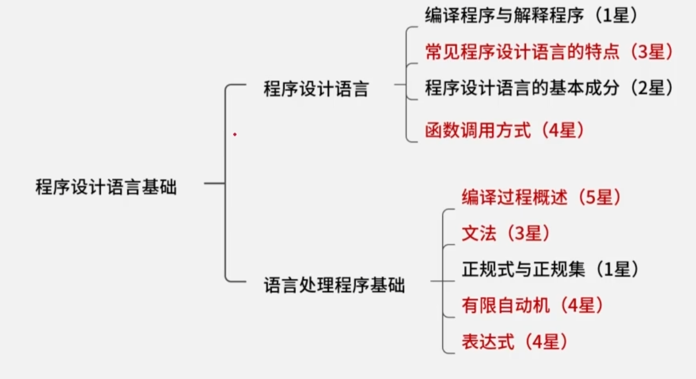


##### 编译型语言和解释型语言

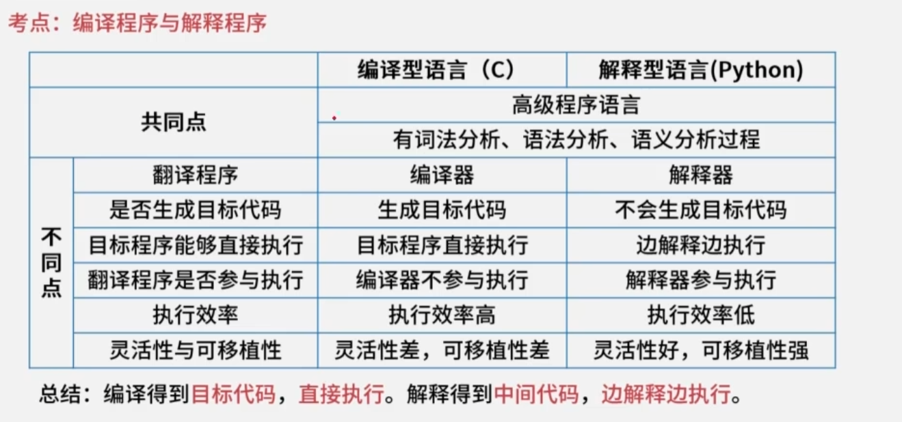

注：中间代码生成和代码优化都是可做可不做的

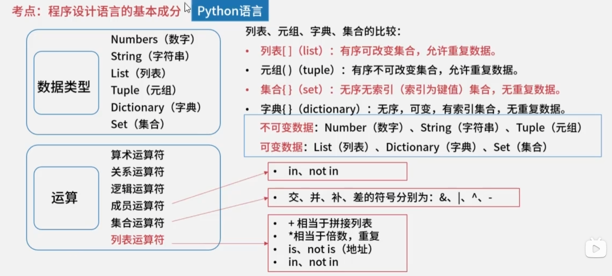

程序控制结构：顺序结构、调节结构、循环结构

函数的调用方式：

- 传值：传入数值，可以是变量、常量或表达式。不影响原方法的值
- 传址：只能传入地址。会影响原方法的值

##### 编译过程


- 词法分析：从左到右诸葛扫描**源程序**的字符，识别关键字、标识符、常数、运算符和分隔符。输出**记号流**
- 语法分析：根据语法规则将单词符号分解成各类语法单位，并分析源程序是否有语法上的错误。输出**语法树**
- 语义分析：进行类型分析和检查，主要检测源程序是否存在静态语义错误。是否类型不合法等

程序错误：

- 动态错误：发送在程序运行时。比如：除零异常、数组下标越界等
- 静态错误：编译时错误。比如：缺少结束标点，括号不匹配

中间代码：

- 后缀式
- 语法树
- 三地址码
- 四元式：运算符，运算对象1，运算对象2，运算结果

##### 文法（语法）

一个形式文法是由一个有序的四元组组成：G=（V,T,S,P）

V:非终结符有穷非空集合。是一个占位符，语法成分或语法变量

T:终结符有穷非空集合。是语言的组成部分，是最终结果。V∩T=∅

S:起始符。是语言的开始符号。是一个特殊的非终结符

P:产生式的有穷集合。用终结符替代非终结符的规则。

正则闭包：$A^+$=$A^1∪A^2∪A^3……∪A^n$(即所有幂的组合)

闭包：$A^*$=$A^0∪A^1∪A^2∪A^3……∪A^n$（在正则闭包基础上加上空）

文法的类型：

- 0型文法：也叫短语文法或无限制文法。只要求产生式左边至少包含一个非终结符。（最灵活的文法，广泛应用与编译器的各个阶段）
- 1型文法：也叫上下文有关文法。追加规则：产生式左边长度小于等于右边长度。（常用于描述上下文有关语言，也用于描述自然语言处理）
- 2型文法：也叫上下文无关文法。追加规则：产生式左边必须是非终结符。
- 3型文法：也叫正规文法或正则文法。追加规则：产生式右边最多两个字符，如果有二个字符必须是（终结符+非终结符）的格式，如果是一个字符，那么必须是终结符。（最简单的文法，最严格的限制，正则语言可以使用有限自动机来识别和生成）

##### 正规式与正规集

正规式（Regular Expression）与正规集（Regular Set）是形式语言与自动机理论中的核心概念，两者构成了描述词法单元（即编程语言中的单词符号，如标识符、常数、运算符等）的形式化基础。其定义及相互关系可结构化阐述如下。

 正规集的定义

正规集是一种**语言**，即一个**字符串的集合**。在编译原理的上下文中，它特指能被某类有限自动机（Finite Automaton）所识别（或接受）的所有字符串构成的集合1。例如，所有由字母开头的字母数字串（标识符）、所有十进制整数、所有由特定字符组成的运算符（如 `+`, `-`, `*`, `/`）等，各自构成一个正规集。程序设计语言中的合法单词集合，本质上就是正规集1。

正规式的定义

正规式（又称正则表达式）是一种**代数表达式**，用于**表示**正规集。它通过一组递归定义的运算符（并、连接、闭包）来形式化地描述字符串集合的模式。其形式定义通常基于一个给定的字母表 Σ：

1. **基础规则**：
   - **ε**（空串）是一个正规式，它表示仅包含空串的集合 `{ε}`。
   - 对于任意 **a ∈ Σ**，`a` 是一个正规式，它表示仅包含单个字符 `a` 的集合 `{a}`。
2. **归纳规则**：假设 `r` 和 `s` 是表示正规集 `L(r)` 和 `L(s)` 的正规式，那么：
   - **并（`|` 或 `+`）**：`(r|s)` 是一个正规式，表示集合 `L(r) ∪ L(s)`。
   - **连接（`.`常省略）**：`(rs)` 是一个正规式，表示集合 `L(r)L(s)`（即所有由 `L(r)` 中一个字符串后接 `L(s)` 中一个字符串构成的字符串集合）。
   - **闭包（`*`）**：`(r*)` 是一个正规式，表示集合 `(L(r))*`（即 `L(r)` 中字符串的零次或多次重复连接所构成的所有字符串的集合）。

正规式与正规集的等价关系

正规式与正规集之间存在一一对应的等价关系：**一个正规式唯一地确定一个正规集；反之，一个正规集可以由多个彼此等价的正规式来表示**1。这种等价性使得我们可以用简洁的代数表达式（正规式）来精确描述复杂的字符串集合（正规集）。例如，正规式 `(a|b)*` 表示的正规集是所有由字符 `a` 和 `b` 组成的任意长度（包括空串）的字符串集合。

 在词法分析中的应用

在编译器的词法分析阶段，正规式是描述各类词法单元模式的**标准工具**。为一种程序设计语言构建词法分析器（或称扫描器）的典型步骤如下：

1. **为每类词法单元定义正规式**：例如，标识符可定义为 `letter(letter|digit)*`，整数常数为 `digit digit*`（或 `digit+`）。
2. **合并为总正规式**：通过**或运算（`|`）** 将语言中所有词法单元的正规式连接起来，形成一个覆盖整个单词表的单一正规式1。
3. **转换为有限自动机**：利用算法（如Thompson构造法）将该总正规式转换为一个等价的**非确定有限自动机（NFA）**。
4. **确定化与最小化**：通过子集构造法将NFA转化为等价的**确定有限自动机（DFA）**，再对DFA进行状态最小化优化，以获得一个状态数最少、效率最高的识别器1。
5. **驱动词法分析**：最终的最小化DFA可以很容易地用程序（如二维数组表示的状态转移表）实现，从而高效地扫描源代码字符流，识别出一个个词法单元。

 与有限自动机的关联

正规式、正规集与有限自动机构成了形式语言中**正则语言**的三大等价描述模型：

1. **描述能力等价**：一个语言是正规集（正则语言），当且仅当它能被某个正规式描述，也当且仅当它能被某个有限自动机（DFA或NFA）识别。
2. **转换算法完备**：存在标准的算法可以在正规式、NFA、DFA三者之间进行相互转换。**NFA更易于人工根据正规式构造，而DFA则更易于程序实现**。通过“NFA确定化”和“DFA最小化”算法，可以获得一个状态数最少、识别效率最高的DFA用于词法分析1。

**结论**：正规式是用于**描述**词法模式的语法形式，正规集是这些模式所对应的**字符串集合**。它们是编译器词法分析阶段的理论基石，通过将其转化为确定有限自动机，为高效、准确的词法分析器实现提供了清晰且可自动化的路径。

##### 有限自动机

### 有限自动机的定义与核心模型

有限自动机（Finite Automaton, FA）是一种用于描述和识别**正则语言**（即正规集）的抽象计算模型。它是一个具有有限数量状态的系统，根据输入的符号序列，按照既定的规则在状态之间进行转移，最终根据停止时的状态是否属于“接受状态”来决定是否接受该输入串。在编译原理、形式语言理论和文本处理等领域，有限自动机是词法分析器的理论基础和实现工具23。

其形式化定义通常以一个**五元组** (Q, Σ, δ, q₀, F) 给出，其中各元素的含义如下表所示：

| 符号   | 含义                     | 说明与示例                                                   |
| :----- | :----------------------- | :----------------------------------------------------------- |
| **Q**  | 有限状态集合             | 自动机所有可能状态的集合，例如 Q = {q₀, q₁, q₂}。            |
| **Σ**  | 有限输入字母表           | 自动机可以接收的输入符号的集合，例如 Σ = {a, b}。            |
| **δ**  | 状态转移函数             | 定义了在当前状态和输入符号下，自动机将转移到哪个（或哪些）状态。这是区分不同类型FA的关键。 |
| **q₀** | 初始状态                 | q₀ ∈ Q，是自动机开始处理输入字符串时的起始状态。             |
| **F**  | 接受状态（终止状态）集合 | F ⊆ Q。当自动机处理完整个输入串后，若其最终状态落在F中，则**接受**该输入串；否则拒绝。一个DFA允许没有终止状态，但这样的自动机不接受任何字符串。 |

根据状态转移函数 **δ** 的不同性质，有限自动机主要分为两大类：**确定有限自动机（DFA）** 和 **非确定有限自动机（NFA）**。它们在定义能力和描述语言上是等价的，但在构造方式和运行机制上存在差异。

#### 1. 确定有限自动机（DETERMINISTIC FINITE AUTOMATON, DFA）

DFA是最基本、最直观的有限自动机模型。其核心特征是“确定性”，即对于任何一个状态和输入符号，下一步的状态是**唯一确定**的。

- **形式化定义**：对于一个DFA，其状态转移函数 δ 是一个**单值映射**：δ: Q × Σ → Q。这意味着给定当前状态和输入符号，有且只有一个下一个状态。
- **特点**：
  - 初态只有一个（q₀）。
  - 状态转移是单值的。
  - 不允许空转移（ε-转移），即不能在不消耗输入符号的情况下改变状态。

#### 2. 非确定有限自动机（NONDETERMINISTIC FINITE AUTOMATON, NFA）

NFA是DFA的推广，其核心特征是“非确定性”。这意味着在某个状态下，对于同一个输入符号（或空串），可能有**多个**可能的下一个状态，甚至可以不消耗输入符号就发生转移。

- **形式化定义**：对于一个NFA，其状态转移函数 δ 是一个**多值映射**：δ: Q × (Σ ∪ {ε}) → 2^Q（即映射到Q的幂集，一个状态集合）。这允许：
  1. 同一输入符号对应多个后继状态。
  2. 存在 ε-转移。
- **特点**：
  - 初态可以是一个集合（即可以有多个初始状态）。
  - 状态转移是多值的。
  - 允许 ε-转移。
- **与DFA的等价性及转换**：尽管NFA的定义更灵活、更易于人工根据正规式设计（例如使用Thompson构造法），但**任何NFA都可以转化为一个接受相同语言的DFA**。这通过“子集构造法”实现，其基本思想是将NFA的一组可能状态（一个状态集合）映射为DFA的一个**新状态**。证明DFA和NFA等价的算法，核心就是消除NFA在初态数量、转移函数单值性和ε-转移这三方面与DFA的差异。

#### 3. 有限自动机的应用与化简

- **在词法分析中的应用**：编译器词法分析器的核心就是一个DFA。首先用正规式描述各类单词（如标识符、关键字、常数），然后将这些正规式转化为一个NFA，再通过子集构造法确定化为DFA，最后对DFA进行最小化，得到最简状态机用于高效识别源代码中的词素。
- **DFA的最小化（化简）**：对于给定的DFA，可能存在多个等价的状态（即从这些状态出发，对于任何后续输入串，接受性完全相同）。最小化算法通过合并这些等价状态，得到一个状态数最少的、功能等价的DFA。这能显著减小状态转移表的规模，提高识别效率。一个经典的化简算法是“划分法”，它首先将状态划分为接受状态和非接受状态两个组，然后不断细分这些组，直到组内的状态在所有输入符号下都转移到相同的组内。

**总结**：有限自动机是一个由五元组定义的、状态有限的抽象机器。DFA以其确定性便于实现，NFA以其灵活性便于设计。二者在描述正则语言的能力上等价，并且存在系统的算法（子集构造法、最小化算法）进行相互转换和优化，这使其成为连接形式化描述（正规式）和实际识别程序（词法分析器）的关键桥梁。

##### 表达式

前缀表达式：运算符在前面

中缀表达式：运算符在中间

后缀表达式（逆波兰式）：运算符在最后。使用栈处理

#### 数据结构


##### 线性表

数组存储：静态分配的连续内存，灵活性差。读取快，查询、新增、删除慢

链表存储：不连续的内存，内存友好，但需要更多空间。查询、读取慢，新增、删除快

- 头指针：指向头节点的指针变量
- 头结点：首节点前的节点，存放链表首地址。方便删除、插入操作
- 首节点：第一个有效节点。
- 尾节点：最后一个有效节点。
- 尾指针：指向尾节点的指针变量。

链表的节点实际上是结构体变量，包括数据部分和存地址的指针变量。

链表类型：单向链表、循环链表、双向链表

队列：先进先出

栈：先进后出

##### 串

串是仅由字符构成的有限序列，是一种线性表。

空串：没有任何字符的串。

空白串：由空白字符组成的串。

子串：由串中任意长度的连续字符组成的序列。

子序列：不改变字符的相对位置，由串中字符组成的序列。

串比较：先比较串长度，长度长的较大，其次按字符顺序比较ASCII码，字符码值大的较大。

串相等：两个串部件长度相等，每个位置上的字符也相等。

##### 数组和矩阵

一维数组：

二维数组：按行存储、按列存储

多维数组：

注：下标一般从0 开始

稀疏矩阵：使用三元组表（行号，列号，元素值）表示。顺序存储使用**三元组顺序表**，链表存储使用**十字链表**。

### 二叉树：定义、结构与性质详解

二叉树是数据结构中一种非常重要且应用广泛的树形结构。它在计算机科学的诸多领域，如数据存储、算法设计（尤其是排序和搜索）、表达式解析、文件系统组织以及编译器设计中都扮演着核心角色。理解二叉树的精确定义是掌握其后续所有特性和算法的基础。

#### 一、 二叉树的精确定义

根据数据结构的标准定义，**二叉树**是满足以下两个条件的有限节点集合：

1. **可以为空**：该集合可以是一个没有任何节点的空树。
2. **若不为空，则它由根节点及互不相交的左子树和右子树组成，且左、右子树本身又都是二叉树**。

这个定义是递归的，它清晰地刻画了二叉树的层次和分支结构。每个节点最多有两个“孩子”，通常称为**左孩子**和**右孩子**。这种“最多两个分支”的限制，是二叉树与普通树最根本的区别。

为了更清晰地理解二叉树的结构组成，我们可以将其核心要素总结如下表：

| 组成部分      | 描述                                                         | 备注                                                     |
| :------------ | :----------------------------------------------------------- | :------------------------------------------------------- |
| **节点**      | 树的基本构成单位，用于存储数据元素和维持结构。               | 包含数据域和至多两个指针域 。                            |
| **根节点**    | 树的顶端节点，是访问整棵树的起点。                           | 一棵树有且仅有一个根节点。                               |
| **子树**      | 一个节点及其后代构成的树。                                   | 二叉树中，每个节点都拥有0个、1个或2个子树（左/右子树）。 |
| **父/子节点** | 若节点A直接连接到节点B，且A在上B在下，则A是B的父节点，B是A的子节点。 | 根节点没有父节点；叶子节点没有子节点。                   |
| **度**        | 一个节点拥有的子节点数。                                     | 二叉树的节点度 ≤ 2。                                     |
| **叶子节点**  | 度为0的节点，即没有子节点的节点。                            | 也称为终端结点。                                         |
| **深度/高度** | **深度**：从根节点到该节点的唯一路径上的边数（根深度为0或1，定义各异）。**高度**：从该节点到最远叶子节点的最长路径上的边数。 | 树的高度等于根节点的高度。                               |

#### 二、 二叉树的五种基本形态

基于定义，二叉树可以呈现以下五种基本形态，这体现了其结构的灵活性 34：

1. **空二叉树**。
2. **仅有根节点的二叉树**。
3. **只有根节点和左子树**（右子树为空）。
4. **只有根节点和右子树**（左子树为空）。
5. **具有根节点、左子树和右子树**。

#### 三、 两种特殊的二叉树

在众多二叉树形态中，有两种结构规整、性质鲜明的特殊类型：

1. **满二叉树**
   - **定义**：一棵深度为 `k` 的二叉树，如果其第 `1` 至第 `k` 层的所有节点都达到了最大数量，则称为满二叉树。
   - **特点**：深度为 `k` 的满二叉树，其节点总数为 `2^k - 1`。每一层的节点数都是上一层的两倍，所有叶子节点都出现在最底层。
2. **完全二叉树**
   - **定义**：深度为 `k` 的二叉树，其前 `k-1` 层是满的，且第 `k` 层的所有节点都**连续集中在最左边**。满二叉树是特殊的完全二叉树。
   - **重要性**：完全二叉树非常适合用**数组（顺序存储）** 来实现，因为可以通过下标公式方便地计算父子节点位置，从而节省指针的存储空间。

#### 四、 二叉树的主要性质（基于定义推导）

二叉树的定义蕴含了一系列重要的数学性质，这些性质是进行算法分析和设计的基础：

1. **性质1**：在二叉树的第 `i` 层上，至多有 `2^(i-1)` 个节点（`i≥1`）。
   - *推导*：由定义，每个节点最多有2个子节点，因此节点数逐层以2为倍数增长。
2. **性质2**：深度为 `k` 的二叉树，至多有 `2^k - 1` 个节点（`k≥1`）。
   - *推导*：对性质1中从第1层到第k层的最大节点数求和：`∑(i=1 to k) 2^(i-1) = 2^k - 1`。
3. **性质3**：对任何一棵二叉树，如果其叶子节点数为 `n0`，度为2的节点数为 `n2`，则 `n0 = n2 + 1`。
   - *推导*：设节点总数为 `n`，度为1的节点数为 `n1`。则有 `n = n0 + n1 + n2`。从分支数角度看，总分支数 `B = n - 1`（除根节点外，每个节点都有一个分支指向它）。同时，分支均由度为1或2的节点射出，故 `B = n1 + 2*n2`。联立两式可得 `n0 = n2 + 1`。
4. **性质4**：具有 `n` 个节点的完全二叉树，其深度 `k` 为 `⌊log₂n⌋ + 1`（向下取整）。
   - *推导*：由性质2，深度为 `k-1` 和 `k` 的满二叉树节点数范围是：`2^(k-1) - 1 < n ≤ 2^k - 1`，由此可推出 `k = ⌊log₂n⌋ + 1`。
5. **性质5**：对于一棵有 `n` 个节点的完全二叉树，如果按从上到下、从左到右的顺序对所有节点从1开始编号，则对任意节点 `i`（`1 ≤ i ≤ n`）有：
   - 如果 `i > 1`，则其父节点编号为 `⌊i/2⌋`。
   - 其左孩子节点编号为 `2*i`（如果 `2*i ≤ n`）。
   - 其右孩子节点编号为 `2*i + 1`（如果 `2*i + 1 ≤ n`）。
   - *应用*：此性质是**顺序存储**完全二叉树的理论基础。

#### 五、 二叉树的存储结构

二叉树的定义逻辑上清晰，在计算机中主要有两种物理存储方式：

1. **顺序存储**
   - **适用**：主要用于**完全二叉树**。
   - **方法**：用一组连续的存储单元（数组）按层序编号依次存放节点。对于非完全二叉树，需要空出不存在节点的位置，会造成空间浪费 36。
2. **链式存储**
   - **适用**：所有类型的二叉树，是最常用的存储方式。
   - **方法**：每个节点包含一个数据域和两个指针域，分别指向其左孩子和右孩子。

#### 六、 定义的应用：以表达式二叉树为例

二叉树的结构非常适合表示具有二元操作符的算术表达式，这直接体现了其定义中“根与左右子树”的递归结构 2。

- **规则**：表达式中的每个操作符作为一个根节点，其左、右子树分别是该操作符的左、右操作数（可以是数字或子表达式）。
- **示例**：表达式 `(a + b) * (c - d)` 对应的二叉树为：


```
        *
       / \
      +   -
     / \ / \
    a  b c  d
```

综上所述，二叉树的定义——“一个根节点加上两棵互不相交的二叉树左子树和右子树”——虽然简洁，却奠定了其整个理论体系的基石。从这个递归定义出发，可以自然地推导出其形态、性质、存储方式以及广泛的应用场景。无论是简单的数据组织，还是复杂的算法如哈夫曼编码、二叉搜索树、堆排序和线段树，其本质都建立在这一清晰而强大的结构定义之上。

### 二叉树遍历：递归、迭代与层序遍历详解

二叉树遍历是访问树中所有节点，且每个节点仅访问一次的过程。根据访问根节点、左子树、右子树的先后顺序，主要分为**前序遍历**、**中序遍历**、**后序遍历**三种深度优先遍历（DFS），以及**层序遍历**这一广度优先遍历（BFS）。掌握这些遍历方法对于操作二叉树数据结构至关重要。

#### 一、 四种核心遍历方式的定义与访问顺序

下表清晰对比了四种基本遍历方式的定义与节点访问顺序：

| 遍历方式     | 定义（递归描述）                                        | 节点访问顺序（简称） | 典型应用场景                                                 |
| :----------- | :------------------------------------------------------ | :------------------- | :----------------------------------------------------------- |
| **前序遍历** | 1. 访问根节点。 2. 前序遍历左子树。 3. 前序遍历右子树。 | **根 -> 左 -> 右**   | 复制整个树结构；获取前缀表达式（波兰式）。                   |
| **中序遍历** | 1. 中序遍历左子树。 2. 访问根节点。 3. 中序遍历右子树。 | **左 -> 根 -> 右**   | 对二叉搜索树（BST）进行排序输出。                            |
| **后序遍历** | 1. 后序遍历左子树。 2. 后序遍历右子树。 3. 访问根节点。 | **左 -> 右 -> 根**   | 释放二叉树内存；计算表达式树的值；获取后缀表达式（逆波兰式）。 |
| **层序遍历** | 从根节点开始，逐层、从左到右访问所有节点。              | **按层从左到右**     | 按层级打印树结构；寻找最短路径（如二叉树的最小深度）。       |

#### 二、 递归实现（最直观的方法）

递归实现直接对应遍历的递归定义，代码简洁易懂，是理解遍历逻辑的基础。

```
// 二叉树节点的链式存储结构定义 [ref_3][ref_6]
typedef struct TreeNode {
    int val;
    struct TreeNode *left;
    struct TreeNode *right;
} TreeNode;

// 1. 前序遍历 (递归)
void preorderTraversal_Recursive(TreeNode* root) {
    if (root == NULL) return; // 递归基：空树
    printf("%d ", root->val); // 访问根节点
    preorderTraversal_Recursive(root->left); // 递归遍历左子树
    preorderTraversal_Recursive(root->right); // 递归遍历右子树
} // [ref_4][ref_5]

// 2. 中序遍历 (递归)
void inorderTraversal_Recursive(TreeNode* root) {
    if (root == NULL) return;
    inorderTraversal_Recursive(root->left); // 递归遍历左子树
    printf("%d ", root->val); // 访问根节点
    inorderTraversal_Recursive(root->right); // 递归遍历右子树
} // [ref_3][ref_6]

// 3. 后序遍历 (递归)
void postorderTraversal_Recursive(TreeNode* root) {
    if (root == NULL) return;
    postorderTraversal_Recursive(root->left); // 递归遍历左子树
    postorderTraversal_Recursive(root->right); // 递归遍历右子树
    printf("%d ", root->val); // 访问根节点
} // [ref_4][ref_5]
```

**递归的优缺点**：

- **优点**：代码简洁，逻辑清晰，与数学定义完美对应。
- **缺点**：递归深度受限于函数调用栈，对于深度很大的树可能导致栈溢出。

#### 三、 迭代实现（使用栈模拟递归）

迭代法通过显式地使用栈来模拟递归调用栈的过程，避免了递归可能带来的栈溢出问题，是更工程化的实现方式。

**前序遍历迭代法**：核心是“访问根节点后，先右后左入栈”，以保证出栈时是“根->左->右”的顺序。

```
// 前序遍历 (迭代，使用栈)
void preorderTraversal_Iterative(TreeNode* root) {
    if (root == NULL) return;
    TreeNode* stack[100]; // 简易栈实现
    int top = -1;
    stack[++top] = root; // 根节点入栈

    while (top >= 0) {
        TreeNode* node = stack[top--]; // 弹出栈顶节点
        printf("%d ", node->val); // 访问

        // 先右后左入栈，保证左子树先被访问
        if (node->right != NULL) stack[++top] = node->right; // [ref_4]
        if (node->left != NULL) stack[++top] = node->left;
    }
}
```

**中序遍历迭代法**：需要借助指针`cur`进行遍历，核心思想是“一路向左到底，然后处理节点，再转向右子树” 。

```
// 中序遍历 (迭代，使用栈)
void inorderTraversal_Iterative(TreeNode* root) {
    TreeNode* stack[100];
    int top = -1;
    TreeNode* cur = root;

    while (cur != NULL || top >= 0) {
        // 1. 一路向左，将经过的节点全部入栈
        while (cur != NULL) {
            stack[++top] = cur;
            cur = cur->left;
        }
        // 2. 弹出栈顶节点并访问（此时它是“最左”的节点）
        cur = stack[top--];
        printf("%d ", cur->val); // 访问
        // 3. 转向右子树
        cur = cur->right; // [ref_3][ref_6]
    }
}
```

**后序遍历迭代法**：可以利用前序遍历的变体（根->右->左），然后反转结果得到（左->右->根）。更经典的方法是记录上一个访问的节点，以判断右子树是否已处理 。

```
// 后序遍历 (迭代，使用栈和prev指针)
void postorderTraversal_Iterative(TreeNode* root) {
    if (root == NULL) return;
    TreeNode* stack[100];
    int top = -1;
    TreeNode* cur = root;
    TreeNode* prev = NULL; // 记录上一个访问的节点

    while (cur != NULL || top >= 0) {
        // 1. 一路向左到底
        while (cur != NULL) {
            stack[++top] = cur;
            cur = cur->left;
        }
        // 2. 查看栈顶节点
        TreeNode* peekNode = stack[top];
        // 3. 如果右子树存在且未被访问过，则转向右子树
        if (peekNode->right != NULL && peekNode->right != prev) {
            cur = peekNode->right;
        } else {
            // 4. 否则，弹出栈顶节点并访问
            printf("%d ", peekNode->val);
            prev = peekNode; // 更新前驱节点
            top--; // [ref_4][ref_5]
        }
    }
}
```

#### 四、 层序遍历实现（使用队列）

层序遍历需要用到**队列**（FIFO）这一数据结构，按层级顺序访问节点。

```
// 层序遍历 (使用队列)
void levelOrderTraversal(TreeNode* root) {
    if (root == NULL) return;
    TreeNode* queue[100]; // 简易队列实现
    int front = 0, rear = 0;
    queue[rear++] = root; // 根节点入队

    while (front < rear) {
        int levelSize = rear - front; // 当前层的节点数
        for (int i = 0; i < levelSize; i++) {
            TreeNode* node = queue[front++]; // 出队
            printf("%d ", node->val); // 访问

            // 将下一层节点从左到右入队
            if (node->left != NULL) queue[rear++] = node->left;
            if (node->right != NULL) queue[rear++] = node->right; // [ref_3][ref_5]
        }
        printf("\n"); // 可选：按层换行
    }
}
```

#### 五、 进阶：MORRIS遍历算法

Morris遍历是一种**空间复杂度为O(1)**的遍历算法，它通过临时修改叶子节点的空指针（线索化）来记录回溯路径，从而无需使用栈或递归栈 26。

**Morris中序遍历算法思想**：

1. 如果当前节点的左孩子为空，则访问当前节点并将其右孩子作为当前节点。
2. 如果当前节点的左孩子不为空：
   - 找到当前节点在中序遍历下的**前驱节点**（即左子树中最右侧的节点）。
   - 如果前驱节点的右孩子为空，将其右孩子指向当前节点（建立线索），然后将当前节点更新为其左孩子。
   - 如果前驱节点的右孩子已经是当前节点（说明左子树已访问完），则断开线索，访问当前节点，然后将当前节点更新为其右孩子。

```
// Morris 中序遍历 (O(1)空间)
void morrisInorderTraversal(TreeNode* root) {
    TreeNode *cur = root, *pre = NULL;
    while (cur != NULL) {
        if (cur->left == NULL) {
            // 情况1：没有左孩子，直接访问并转向右孩子
            printf("%d ", cur->val);
            cur = cur->right;
        } else {
            // 情况2：有左孩子，找到中序前驱节点pre
            pre = cur->left;
            while (pre->right != NULL && pre->right != cur) {
                pre = pre->right;
            }
            if (pre->right == NULL) {
                // 情况2a：建立线索，并继续探索左子树
                pre->right = cur; // 建立线索
                cur = cur->left;
            } else {
                // 情况2b：线索已存在，说明左子树已访问完
                pre->right = NULL; // 断开线索
                printf("%d ", cur->val); // 访问当前节点
                cur = cur->right; // 转向右子树
            }
        }
    } // [ref_2][ref_6]
}
```

**Morris遍历的优缺点**：

- **优点**：极致节省空间，适合内存严格受限的环境。
- **缺点**：在遍历过程中修改了树的结构（尽管最后会恢复），逻辑较复杂，且只适用于遍历，不能同时进行其他复杂操作。

#### 六、 应用实例：表达式树的求值

遍历是操作二叉树的基础。例如，给定一个表达式二叉树（操作数为叶子节点，操作符为内部节点）：

- **后序遍历**可以用于求值：当访问到一个操作符节点时，它的两个操作数（子树的求值结果）已经计算完毕。

```
// 假设节点值：整数或字符‘+’, ‘-’, ‘*’, ‘/’
int evaluateExpressionTree(TreeNode* root) {
    if (root == NULL) return 0;
    // 如果是叶子节点（操作数），返回其值
    if (root->left == NULL && root->right == NULL) {
        return root->val - '0'; // 简单处理，假设是字符数字
    }
    // 后序遍历：先计算左右子树
    int leftVal = evaluateExpressionTree(root->left);
    int rightVal = evaluateExpressionTree(root->right);
    // 根据操作符计算当前子树的值
    switch (root->val) {
        case '+': return leftVal + rightVal;
        case '-': return leftVal - rightVal;
        case '*': return leftVal * rightVal;
        case '/': return leftVal / rightVal; // 假设除数不为0
        default: return 0;
    }
} // 此例展示了后序遍历如何自然地用于表达式求值
```

总结，二叉树的遍历是理解和操作二叉树的核心。递归法直观，迭代法稳健，层序遍历适用于广度优先的场景，而Morris算法则在空间效率上做到了极致。在实际应用中，应根据具体场景（如树的结构、内存限制、是否需要保留树结构等）选择合适的遍历方法 。

##### 二叉排序树（查找二叉树）

二叉树节点的值：左节点值<根节点值<右节点值

插入节点：从根节点开始，根据规则向下查找，直到合适的节点作为它的子节点。

相同的数据，因为插入顺序不同，构建的树也不同。

##### 哈夫曼树（最优二叉树）

### 哈夫曼树的定义

哈夫曼树（Huffman Tree），也称为最优二叉树或最优搜索树，是一种特殊的二叉树。其核心定义围绕**带权路径长度（Weighted Path Length, WPL）** 最小化这一目标展开。

#### 一、 核心概念与定义

要精确定义哈夫曼树，需要先理解以下几个基础概念：

1. **路径与路径长度**：
   - **路径**：从树中一个节点到另一个节点之间的分支序列。
   - **路径长度**：路径上的分支数目（或边数）。在二叉树中，从根节点到某节点的路径长度，即为该节点的**层数（深度）**。
2. **节点的权与带权路径长度**：
   - **节点的权**：赋予树中每个叶子节点的一个有意义的非负数值，通常表示字符出现的频率、信息的重要性等。
   - **节点的带权路径长度**：从树的根节点到该叶子节点的路径长度 `L` 与该节点权值 `W` 的乘积，即 `WPL_node = L * W`。
3. **树的带权路径长度（WPL）**：
   - 树中**所有叶子节点**的带权路径长度之和。它是衡量一棵二叉树“代价”或“效率”的关键指标。
   - 公式：`WPL_tree = Σ (第 i 个叶子节点的权值 W_i * 其路径长度 L_i)`

基于以上概念，哈夫曼树的**正式定义**可以表述为：
**给定 n 个权值 {w₁, w₂, …, wₙ} 作为 n 个叶子节点，构造一棵二叉树。若该树的带权路径长度（WPL）达到最小，则称这样的二叉树为最优二叉树，也称为哈夫曼树**。

换言之，哈夫曼树是**带权路径长度最短**的二叉树。这种“最优”特性使其在数据压缩编码领域具有无可替代的价值。

#### 二、 哈夫曼树的特点与性质

根据定义和构造过程，哈夫曼树具有以下鲜明特点：

1. **没有度为1的节点**：哈夫曼树是一棵严格的二叉树，每个非叶子节点都有且只有两个子节点。这是因为构造过程中，总是由两个节点合并产生一个新的父节点。
2. **n个叶子节点对应 (2n-1) 个总节点**：给定 n 个带权叶子节点，构造出的哈夫曼树总共有 `2n-1` 个节点。
3. **权值越大的节点离根越近**：这是哈夫曼树实现WPL最小的直观体现。为了最小化 `WPL = Σ(W_i * L_i)`，权值 `W_i` 大的节点，其路径长度 `L_i` 应尽可能小，因此被放置在离根节点更近的位置。
4. **不唯一性**：在构造过程中，如果出现权值相同的节点，合并的先后顺序可能不同，从而导致树的结构不同，但它们的WPL是相同的且都是最小值。因此，对于同一组权值，哈夫曼树的形态可能不唯一，但最优的WPL值是唯一的。

为了更清晰地展示哈夫曼树与普通二叉树的区别，下表进行了对比：

| 特性         | 哈夫曼树 (最优二叉树)                     | 普通二叉树 (如完全二叉树、搜索树)          |
| :----------- | :---------------------------------------- | :----------------------------------------- |
| **构造目标** | **最小化树的带权路径长度(WPL)**           | 满足特定结构（如左<根<右）、存储或查找效率 |
| **节点度**   | **没有度为1的节点**（全是度为0或2的节点） | 可能有度为1的节点                          |
| **权值分布** | **权值大的节点靠近根节点**                | 权值/键值与节点位置无直接优化关系          |
| **应用核心** | **数据压缩（哈夫曼编码）**、最短判定过程  | 数据存储、排序、快速查找                   |

#### 三、 构造哈夫曼树的算法（贪心策略）

哈夫曼树的构造采用经典的**贪心算法**，其步骤清晰且易于实现：

1. **初始化**：将给定的 `n` 个权值看作 `n` 棵独立的二叉树（每棵树只有一个根节点，即叶子节点），构成一个森林 `F`。
2. **选择与合并**：
   - 从森林 `F` 中选出**两棵根节点权值最小的树**作为左右子树。
   - 构造一棵新的二叉树，其根节点的权值为这两棵树根节点权值之和。
   - 将这棵新树加入到森林 `F` 中，同时从 `F` 中删除那两棵被选中的旧树。
3. **重复**：重复步骤2，直到森林 `F` 中只剩下一棵树为止。这棵树就是哈夫曼树。

#### 四、 代码实现（C语言示例）

以下是用C语言实现哈夫曼树构造的代码，清晰地体现了上述算法步骤 ：

```
#include <stdio.h>
#include <stdlib.h>

// 哈夫曼树节点结构定义 [ref_3]
typedef struct HuffmanNode {
    int weight;                 // 权值
    struct HuffmanNode *left;   // 左孩子指针
    struct HuffmanNode *right;  // 右孩子指针
} HuffmanNode;

// 辅助结构：用于森林（最小堆或数组）管理
typedef struct {
    HuffmanNode** nodes;        // 指向节点指针数组的指针
    int size;                   // 当前森林中树的数量
} Forest;

// 函数：从森林中选择并移除两个权值最小的树 [ref_2]
void selectTwoMin(Forest* f, HuffmanNode** min1, HuffmanNode** min2) {
    // 这里使用简单的线性查找演示原理，实际可用最小堆优化 [ref_3]
    int idx1 = 0, idx2 = 1;
    if (f->nodes[idx1]->weight > f->nodes[idx2]->weight) {
        idx1 = 1; idx2 = 0;
    }
    for (int i = 2; i < f->size; i++) {
        if (f->nodes[i]->weight < f->nodes[idx1]->weight) {
            idx2 = idx1;
            idx1 = i;
        } else if (f->nodes[i]->weight < f->nodes[idx2]->weight) {
            idx2 = i;
        }
    }
    *min1 = f->nodes[idx1];
    *min2 = f->nodes[idx2];
    // 移除选中的两棵树（用最后一棵树覆盖）
    f->nodes[idx1] = f->nodes[f->size - 1];
    // 如果idx2指向了被覆盖的位置，需要调整
    if (idx2 == f->size - 1) idx2 = idx1;
    f->nodes[idx2] = f->nodes[f->size - 2];
    f->size -= 2;
}

// 函数：构造哈夫曼树 [ref_4][ref_6]
HuffmanNode* buildHuffmanTree(int weights[], int n) {
    if (n <= 0) return NULL;

    // 1. 初始化：创建n个单独的节点作为初始森林
    Forest forest;
    forest.size = n;
    forest.nodes = (HuffmanNode**)malloc(n * sizeof(HuffmanNode*));
    for (int i = 0; i < n; i++) {
        forest.nodes[i] = (HuffmanNode*)malloc(sizeof(HuffmanNode));
        forest.nodes[i]->weight = weights[i];
        forest.nodes[i]->left = forest.nodes[i]->right = NULL;
    }

    // 2. 重复选择与合并，直到森林中只剩一棵树
    while (forest.size > 1) {
        HuffmanNode *min1, *min2;
        selectTwoMin(&forest, &min1, &min2); // [ref_2]

        // 创建新节点，其权值为两者之和
        HuffmanNode* newNode = (HuffmanNode*)malloc(sizeof(HuffmanNode));
        newNode->weight = min1->weight + min2->weight;
        newNode->left = min1;
        newNode->right = min2; // [ref_5]

        // 将新节点加入森林
        forest.nodes[forest.size] = newNode;
        forest.size++;
    }

    HuffmanNode* root = forest.nodes[0]; // 最后的根节点
    free(forest.nodes);
    return root;
}

// 辅助函数：计算哈夫曼树的WPL (用于验证) [ref_5]
int calculateWPL(HuffmanNode* root, int depth) {
    if (root == NULL) return 0;
    // 如果是叶子节点，贡献其带权路径长度
    if (root->left == NULL && root->right == NULL) {
        return root->weight * depth;
    }
    // 否则，递归计算左右子树
    return calculateWPL(root->left, depth + 1) + calculateWPL(root->right, depth + 1);
}

int main() {
    int weights[] = {5, 2, 4, 7}; // 对应示例中的权值
    int n = sizeof(weights) / sizeof(weights[0]);

    HuffmanNode* huffmanTree = buildHuffmanTree(weights, n);
    printf("哈夫曼树构造完成。\n");
    printf("该树的带权路径长度(WPL)为: %d\n", calculateWPL(huffmanTree, 0));
    // 注意：实际应用中需添加内存释放代码
    return 0;
}
```

#### 五、 核心应用：哈夫曼编码

哈夫曼树最著名的应用是**哈夫曼编码**，它是一种用于数据压缩的**前缀编码**。

- **编码生成**：在构造好的哈夫曼树中，规定指向左孩子的分支代表‘0’，指向右孩子的分支代表‘1’。从根节点到每个叶子节点的路径上遇到的‘0’和‘1’序列，即为该叶子节点对应字符的哈夫曼编码。
- **前缀特性**：由于哈夫曼树中每个字符都是叶子节点，没有一个编码是另一个编码的前缀，这保证了编码解码的无二义性。
- **最优性**：哈夫曼编码是**平均编码长度最短**的二进制前缀编码，其平均长度等于哈夫曼树的WPL除以总权值（总频率）。这正是哈夫曼树最小化WPL特性在信息论中的直接体现。

总结，哈夫曼树是一种通过贪心策略构造的、带权路径长度最小的二叉树。其定义的核心在于“最优”，性质独特，构造算法清晰，并且是产生高效无损压缩编码——哈夫曼编码的理论基础。

图是计算机科学中用于表示复杂关系的一种非线性数据结构。它由**顶点**（或节点）的集合和连接这些顶点的**边**的集合组成，广泛应用于社交网络、路径规划、网络拓扑等领域 23。

### 一、 图的定义与基本概念

#### 1. 图的定义

一个图 `G` 可以形式化地定义为二元组 `G = (V, E)`：

- **V (Vertex Set)**：一个**非空**的顶点集合。
- **E (Edge Set)**：一个顶点对（或二元组）的集合，表示顶点之间的关系。每条边 `e ∈ E` 可以表示为 `(u, v)`，其中 `u, v ∈ V` 。

#### 2. 图的基本类型与术语

根据边的性质，图可以分为以下几类：

| 类型         | 描述                                                         | 特点                         |
| :----------- | :----------------------------------------------------------- | :--------------------------- |
| **无向图**   | 边没有方向，`(u, v)` 和 `(v, u)` 表示同一条边。              | 边表示双向关系，如好友关系。 |
| **有向图**   | 边有方向，`<u, v>` 表示从 `u` 指向 `v` 的弧。                | 边表示单向关系，如网页链接。 |
| **简单图**   | 无自环（顶点到自身的边）且无平行边（两顶点间多条同向边）。   | 最常见的研究模型。           |
| **完全图**   | 任意两个不同顶点之间都恰有一条边。无向完全图有 `n(n-1)/2` 条边。 | 边数达到最大。               |
| **连通图**   | （针对无向图）图中任意两个顶点都是连通的（存在路径）。       | 非连通图由多个连通分量组成。 |
| **强连通图** | （针对有向图）图中任意两个顶点都是双向可达的。               | 要求更高。                   |

其他重要概念还包括**顶点的度**（与该顶点关联的边数）、**路径**、**环**、**子图**、**生成树**等 。

### 二、 图的存储结构

图的存储结构需要高效地表示顶点和边的关系。主要有以下两种方式：

#### 1. 邻接矩阵

使用一个 `n x n` 的二维数组（矩阵）`matrix` 来表示 `n` 个顶点的图。

- **无权图**：`matrix[i][j] = 1` 表示顶点 `i` 到 `j` 有边，`0` 表示无边 。
- **带权图**：`matrix[i][j]` 存储边的权值，用一个特殊值（如 `INF`）表示无边 。

**特点** ：

- **优点**：实现简单，直观；可以快速判断任意两个顶点间是否有边。
- **缺点**：空间复杂度为 `O(n²)`，稀疏图空间浪费大；添加或删除顶点操作成本高。

#### 2. 邻接表

为每个顶点建立一个单链表，链表中存储与该顶点**直接相邻**的所有顶点（对于有向图，通常存储出边邻接点）。

**特点**：

- **优点**：空间复杂度为 `O(|V| + |E|)`，特别适合存储稀疏图；易于找到某个顶点的所有邻接点。
- **缺点**：判断任意两个顶点间是否有边，需要遍历链表，效率较低。

#### 3. 存储结构对比

| 特性                     | 邻接矩阵                     | 邻接表                     |
| :----------------------- | :--------------------------- | :------------------------- |
| **空间复杂度**           | `O(                          | V                          |
| **查边 (u, v) 是否存在** | `O(1)`                       | `O(deg(u))` 或 `O(deg(v))` |
| **遍历顶点所有邻接点**   | `O(                          | V                          |
| **适用场景**             | 稠密图，频繁判断任意两点关系 | 稀疏图，频繁遍历邻接点     |
| **添加/删除顶点**        | 代价高（需调整矩阵大小）     | 相对容易                   |

### 三、 图的遍历算法

图的遍历是指从图中某一顶点出发，按照某种规则访问图中所有顶点，且每个顶点仅被访问一次。两种最基础的遍历算法是**深度优先搜索**和**广度优先搜索**。

#### 1. 深度优先遍历

深度优先遍历沿着图的边深入探索，直到无法继续，然后回溯到上一个顶点，选择另一条未探索的路径继续 46。

**算法思想（递归实现）**：

1. 从起始顶点 `v` 开始，访问 `v` 并标记为已访问。
2. 依次检查 `v` 的每一个未访问过的邻接顶点 `w`。
3. 递归地对 `w` 进行深度优先遍历。
4. 当 `v` 的所有邻接顶点都被访问后，回溯。

#### 2. 广度优先遍历

广度优先遍历以“层次”的方式访问顶点，先访问起始顶点的所有邻接点，再访问这些邻接点的邻接点，以此类推 46。

**算法思想（队列辅助实现）**：

1. 从起始顶点 `v` 开始，访问 `v` 并标记，然后将 `v` 入队。
2. 当队列非空时，取出队首顶点 `u`。
3. 依次访问 `u` 的所有未访问的邻接顶点 `w`，访问后标记并入队。
4. 重复步骤2和3，直到队列为空。

#### 3. 遍历算法对比与应用

| 特性                     | 深度优先遍历 (DFS)                             | 广度优先遍历 (BFS)                     |
| :----------------------- | :--------------------------------------------- | :------------------------------------- |
| **数据结构**             | 栈（递归或显式栈）                             | 队列                                   |
| **访问顺序**             | 类似树的先序遍历                               | 类似树的层次遍历                       |
| **空间复杂度**           | `O(                                            | V                                      |
| **时间复杂度（邻接表）** | `O(                                            | V                                      |
| **典型应用**             | 拓扑排序、连通分量检测、寻找路径、解决迷宫问题 | 最短路径（无权图）、广播网络、层次分析 |

**应用场景示例**：

- **社交网络好友推荐（BFS）**：从你的账号出发，BFS可以逐层发现一度好友、二度好友等，适合寻找最短社交距离。
- **迷宫求解（DFS）**：探索迷宫时，DFS适合尝试一条路走到黑，如果遇到死路再回溯，常用于寻找一条可行路径。
- **检查图的连通性（DFS/BFS）**：从一个顶点出发进行遍历，如果能访问所有顶点，则图是连通的（无向图）34。

### 图的拓扑排序

拓扑排序是针对**有向无环图**（Directed Acyclic Graph, DAG）的顶点进行线性排序，使得对于图中的每一条有向边 `(u, v)`，顶点 `u` 在排序中都出现在顶点 `v` 之前。它反映了顶点之间的依赖关系，常用于任务调度、课程安排等场景。

#### 算法思想与步骤（KAHN算法）

Kahn算法基于**入度**的概念，使用队列实现，是一种广度优先的策略。

**核心步骤**：

1. **初始化**：计算图中每个顶点的入度（指向该顶点的边的数量）。
2. **入队**：将所有入度为0的顶点加入一个队列（或栈）。
3. **处理队列**：
   a. 从队列中取出一个顶点 `u`，并将其输出到拓扑序列中。
   b. 遍历顶点 `u` 的所有邻接顶点 `v`，将 `v` 的入度减1（相当于“移除”边 `(u, v)`）。
   c. 如果某个邻接顶点 `v` 的入度减为0，则将其加入队列。
4. **循环**：重复步骤3，直到队列为空。
5. **检查**：如果输出的顶点数等于图中顶点总数，则排序成功；否则，说明图中存在环，无法进行拓扑排序。

------

### 最小生成树

最小生成树（Minimum Spanning Tree, MST）是在一个**连通无向带权图**中，找到一棵包含所有顶点的树，使得树上所有边的权值之和最小。它常用于网络设计、电路布线等需要以最小成本连接所有节点的问题。

两种经典算法对比如下：

| 特性           | **Prim算法**                                                 | **Kruskal算法**                                              |
| :------------- | :----------------------------------------------------------- | :----------------------------------------------------------- |
| **核心思想**   | 从一个顶点开始，逐步扩张生成树，每次添加当前生成树到外界顶点的最小权边。 | 按边权从小到大排序，依次选择不构成环的边加入生成树，直到边数达到 `n-1`。 |
| **数据结构**   | 优先队列（最小堆）存储候选边。                               | 并查集（Union-Find）判断边是否会形成环。                     |
| **适用图**     | 稠密图（边多）。                                             | 稀疏图（边少）。                                             |
| **时间复杂度** | `O(                                                          | E                                                            |


------

### 最短路径

最短路径算法用于寻找图中两个顶点之间权值之和最小的路径。根据图的特点（有无负权边、单源还是全源），有多种经典算法 。

#### 1. 单源最短路径

**Dijkstra算法**：适用于**边权非负**的图，求解从一个源点到其他所有顶点的最短路径 46。

- **核心思想**：贪心策略。维护一个到源点距离已知最短的顶点集合 `S`，每次从未确定集合 `V-S` 中选择距离源点最近的顶点加入 `S`，并松弛其邻接边。
- **数据结构**：优先队列（最小堆）高效选择最近顶点。
- **限制**：**不能处理含有负权边的图**，因为其贪心选择的前提是当前最短路径是全局最短的，负权边会破坏这个性质。

**Bellman-Ford算法**：可处理**含有负权边**的图，并能检测**负权环**。通过对所有边进行 `|V|-1` 轮松弛操作来求解。时间复杂度为 `O(|V|*|E|)`，高于Dijkstra，但适用性更广 46。

#### 2. 多源最短路径

**Floyd-Warshall算法**：动态规划算法，用于求解**所有顶点对**之间的最短路径。它能处理负权边（但不能有负权环）46。

- **核心思想**：定义 `dist[k][i][j]` 为从 `i` 到 `j` 只经过前 `k` 个顶点的最短路径长度。通过三重循环逐步松弛。
- **代码关键**：使用一个二维数组 `dist` 进行状态转移：`dist[i][j] = min(dist[i][j], dist[i][k] + dist[k][j])`。

**算法对比总结**：

| 算法               | 适用图类型           | 求解问题           | 时间复杂度                      | 核心思想                  |
| :----------------- | :------------------- | :----------------- | :------------------------------ | :------------------------ |
| **Dijkstra**       | 边权非负             | 单源最短路径       | `O((|V|+|E|) log |V|)` (二叉堆) | 贪心，每次选择最近顶点    |
| **Bellman-Ford**   | 可有负权边，检测负环 | 单源最短路径       | `O(|V|*|E|)`                    | 动态规划，松弛所有边V-1轮 |
| **Floyd-Warshall** | 可有负权边（无负环） | 所有顶点对最短路径 | `O(|V|³)`                       | 动态规划，中间顶点过渡    |

**应用场景**：

- **Dijkstra**：地图导航（道路长度非负）、网络路由协议（如OSPF）。
- **Bellman-Ford**：金融套利检测（汇率转换可能存在负权环）、带负权的网络流。
- **Floyd-Warshall**：城市交通网络中心性分析、任意两点间最短距离预计算。

总结，图是一种强大的数据结构，其定义清晰，存储结构（邻接矩阵和邻接表）各有优劣，需根据具体应用选择。深度优先和广度优先遍历是图算法的基础，它们以不同的策略探索图的结构，是解决路径查找、连通性分析、拓扑排序等更复杂问题的基石 236。

#### 算法


##### 查找算法

在计算机科学中，查找算法用于在数据集合（如数组、链表、树、图等）中定位特定元素。根据数据结构是否有序、是否动态变化以及性能要求，有多种经典的查找算法可供选择。本文将详细介绍几种核心的查找算法，并通过具体的代码示例和场景分析进行说明。

### 一、查找算法概述

查找算法的核心目标是在一个数据集合中，以尽可能高的效率找到目标元素或确认其不存在。算法的效率通常用**时间复杂度**来衡量，而算法的选择则高度依赖于数据的**存储结构**和**有序性**。

根据数据集合的特点，查找算法可分为以下几类：

| 算法类型     | 典型算法                          | 前提条件                         | 平均时间复杂度 | 适用场景                             |
| :----------- | :-------------------------------- | :------------------------------- | :------------- | :----------------------------------- |
| **无序查找** | 顺序（线性）查找                  | 无要求                           | O(n)           | 数据量小、无序或无法建立索引         |
| **有序查找** | 二分查找、插值查找、斐波那契查找  | 数据**有序**（升序或降序）       | O(log n)       | 静态有序数据集合，查找频繁           |
| **树形查找** | 二叉搜索树、平衡树（AVL，红黑树） | 数据组织为特定树结构             | O(log n)       | 动态数据集，需要频繁插入、删除和查找 |
| **哈希查找** | 哈希表                            | 设计良好的哈希函数和冲突处理机制 | O(1)           | 对查找速度要求极高，内存充足         |

其中，对于**静态有序数组**，二分查找及其变种（插值查找、斐波那契查找）是最常用且高效的选择 25。

### 二、顺序查找（Sequential Search）

**顺序查找**，又称线性查找，是最直观的查找方法。它从数据结构的一端开始，按顺序扫描每个元素，直到找到目标值或遍历完所有元素。

- **核心思想**：逐个比较，穷举遍历 3。
- **优点**：实现简单，对数据无任何要求（无序、有序均可）。
- **缺点**：效率低，当数据量 `n` 很大时，最坏和平均情况都需要比较 `n` 次。
- **时间复杂度**：O(n) 23。
- **空间复杂度**：O(1)。

### 三、二分查找（Binary Search）

**二分查找**是处理**有序数组**的最高效算法之一。它采用分治策略，每次比较都将搜索范围缩小一半 45。

- **核心思想**：
  1. 确定数组的中间元素 `mid`。
  2. 将目标值 `target` 与 `arr[mid]` 比较。
  3. 若相等，查找成功。
  4. 若 `target < arr[mid]`，则在左半部分 (`left` 到 `mid-1`) 继续查找。
  5. 若 `target > arr[mid]`，则在右半部分 (`mid+1` 到 `right`) 继续查找。
  6. 重复此过程，直到找到或搜索区间为空 (`left > right`) 5。
- **前提条件**：**数组必须是有序的**（通常是升序）25。
- **时间复杂度**：O(log n)，效率远高于顺序查找 5。
- **空间复杂度**：迭代实现为 O(1)，递归实现为 O(log n)（调用栈深度）。

### 四、插值查找（Interpolation Search）

**插值查找**是二分查找的优化变种，适用于数据**分布均匀且有序**的情况 2。它不像二分查找那样总是从中间开始，而是根据目标值在整个范围中的可能位置进行“插值”估算。

- **核心公式**：`mid = left + (target - arr[left]) * (right - left) // (arr[right] - arr[left])` 2。
- **工作原理**：假设数组值线性增长，通过比例直接估算 `target` 的位置。
- **优点**：对于分布均匀的数据，平均查找次数比二分查找更少，接近 O(log log n)。
- **缺点**：对数据分布敏感。如果数据分布不均匀（如 `[1, 2, 100, 1000, 10000]` 中找 `2`），性能可能退化到 O(n)。
- **时间复杂度**：平均 O(log log n)，最坏 O(n) 2。

### 五、斐波那契查找（Fibonacci Search）

**斐波那契查找**是另一种基于黄金分割原理的查找算法，同样是二分查找的变体 26。它使用斐波那契数列来分割数组，避免使用除法运算。

- **核心思想**：
  1. 找到大于或等于数组长度 `n` 的最小斐波那契数 `F(k)`。
  2. 将原数组扩展至长度为 `F(k)-1`（用最后一个元素填充）。
  3. 通过斐波那契数进行分割：`mid = low + F(k-1) - 1`。
  4. 比较 `target` 与 `arr[mid]`，根据比较结果在前 `F(k-1)-1` 个元素或后 `F(k-2)-1` 个元素中继续查找，并更新斐波那契数列的索引 。
- **优点**：只涉及加减运算，在某些硬件上可能比二分查找的乘除运算更快。
- **缺点**：实现相对复杂，需要预计算或存储斐波那契数列。
- **时间复杂度**：O(log n) 。

### 六、算法对比与选择建议

下表总结了上述四种基于比较的查找算法的关键特性：

| 特性           | **顺序查找**             | **二分查找**               | **插值查找**                             | **斐波那契查找**           |
| :------------- | :----------------------- | :------------------------- | :--------------------------------------- | :------------------------- |
| **前提条件**   | 无                       | **必须有序**               | 有序且**分布均匀**                       | **必须有序**               |
| **时间复杂度** | O(n)                     | O(log n)                   | 平均 O(log log n)，最坏 O(n)             | O(log n)                   |
| **空间复杂度** | O(1)                     | O(1) (迭代)                | O(1)                                     | O(1)                       |
| **优点**       | 简单通用，无需排序       | 效率高，稳定               | 均匀数据下极快                           | 避免乘除运算               |
| **缺点**       | 效率低                   | 要求有序数组               | 对数据分布敏感                           | 实现复杂，需额外空间存数列 |
| **适用场景**   | 小数据量、无序数据、链表 | **静态有序数组**的标准查找 | 大规模、**均匀分布**的有序数据（如字典） | 对乘除运算成本敏感的环境   |

**选择指南**：

1. **数据无序且量小**：直接使用**顺序查找**，简单有效。
2. **数据有序，是静态数组（很少插入删除）**：**二分查找**是首选，稳定且高效，实现简单。
3. **数据有序且数值分布非常均匀**：可以尝试**插值查找**，可能获得更好的平均性能。
4. **需要考虑硬件运算特性**：在乘除法开销大的环境中，可考虑**斐波那契查找**。
5. **数据动态变化（频繁增删）**：应使用**二叉搜索树（BST）**、**平衡树（如AVL树、红黑树）** 或**跳表**，它们能在 O(log n) 时间内支持查找、插入和删除。
6. **对查找速度有极致要求，内存充足**：**哈希表**是理想选择，可实现接近 O(1) 的查找时间复杂度。

在实际应用中，二分查找及其变种是处理有序静态数据集最核心的工具，理解其原理和变体有助于在特定场景下做出最优选择。

##### 排序算法

### 排序算法详解

排序算法是计算机科学中将一组数据按照特定顺序（升序或降序）重新排列的算法。它们在数据处理、数据库索引、信息检索等众多领域有广泛应用。根据操作方式和性能特点，排序算法可以分为多个类别。

### 一、排序算法分类概览

| 分类维度       | 类别       | 代表算法                             | 核心特点                                     |
| :------------- | :--------- | :----------------------------------- | :------------------------------------------- |
| **时间复杂度** | O(n²)      | 冒泡、选择、插入排序                 | 简单直观，适用于小规模数据                   |
|                | O(n log n) | 归并、快速、堆排序                   | 高效，适用于大规模数据                       |
|                | O(n)       | 计数、基数、桶排序                   | 特定条件下（如整数范围小）效率极高           |
| **稳定性**     | 稳定排序   | 冒泡、插入、归并、计数、基数排序     | 相等元素的相对位置在排序后不变               |
|                | 不稳定排序 | 选择、快速、堆排序                   | 相等元素的相对位置可能改变                   |
| **额外空间**   | 原地排序   | 冒泡、选择、插入、希尔、堆、快速排序 | 空间复杂度为O(1)或很小                       |
|                | 非原地排序 | 归并、计数、基数、桶排序             | 需要额外内存空间                             |
| **操作方式**   | 比较排序   | 冒泡、选择、插入、归并、快速、堆排序 | 通过比较元素大小决定顺序，理论下限O(n log n) |
|                | 非比较排序 | 计数、基数、桶排序                   | 利用数据特定属性，可突破O(n log n)限制       |

### 二、常见排序算法原理与实现

#### 1. 冒泡排序 (BUBBLE SORT)

- **核心思想**：重复遍历列表，比较相邻元素，如果顺序错误就交换它们，直到没有需要交换的元素为止 5。每一轮遍历会将最大（或最小）的元素“冒泡”到正确位置。
- **时间复杂度**：最好O(n)（已有序），平均和最坏O(n²)。
- **稳定性**：稳定。
- **适用场景**：教学、数据量极小或近乎有序的简单场景。

**Python 代码示例**：

```
def bubble_sort(arr):
    """
    冒泡排序算法实现 [ref_3][ref_5]。
    :param arr: 待排序列表
    :return: 排序后的列表（原地修改）
    """
    n = len(arr)
    for i in range(n - 1):  # 进行 n-1 轮比较 [ref_3]
        swapped = False  # 优化：若本轮无交换，说明已有序，可提前结束
        for j in range(n - 1 - i):  # 每轮将最大元素“冒泡”到最后
            if arr[j] > arr[j + 1]:  # 比较相邻元素 [ref_5]
                arr[j], arr[j + 1] = arr[j + 1], arr[j]  # 交换
                swapped = True
        if not swapped:  # 本轮无交换，提前结束 [ref_3]
            break
    return arr

# 示例
data = [64, 34, 25, 12, 22, 11, 90]
sorted_data = bubble_sort(data.copy())
print(f"冒泡排序结果: {sorted_data}")
```

#### 2. 选择排序 (SELECTION SORT)

- **核心思想**：将数组分为已排序和未排序两部分，每轮从未排序部分中选出最小（或最大）元素，将其放到已排序部分的末尾 4。不断重复直到所有元素排序完毕。
- **时间复杂度**：最好、平均、最坏均为O(n²)。
- **稳定性**：不稳定（例如 `[5a, 5b, 2]` 排序后 `5a` 和 `5b` 的相对位置可能改变）。
- **适用场景**：数据量小，且对稳定性无要求，交换成本高的场景。

**Python 代码示例**：

```
def selection_sort(arr):
    """
    选择排序算法实现 [ref_4]。
    :param arr: 待排序列表
    :return: 排序后的列表（原地修改）
    """
    n = len(arr)
    for i in range(n - 1):  # 需要进行 n-1 轮选择
        min_idx = i  # 假设当前位置是最小值索引 [ref_4]
        for j in range(i + 1, n):  # 在未排序部分查找更小值
            if arr[j] < arr[min_idx]:
                min_idx = j
        if min_idx != i:  # 如果找到更小的，交换
            arr[i], arr[min_idx] = arr[min_idx], arr[i]
    return arr

# 示例
data = [64, 34, 25, 12, 22, 11, 90]
sorted_data = selection_sort(data.copy())
print(f"选择排序结果: {sorted_data}")
```

#### 3. 插入排序 (INSERTION SORT)

- **核心思想**：将数组视为已排序和未排序两部分，逐个将未排序部分的元素插入到已排序部分的正确位置 5。类似于整理扑克牌。
- **时间复杂度**：最好O(n)（已有序），平均和最坏O(n²)。
- **稳定性**：稳定。
- **适用场景**：小规模数据或基本有序的数据，在线算法（数据流输入）。

**Python 代码示例**：

```
def insertion_sort(arr):
    """
    插入排序算法实现 [ref_5]。
    :param arr: 待排序列表
    :return: 排序后的列表（原地修改）
    """
    n = len(arr)
    for i in range(1, n):  # 从第二个元素开始，视为待插入元素 [ref_5]
        key = arr[i]  # 当前待插入的元素
        j = i - 1
        # 将比 key 大的元素向后移动，为 key 腾出位置 [ref_5]
        while j >= 0 and arr[j] > key:
            arr[j + 1] = arr[j]
            j -= 1
        arr[j + 1] = key  # 插入 key 到正确位置
    return arr

# 示例
data = [64, 34, 25, 12, 22, 11, 90]
sorted_data = insertion_sort(data.copy())
print(f"插入排序结果: {sorted_data}")
```

#### 4. 希尔排序 (SHELL SORT)

- **核心思想**：是插入排序的改进版。它通过将整个待排序序列分割成若干子序列（按增量间隔），分别进行直接插入排序，然后逐步缩小增量，直至增量为1，对整个序列进行一次插入排序 5。这使得元素可以大跨步移动，提高了效率。
- **时间复杂度**：取决于增量序列，最坏可优于O(n²)，在O(n log n)到O(n²)之间。
- **稳定性**：不稳定。
- **适用场景**：中等规模数据，比简单插入排序高效。

**Python 代码示例**：

```
def shell_sort(arr):
    """
    希尔排序算法实现（使用希尔增量序列）[ref_5]。
    :param arr: 待排序列表
    :return: 排序后的列表（原地修改）
    """
    n = len(arr)
    gap = n // 2  # 初始增量
    while gap > 0:
        for i in range(gap, n):  # 从第gap个元素开始，对其所在子序列进行插入排序
            temp = arr[i]
            j = i
            while j >= gap and arr[j - gap] > temp:  # 子序列内的插入排序
                arr[j] = arr[j - gap]
                j -= gap
            arr[j] = temp
        gap //= 2  # 缩小增量
    return arr

# 示例
data = [64, 34, 25, 12, 22, 11, 90]
sorted_data = shell_sort(data.copy())
print(f"希尔排序结果: {sorted_data}")
```

#### 5. 归并排序 (MERGE SORT)

- **核心思想**：采用分治法。将数组递归地分成两半，分别对两半进行排序，然后将两个有序的子数组合并成一个有序数组 2。
- **时间复杂度**：最好、平均、最坏均为O(n log n)。
- **稳定性**：稳定。
- **适用场景**：需要稳定排序的大规模数据，链表排序，外部排序（数据量太大无法全部加载到内存）。

**Python 代码示例**：

```
def merge_sort(arr):
    """
    归并排序算法实现（递归版）[ref_2]。
    :param arr: 待排序列表
    :return: 排序后的新列表
    """
    if len(arr) <= 1:
        return arr
    # 分：找到中间点，分割数组
    mid = len(arr) // 2
    left_half = arr[:mid]
    right_half = arr[mid:]
    # 治：递归排序左右两半
    left_sorted = merge_sort(left_half)
    right_sorted = merge_sort(right_half)
    # 合：合并两个有序子数组
    return merge(left_sorted, right_sorted)

def merge(left, right):
    """合并两个有序列表 [ref_2]"""
    result = []
    i = j = 0
    while i < len(left) and j < len(right):
        if left[i] <= right[j]:  # 稳定性的关键：相等时取左边元素
            result.append(left[i])
            i += 1
        else:
            result.append(right[j])
            j += 1
    # 将剩余元素追加到结果
    result.extend(left[i:])
    result.extend(right[j:])
    return result

# 示例
data = [64, 34, 25, 12, 22, 11, 90]
sorted_data = merge_sort(data.copy())
print(f"归并排序结果: {sorted_data}")
```

#### 6. 快速排序 (QUICK SORT)

- **核心思想**：采用分治法。选择一个元素作为“基准”，将数组分为两部分：小于基准的放左边，大于基准的放右边。然后递归地对左右两部分进行快速排序 3。
- **时间复杂度**：平均O(n log n)，最坏O(n²)（如已排序数组且基准选择不当）。
- **稳定性**：不稳定。
- **适用场景**：大规模数据排序的通用首选，平均性能优异。

**Python 代码示例**：

```
def quick_sort(arr):
    """
    快速排序算法实现（递归版）[ref_3]。
    :param arr: 待排序列表
    :return: 排序后的列表（原地修改）
    """
    def _quick_sort(low, high):
        if low < high:
            # pi 是分区操作后基准元素的正确位置索引
            pi = partition(low, high)
            # 递归排序基准左右两边的子数组
            _quick_sort(low, pi - 1)
            _quick_sort(pi + 1, high)

    def partition(low, high):
        """
        分区函数：选择最右元素为基准，将小于基准的移到左边，大于基准的移到右边。
        """
        pivot = arr[high]  # 选择最右侧元素作为基准 [ref_3]
        i = low - 1  # 指向小于基准的子数组的末尾
        for j in range(low, high):
            if arr[j] <= pivot:  # 当前元素小于等于基准
                i += 1
                arr[i], arr[j] = arr[j], arr[i]  # 交换到左侧区域
        # 将基准元素放到正确位置
        arr[i + 1], arr[high] = arr[high], arr[i + 1]
        return i + 1

    _quick_sort(0, len(arr) - 1)
    return arr

# 示例
data = [64, 34, 25, 12, 22, 11, 90]
sorted_data = quick_sort(data.copy())
print(f"快速排序结果: {sorted_data}")
```

#### 7. 堆排序 (HEAP SORT)

- **核心思想**：利用堆这种数据结构（一种近似完全二叉树）。首先将数组构建成最大堆（父节点值 >= 子节点值），此时堆顶（根节点）是最大元素。将其与堆末尾元素交换，然后缩小堆范围并重新调整堆，重复此过程直到堆大小变为1 3。
- **时间复杂度**：最好、平均、最坏均为O(n log n)。
- **稳定性**：不稳定。
- **适用场景**：需要O(n log n)时间复杂度且空间复杂度为O(1)的场景，或者需要随时获取最大/最小元素的场景。

**Python 代码示例**：

```
def heap_sort(arr):
    """
    堆排序算法实现 [ref_3]。
    :param arr: 待排序列表
    :return: 排序后的列表（原地修改）
    """
    n = len(arr)

    # 构建最大堆
    for i in range(n // 2 - 1, -1, -1):  # 从最后一个非叶子节点开始向上调整
        heapify(arr, n, i)

    # 逐个提取堆顶元素（最大值）并放到数组末尾
    for i in range(n - 1, 0, -1):
        arr[0], arr[i] = arr[i], arr[0]  # 将堆顶（最大值）与末尾交换
        heapify(arr, i, 0)  # 调整剩余元素为最大堆，堆大小减1
    return arr

def heapify(arr, n, i):
    """
    调整以 i 为根的子树为最大堆 [ref_3]。
    :param arr: 堆数组
    :param n: 堆的大小
    :param i: 当前根节点索引
    """
    largest = i  # 初始化最大值为根
    left = 2 * i + 1
    right = 2 * i + 2

    # 如果左子节点存在且大于根
    if left < n and arr[left] > arr[largest]:
        largest = left
    # 如果右子节点存在且大于当前最大值
    if right < n and arr[right] > arr[largest]:
        largest = right
    # 如果最大值不是根，则交换并递归调整受影响的子树
    if largest != i:
        arr[i], arr[largest] = arr[largest], arr[i]
        heapify(arr, n, largest)

# 示例
data = [64, 34, 25, 12, 22, 11, 90]
sorted_data = heap_sort(data.copy())
print(f"堆排序结果: {sorted_data}")
```

### 三、非比较排序算法简介

当数据具有特定属性时，非比较排序算法可以突破基于比较的排序算法O(n log n)的时间下限，达到线性时间复杂度O(n)。

1. **计数排序 (Counting Sort)**
   - **原理**：适用于数据范围不大的整数排序。统计每个元素出现的次数，然后根据计数结果将元素放回原数组 3。
   - **时间复杂度**：O(n + k)，其中k是数据范围。
   - **稳定性**：稳定。
   - **适用场景**：整数排序，且数据范围k远小于数据量n。
2. **基数排序 (Radix Sort)**
   - **原理**：按照数字的位数（或字符的位）从低位到高位（或反之）依次进行稳定排序（通常使用计数排序作为子程序）3。
   - **时间复杂度**：O(d * (n + k))，其中d是最大位数，k是基数（如10进制为10）。
   - **稳定性**：稳定。
   - **适用场景**：整数或字符串排序，位数或长度相对固定。
3. **桶排序 (Bucket Sort)**
   - **原理**：将数据分到有限数量的有序桶里，每个桶再单独排序（可能使用其他排序算法），最后按顺序连接所有桶。
   - **时间复杂度**：平均O(n + k)，最坏O(n²)。
   - **适用场景**：数据均匀分布在一个范围内。

### 四、算法选择与总结

选择排序算法时，需要综合考虑数据规模、数据特性、稳定性要求和空间限制。

| 数据规模             | 数据特性          | 稳定性要求 | 推荐算法                     | 理由                               |
| :------------------- | :---------------- | :--------- | :--------------------------- | :--------------------------------- |
| **小规模 (n < 100)** | 任意              | 是         | **插入排序**                 | 简单稳定，对近乎有序数据效率高     |
|                      | 任意              | 否         | **选择排序** 或 **冒泡排序** | 实现简单，交换次数选择排序更少     |
| **中等规模**         | 基本有序          | 是/否      | **希尔排序**                 | 插入排序的改进，性能提升明显       |
| **大规模**           | 通用              | 是         | **归并排序**                 | 稳定且保证O(n log n)               |
|                      | 通用              | 否         | **快速排序**                 | 平均性能最好，常数因子小           |
|                      | 内存受限          | 否         | **堆排序**                   | 原地排序，O(n log n)最坏时间复杂度 |
| **特定情况**         | 整数，范围小      | 是         | **计数排序**                 | O(n + k)，线性时间                 |
|                      | 多位数整数/字符串 | 是         | **基数排序**                 | O(d * n)，线性时间扩展             |
|                      | 均匀分布          | 是         | **桶排序**                   | 平均线性时间                       |

在实践中，编程语言的标准库排序函数（如Python的`list.sort()`和`sorted()`，Java的`Arrays.sort()`）通常采用高度优化的混合排序算法（如Timsort，结合了归并排序和插入排序），以适应各种实际情况，在大多数场景下都是最优选择。理解这些基础算法的原理，有助于在特殊需求或性能调优时做出正确决策。

##### 算法策略

**算法策略**是解决特定问题或优化特定任务时所遵循的系统性方法、规则或步骤的集合。它是计算机算法的核心思想，指导如何高效、准确地处理数据或逻辑。一个优秀的算法策略不仅能解决问题，还能在时间（时间复杂度）和空间（空间复杂度）资源消耗上达到平衡。

### 一、核心算法策略分类与对比

算法策略可以根据其解决问题的核心思想和模式进行分类。下表概述了几种最核心的策略及其特点：

| 策略名称                                            | 核心思想                                                     | 典型应用场景                                                 | 优点                                                         | 缺点                                                         | 关键考量                                                   |
| :-------------------------------------------------- | :----------------------------------------------------------- | :----------------------------------------------------------- | :----------------------------------------------------------- | :----------------------------------------------------------- | :--------------------------------------------------------- |
| **分治策略 (Divide and Conquer)**                   | 将原问题分解为若干个规模较小、结构相似的子问题，递归求解子问题，然后合并子问题的解得到原问题的解 6。 | 归并排序、快速排序、二分查找、汉诺塔、大规模计算（如MapReduce）。 | 结构清晰，易于并行化；能有效解决复杂问题。                   | 递归可能带来栈溢出风险；分解与合并过程可能引入额外开销。     | 如何划分子问题，以及如何高效合并结果。                     |
| **动态规划 (Dynamic Programming, DP)**              | 将原问题分解为相互重叠的子问题，通过记忆化（自顶向下）或制表法（自底向上）保存子问题的解，避免重复计算，从而高效求解 6。 | 背包问题、最长公共子序列、最短路径（Floyd-Warshall）、编辑距离、股票买卖最佳时机。 | 能有效解决具有最优子结构和重叠子问题的复杂优化问题。         | 状态定义和转移方程设计需要技巧；可能占用较多存储空间。       | 确定状态、状态转移方程、边界条件。                         |
| **贪心策略 (Greedy)**                               | 在每一步选择中都采取当前状态下**局部最优**的选择，期望通过一系列局部最优最终达到全局最优 6。 | 霍夫曼编码、最小生成树（Prim, Kruskal）、单源最短路径（Dijkstra，仅限非负权图）、活动选择问题。 | 通常高效、简单、直观。                                       | **不保证能得到全局最优解**，只在具有贪心选择性质的问题中有效。 | 验证问题是否具有贪心选择性质和最优子结构。                 |
| **回溯策略 (Backtracking)**                         | 一种选优搜索法，按选优条件向前搜索。当探索到某一步，发现原先选择并不优或无法达到目标时，就退回一步重新选择（“回溯”），尝试其他路径 6。 | N皇后问题、全排列、组合总和、数独、图的着色、迷宫求解。      | 能系统地搜索问题的所有可能解，适用于解空间很大的约束满足问题。 | 时间复杂度可能非常高（指数级），需要剪枝优化。               | 定义解空间树，设计约束条件和限界函数以进行剪枝。           |
| **递归与递推 (Recursion & Recurrence)**             | **递归**：函数直接或间接调用自身。**递推**：根据已知初始条件和递推关系式，从边界值开始逐步推导出最终结果 6。 | 递归：树的遍历、斐波那契数列（低效版）、分治算法实现。 递推：斐波那契数列（高效迭代）、爬楼梯问题、动态规划的制表法。 | 递归代码简洁，符合思维习惯；递推效率高，避免递归开销。       | 递归可能深度过大导致栈溢出，且存在重复计算风险。             | 递归需明确基线条件和递归条件；递推需确定初始状态和递推式。 |
| **穷举与分支限界 (Brute-Force & Branch and Bound)** | **穷举**：列举所有可能情况，从中找出满足条件的解 6。**分支限界**：在穷举基础上，利用限界函数剪去不可能产生最优解的分支。 | 穷举：密码破解、小规模组合问题。 分支限界：旅行商问题(TSP)、0/1背包问题（求最优解）。 | 穷举简单直接，保证找到解（如果存在）；分支限界能大幅减少搜索空间。 | 穷举时间复杂度极高；分支限界设计复杂。                       | 如何有效生成所有候选解；如何设计紧致的限界函数。           |

### 二、策略详解与代码实践

#### 1. 分治策略 (DIVIDE AND CONQUER)

分治策略通常遵循三个步骤：**分解** -> **解决** -> **合并**。快速排序是分治策略的经典应用。

**Python 代码示例：快速排序**

```
def quick_sort(arr):
    """
    快速排序 - 分治策略的典型应用 [ref_6]。
    分解：选择基准，将数组分为左右两部分。
    解决：递归地对左右两部分进行快速排序。
    合并：由于原地排序，无需显式合并步骤。
    """
    if len(arr) <= 1:
        return arr
    pivot = arr[len(arr) // 2]  # 选择中间元素作为基准
    left = [x for x in arr if x < pivot]   # 分解：小于基准的子问题
    middle = [x for x in arr if x == pivot] # 等于基准的部分
    right = [x for x in arr if x > pivot]  # 分解：大于基准的子问题
    # 解决与合并：递归解决子问题并合并结果
    return quick_sort(left) + middle + quick_sort(right)

# 示例
data = [3, 6, 8, 10, 1, 2, 1]
sorted_data = quick_sort(data)
print(f"快速排序（分治）结果: {sorted_data}")
```

#### 2. 动态规划 (DYNAMIC PROGRAMMING)

动态规划适用于具有“重叠子问题”和“最优子结构”的问题。以斐波那契数列为例，对比递归（低效）与动态规划（高效）。

**Python 代码示例：斐波那契数列**

```
def fib_recursive(n):
    """递归解法：存在大量重复计算，时间复杂度O(2^n) [ref_6]"""
    if n <= 1:
        return n
    return fib_recursive(n-1) + fib_recursive(n-2)

def fib_dp(n):
    """
    动态规划解法（制表法）：自底向上，时间复杂度O(n) [ref_6]。
    状态定义：dp[i]表示第i个斐波那契数。
    状态转移方程：dp[i] = dp[i-1] + dp[i-2]。
    边界条件：dp[0]=0, dp[1]=1。
    """
    if n == 0:
        return 0
    dp = [0] * (n + 1)  # 创建DP表
    dp[1] = 1  # 初始化边界条件
    for i in range(2, n + 1):  # 自底向上填表
        dp[i] = dp[i-1] + dp[i-2]  # 状态转移 [ref_6]
    return dp[n]

# 示例
n = 10
print(f"斐波那契数列第{n}项（递归）: {fib_recursive(n)}") # 效率低
print(f"斐波那契数列第{n}项（动态规划）: {fib_dp(n)}")   # 效率高
```

#### 3. 贪心策略 (GREEDY)

贪心策略的关键在于每一步都做出**当前看来最好的选择**。以“找零钱”问题（硬币无限，求最小数量）为例，在标准硬币体系（如[1,5,10,20,50,100]）下，贪心算法有效。

**Python 代码示例：找零钱（贪心）**

```
def coin_change_greedy(coins, amount):
    """
    找零钱问题的贪心解法（仅在特定面值体系下最优）[ref_6]。
    策略：每次选择面值不超过剩余金额的最大硬币。
    """
    coins.sort(reverse=True)  # 从大到小排序
    count = 0
    result = []
    for coin in coins:
        while amount >= coin:  # 贪心选择：尽可能多用当前最大面值
            amount -= coin
            count += 1
            result.append(coin)
    if amount != 0:  # 如果无法正好凑齐，返回-1（贪心可能失败）
        return -1, []
    return count, result

# 示例（标准人民币面值，贪心有效）
coins = [1, 5, 10, 20, 50, 100]
amount = 93
min_count, coin_list = coin_change_greedy(coins, amount)
print(f"找零{amount}元，贪心算法需要硬币数: {min_count}, 硬币组合: {coin_list}")
# 注意：如果硬币体系是[1, 3, 4]，金额为6，贪心会给出[4,1,1]（3个），而最优是[3,3]（2个）。
```

#### 4. 回溯策略 (BACKTRACKING)

回溯法通过试错来寻找解，并在发现当前路径无法得到有效解时进行“回溯”。N皇后问题是经典案例。

**Python 代码示例：N皇后问题**

```
def solve_n_queens(n):
    """
    解决N皇后问题的回溯算法 [ref_6]。
    策略：逐行放置皇后，检查每个位置是否与已放置的皇后冲突（列、主对角线、副对角线）。
    """
    def is_safe(board, row, col):
        """检查在(board[row][col])放置皇后是否安全"""
        # 检查当前列
        for i in range(row):
            if board[i][col] == 'Q':
                return False
        # 检查左上对角线
        for i, j in zip(range(row-1, -1, -1), range(col-1, -1, -1)):
            if board[i][j] == 'Q':
                return False
        # 检查右上对角线
        for i, j in zip(range(row-1, -1, -1), range(col+1, n)):
            if board[i][j] == 'Q':
                return False
        return True

    def backtrack(board, row):
        """回溯函数：在第row行放置皇后"""
        if row == n:  # 所有行都成功放置了皇后
            solutions.append([''.join(r) for r in board.copy()])
            return
        for col in range(n):  # 尝试当前行的每一列
            if is_safe(board, row, col):  # 剪枝：如果安全才放置
                board[row][col] = 'Q'     # 做出选择
                backtrack(board, row + 1) # 进入下一行决策
                board[row][col] = '.'     # 撤销选择，回溯

    solutions = []
    # 初始化棋盘
    board = [['.' for _ in range(n)] for _ in range(n)]
    backtrack(board, 0)
    return solutions

# 示例：4皇后问题
solutions = solve_n_queens(4)
print(f"4皇后问题共有 {len(solutions)} 种解法:")
for idx, sol in enumerate(solutions):
    print(f"解法 {idx+1}:")
    for row in sol:
        print(row)
    print()
```

### 三、策略选择与综合应用

在实际问题中，往往需要结合多种策略。例如：

- **动态规划 vs 贪心**：对于“分数背包”问题，贪心（按价值重量比排序）能得到最优解；对于“0/1背包”问题，则必须使用动态规划。
- **回溯 vs 分支限界**：两者都搜索解空间树，但回溯主要找**所有解**，而分支限界通常找**一个最优解**，并利用限界函数剪枝。
- **递归作为实现工具**：分治、回溯、动态规划（记忆化搜索）都常以递归形式实现代码，但其核心思想不同。

选择算法策略的决策流程可参考以下思路：

1. **分析问题特性**：是否存在最优子结构？子问题是否重叠？是否满足贪心选择性质？解空间是否很大且需要搜索？
2. **评估约束条件**：数据规模如何？对时间、空间复杂度有何要求？是否需要精确解或近似解即可？
3. **匹配策略**：
   - 求所有方案 -> **回溯**。
   - 求最优解，且子问题重叠 -> **动态规划**。
   - 求最优解，且具有贪心性质 -> **贪心**（需证明）。
   - 问题可自然分解 -> **分治**。
   - 规模极小或作为其他算法的子过程 -> **穷举/递推**。
4. **实现与优化**：用选定的策略实现算法，并考虑使用记忆化、剪枝、迭代等方式进行优化。

理解这些核心算法策略及其适用场景，是设计和分析高效算法的基础，能够帮助开发者在面对复杂问题时，选择最合适的方法论工具。


#### 面向对象

在面向对象编程（OOP）中，**类（Class）** 是创建对象的模板或蓝图。它定义了一组对象所共有的**属性（状态）**和**方法（行为）**。

以下是类定义的核心要素及主流语言的示例：

### **1. 核心组成**

- **属性（Attributes/Fields）**：描述对象的状态或数据。
- **方法（Methods）**：描述对象的行为或功能。
- **构造函数（Constructor）**：用于在创建对象时初始化属性。
- **访问修饰符**：控制属性和方法的可见性（如 `public`, `private`, `protected`），实现**封装**

### **2. 关键概念总结**

| 概念       | 说明                                                         |
| :--------- | :----------------------------------------------------------- |
| **实例化** | 通过 `new Dog()` 或 `Dog()` 从类创建具体对象的过程。         |
| **封装**   | 将数据（属性）和操作数据的方法绑定在一起，并隐藏内部实现细节。 |
| **继承**   | 类可以继承另一个类的属性和方法（如 `class Puppy extends Dog`）。 |
| **多态**   | 同一个方法名在不同类中可以有不同实现。                       |

多态（Polymorphism）是面向对象编程的核心特性之一，字面意思是“多种形态”。根据不同的分类标准，多态可以分为以下几种主要类型：

### **1. 按“实现机制”分类（最常见）**

在面向对象编程中，多态通常被分为两大类：

- **编译时多态（静态多态 / Early Binding）**
  - **实现方式**：主要通过**方法重载（Overloading）**实现。
  - **特点**：在编译阶段，编译器就能根据方法名和参数列表（参数类型、个数、顺序）确定具体调用哪个方法。
  - **示例**：一个类中有多个同名的 `add` 方法，有的接收两个 `int`，有的接收两个 `double`。
- **运行时多态（动态多态 / Late Binding）**
  - **实现方式**：主要通过**继承**和**方法重写（Overriding）**实现。
  - **特点**：在程序运行期间，根据对象的**实际类型**（而不是引用变量的声明类型）来动态决定调用哪个方法。
  - **示例**：`Animal a = new Dog(); a.speak();` 此时会调用 `Dog` 类的 `speak` 方法，而不是 `Animal` 类的。

### **2. 按“理论模型”分类（计算机科学理论）**

从更广泛的计算机语言理论来看，多态还可以分为：

- **通用多态（Universal Polymorphism）**
  - **包含多态（Inclusion Polymorphism）**：即我们常说的面向对象中的继承与重写。一个变量可以引用基类及其所有子类的对象。
  - **参数多态（Parametric Polymorphism）**：即**泛型（Generics）**。代码逻辑与具体的数据类型无关，例如 `List<String>` 和 `List<Integer>` 使用同一套底层逻辑。
- **特定多态（Ad-hoc Polymorphism）**
  - **重载多态（Overloading Polymorphism）**：即编译时的方法重载。
  - **强制多态（Coercion Polymorphism）**：通过隐式或显式的类型转换来实现多态。例如，在 `3.14 + 2` 中，整数 `2` 被强制转换为浮点数 `2.0` 再进行加法运算。

### **3. 按“表现形式”分类（开发实战视角）**

在实际编码中，我们通常通过以下三种具体语法来体现多态：

- **方法重写（Overriding）**：子类重新定义父类中的方法，体现运行时多态。
- **方法重载（Overloading）**：同一个类中方法名相同但参数不同，体现编译时多态。
- **接口与抽象类实现**：不同的类实现同一个接口，提供各自不同的行为逻辑。这也是多态最强大的应用之一，允许系统通过统一的接口调用不同对象的专属行为。

**总结来说：**
日常开发中，我们提到“多态”，90%的情况是指**运行时多态（重写）**，它是实现系统解耦、支持开闭原则（对扩展开放，对修改封闭）的关键。而编译时多态（重载）则更多是为了提升代码的易用性和可读性。


面向对象的开发流程是一个从抽象到具体、从设计到实现的标准化闭环。结合面向对象的核心思想，整个开发流程通常可以归纳为以下几个关键阶段：

### **1. 需求分析阶段 (OOA)**

这是开发的起点，主要任务是明确系统要解决的业务问题。开发人员需要梳理业务场景，识别出核心的“实体对象”、它们的特征（属性）、行为（方法）以及实体之间的关联关系。

### **2. 抽象建模阶段**

在明确需求后，对现实世界中的实体进行抽象。提取出对象的共性特征和行为，忽略无关细节，从而形成“类（Class）”的初步定义。这一步是面向对象开发的核心，抽象的质量直接决定了后续代码的架构质量。

### **3. 类的设计与封装**

将抽象好的特征定义为类的“属性”，行为定义为“方法”。在编写类的具体代码时，需要运用**封装**原则，通过访问控制（如公有、私有）将数据和操作绑定在一起，隐藏内部实现细节，保证数据安全。

### **4. 继承优化与多态设计**

检查系统中是否存在多个类具有重复的属性或方法。如果有，将这些公共内容抽离为“父类/基类”，让子类通过**继承**来复用代码。同时，基于继承关系进行**多态**设计，让子类重写父类的方法，使得同一个方法在不同对象上能产生不同的执行结果，从而提升程序的灵活性和可扩展性。

### **5. 编码实现与对象交互**

使用面向对象的编程语言（如 Java、Python、C++ 等）将设计好的类转化为实际的代码。在程序中创建对象（实例化），并通过对象之间的方法调用和消息传递来实现它们之间的交互，完成具体的业务功能。

### **6. 测试、调试与重构**

代码编写完成后，需要进行单元测试、集成测试等，验证各个类的方法是否正确实现，以及对象间的交互是否符合预期。根据测试结果修复错误，并进行代码重构和优化，以提高代码的可读性、可维护性和性能。

### **7. 扩展迭代与维护**

在系统部署后，面对新的业务需求变更，可以基于“继承+多态”机制新增子类或重写方法。这种方式允许在不修改原有核心代码的前提下完成功能扩展（符合开闭原则），从而形成整个开发流程的良性闭环。


面向对象设计原则是指导我们如何构建高内聚、低耦合、易维护、可扩展的软件系统的核心准则。业界最著名的是 **SOLID 原则**（由 Robert C. Martin 提出），此外还有几个重要的补充原则。

以下是面向对象设计原则的完整总结：

### **核心：SOLID 原则**

#### **1. 单一职责原则 (SRP - Single Responsibility Principle)**

- **定义**：一个类应该只有一个引起它变化的原因。
- **通俗解释**：一个类只负责一项职责。不要把“管理用户数据”和“发送邮件”写在同一个类里。
- **好处**：降低类的复杂度，提高可读性；修改某项功能时，不会影响其他功能。

#### **2. 开闭原则 (OCP - Open/Closed Principle)**

- **定义**：软件实体（类、模块、函数等）应该对**扩展开放**，对**修改关闭**。
- **通俗解释**：当需要增加新功能时，应该通过添加新代码（如新增子类、新类）来实现，而不是去修改原有的、已经测试通过的代码。
- **好处**：保证系统的稳定性，避免因修改旧代码引入新的 Bug。这是面向对象设计的终极目标。

#### **3. 里氏替换原则 (LSP - Liskov Substitution Principle)**

- **定义**：子类对象必须能够替换掉所有父类对象，而程序逻辑不会出错。
- **通俗解释**：子类可以扩展父类的功能，但不能改变父类原有的功能。如果父类有一个 `fly()` 方法，子类（如鸵鸟）就不应该继承它，因为鸵鸟不会飞，强行继承并抛出异常就违背了此原则。
- **好处**：保证继承关系的正确性，是多态能够安全使用的前提。

#### **4. 接口隔离原则 (ISP - Interface Segregation Principle)**

- **定义**：客户端不应该依赖它不需要的接口；类间的依赖关系应该建立在最小接口上。
- **通俗解释**：不要定义一个庞大臃肿的接口，应该将其拆分成多个更小、更具体的接口。让实现类只实现它需要的方法，而不是被迫实现一堆用不到的空方法。
- **好处**：降低类之间的耦合度，提高系统的灵活性。

#### **5. 依赖倒置原则 (DIP - Dependency Inversion Principle)**

- **定义**：高层模块不应该依赖低层模块，二者都应该依赖其抽象；抽象不应该依赖细节，细节应该依赖抽象。
- **通俗解释**：编程要面向接口/抽象类编程，而不是面向具体实现编程。例如，业务逻辑层（高层）不要直接 `new` 一个具体的数据库操作类（低层），而是依赖一个“数据访问接口”，具体的数据库操作类去实现这个接口。
- **好处**：极大地降低了模块间的耦合，方便替换底层实现（如从 MySQL 切换到 PostgreSQL，高层业务代码完全不用改）。

------

### **其他重要设计原则**

除了 SOLID，还有几个原则在实际开发中同样至关重要：

#### **6. 迪米特法则 (LoD - Law of Demeter / 最少知识原则)**

- **定义**：一个对象应该对其他对象保持最少的了解。
- **通俗解释**：只和朋友交流，不和陌生人说话。类只应该调用自身的方法、传入参数的方法、自己创建的对象的方法。不要出现 `a.getB().getC().doSomething()` 这种过深的链式调用。
- **好处**：降低类与类之间的耦合，一个模块修改时，对其他模块的影响降到最低。

#### **7. 组合/聚合复用原则 (CARP - Composite/Aggregate Reuse Principle)**

- **定义**：尽量使用组合/聚合，而不是继承来达到复用的目的。
- **通俗解释**：“黑盒复用”优于“白盒复用”。继承会破坏封装性（子类能看到父类的内部细节），且是强耦合。如果只是为了复用代码，把另一个类的对象作为当前类的属性（组合）是更好的选择。
- **好处**：系统更加灵活，类的继承层次不会变得过于庞大和复杂。

面向对象设计原则是指导我们如何构建高内聚、低耦合、易维护、可扩展的软件系统的核心准则。业界最著名的是 **SOLID 原则**（由 Robert C. Martin 提出），此外还有几个重要的补充原则。

以下是面向对象设计原则的完整总结：

### **核心：SOLID 原则**

#### **1. 单一职责原则 (SRP - Single Responsibility Principle)**

- **定义**：一个类应该只有一个引起它变化的原因。
- **通俗解释**：一个类只负责一项职责。不要把“管理用户数据”和“发送邮件”写在同一个类里。
- **好处**：降低类的复杂度，提高可读性；修改某项功能时，不会影响其他功能。

#### **2. 开闭原则 (OCP - Open/Closed Principle)**

- **定义**：软件实体（类、模块、函数等）应该对**扩展开放**，对**修改关闭**。
- **通俗解释**：当需要增加新功能时，应该通过添加新代码（如新增子类、新类）来实现，而不是去修改原有的、已经测试通过的代码。
- **好处**：保证系统的稳定性，避免因修改旧代码引入新的 Bug。这是面向对象设计的终极目标。

#### **3. 里氏替换原则 (LSP - Liskov Substitution Principle)**

- **定义**：子类对象必须能够替换掉所有父类对象，而程序逻辑不会出错。
- **通俗解释**：子类可以扩展父类的功能，但不能改变父类原有的功能。如果父类有一个 `fly()` 方法，子类（如鸵鸟）就不应该继承它，因为鸵鸟不会飞，强行继承并抛出异常就违背了此原则。
- **好处**：保证继承关系的正确性，是多态能够安全使用的前提。

#### **4. 接口隔离原则 (ISP - Interface Segregation Principle)**

- **定义**：客户端不应该依赖它不需要的接口；类间的依赖关系应该建立在最小接口上。
- **通俗解释**：不要定义一个庞大臃肿的接口，应该将其拆分成多个更小、更具体的接口。让实现类只实现它需要的方法，而不是被迫实现一堆用不到的空方法。
- **好处**：降低类之间的耦合度，提高系统的灵活性。

#### **5. 依赖倒置原则 (DIP - Dependency Inversion Principle)**

- **定义**：高层模块不应该依赖低层模块，二者都应该依赖其抽象；抽象不应该依赖细节，细节应该依赖抽象。
- **通俗解释**：编程要面向接口/抽象类编程，而不是面向具体实现编程。例如，业务逻辑层（高层）不要直接 `new` 一个具体的数据库操作类（低层），而是依赖一个“数据访问接口”，具体的数据库操作类去实现这个接口。
- **好处**：极大地降低了模块间的耦合，方便替换底层实现（如从 MySQL 切换到 PostgreSQL，高层业务代码完全不用改）。

------

### **其他重要设计原则**

除了 SOLID，还有几个原则在实际开发中同样至关重要：

#### **6. 迪米特法则 (LoD - Law of Demeter / 最少知识原则)**

- **定义**：一个对象应该对其他对象保持最少的了解。
- **通俗解释**：只和朋友交流，不和陌生人说话。类只应该调用自身的方法、传入参数的方法、自己创建的对象的方法。不要出现 `a.getB().getC().doSomething()` 这种过深的链式调用。
- **好处**：降低类与类之间的耦合，一个模块修改时，对其他模块的影响降到最低。

#### **7. 组合/聚合复用原则 (CARP - Composite/Aggregate Reuse Principle)**

- **定义**：尽量使用组合/聚合，而不是继承来达到复用的目的。
- **通俗解释**：“黑盒复用”优于“白盒复用”。继承会破坏封装性（子类能看到父类的内部细节），且是强耦合。如果只是为了复用代码，把另一个类的对象作为当前类的属性（组合）是更好的选择。
- **好处**：系统更加灵活，类的继承层次不会变得过于庞大和复杂。

除了前面提到的 SOLID 原则、迪米特法则（LoD）和组合复用原则（CARP）之外，在软件工程领域还有几个非常经典且实用的面向对象设计原则。它们通常被统称为“面向对象设计的七大原则”或“设计原则补充”。

以下是其他几个非常重要的设计原则：

### **1. 里氏替换原则的补充：合成复用原则 (Composite Reuse Principle, CRP)**

虽然前面提到了 CARP，但值得单独强调：

- **核心思想**：**优先使用对象组合，而不是类继承。**
- **为什么**：继承是“白盒复用”，子类暴露了父类的内部细节，且继承关系在编译期就固定了，缺乏灵活性。组合是“黑盒复用”，对象内部细节对外不可见，且可以在运行时动态替换组合的对象。
- **实践**：在大多数现代面向对象设计中，**“多用组合，少用继承”** 是一条黄金法则。

### **2. 契约设计原则 (Design by Contract, DbC)**

这个原则由 Bertrand Meyer 在 Eiffel 语言中提出，强调类与类之间的交互应该像签订“契约”一样明确。

- **核心思想**：通过**前置条件（Preconditions）**、**后置条件（Postconditions）**和**不变量（Invariants）**来严格定义方法的调用规则。
- **通俗解释**：
  - *前置条件*：调用我的方法前，你必须保证什么（比如参数不能为 null）。
  - *后置条件*：我的方法执行完后，我保证会达到什么状态（比如一定会返回一个非空列表）。
  - *不变量*：无论怎么调用，对象的某个状态永远为真（比如银行账户余额永远 >= 0）。
- **好处**：极大地减少了防御性编程，让 Bug 在调用边界就能被迅速定位。

### **3. 正交性原则 (Orthogonality)**

源于数学和建筑学，在软件设计中极其重要。

- **核心思想**：消除代码中的相互依赖和副作用。改变系统中的一个组件，不应该引起其他不相关组件的意外变化。
- **通俗解释**：就像汽车的方向盘只管转向，油门只管加速。如果你踩油门时方向盘会跟着动，这就是“不正交”。
- **好处**：系统模块化程度极高，测试和维护变得非常简单。

### **4. 关注点分离原则 (Separation of Concerns, SoC)**

这是整个计算机科学的核心思想之一，也是 MVC 等架构的基础。

- **核心思想**：将一个复杂的系统分解为多个不同的部分，每个部分只负责一个特定的“关注点”（功能领域）。
- **实践**：在 Web 开发中，UI 展示（View）、业务逻辑（Controller/Service）、数据存储（Model）必须严格分开。

### **5. 高内聚，低耦合 (High Cohesion, Low Coupling)**

这其实是所有面向对象设计原则的**终极目标**和**衡量标准**。

- **高内聚**：一个类或模块内部的元素应该紧密相关，共同完成一个明确的任务。（对应 SRP 单一职责）
- **低耦合**：类与类之间的依赖关系应该尽可能少且简单。（对应 DIP 依赖倒置、LoD 迪米特法则）

### **6. 雅格尼原则 (YAGNI - You Aren't Gonna Need It)**

- **核心思想**：**不要过度设计。** 除非当前确实需要，否则不要提前编写“未来可能用到”的代码。
- **好处**：避免代码库膨胀，减少维护负担，保持代码的简洁性。

------

### **💡 总结：如何将这些原则串联起来？**

你可以这样理解它们的关系：

1. **终极目标**：高内聚，低耦合。
2. **核心指导**：SOLID 原则（SRP, OCP, LSP, ISP, DIP）。
3. **防坑指南**：迪米特法则（少管闲事）、YAGNI（别瞎折腾）、正交性（别互相干扰）。
4. **实现手段**：组合复用（少用继承）、契约设计（明确边界）、关注点分离（分层架构）。

掌握了这些原则，你在看优秀的开源代码或使用**设计模式**（如策略模式、观察者模式）时，就能一眼看穿它们是为了满足哪条设计原则而存在的了。


### **UML 的概念**

UML（Unified Modeling Language，统一建模语言）是一种标准化的、面向对象的可视化建模语言。它由对象管理组织（OMG）于1997年正式发布，融合了 Booch、OMT、OOSE 等多种面向对象建模方法的优势。

UML 的核心定位是**“可视化沟通工具”**和**“设计蓝图”**。它不依赖于任何特定的编程语言，而是通过一套标准化的图形符号，将抽象的系统逻辑、业务流程和组件关系转化为直观的图表。其主要目的是消除产品、开发、测试等不同角色之间的沟通壁垒，降低复杂系统的理解成本，并为系统设计、代码生成及后期维护提供清晰的依据。

注：多重度：`0..*`代表0个或多个，`1..*`代表至少1个，`1`代表必须对应1个。

### **UML 的分类体系**

在 UML 2.x 规范中，共定义了 **14种** 核心图。根据描述系统维度的不同，这14种图主要分为**结构型图**和**行为型图**两大类：

#### **1. 结构型图（Structural Diagrams）**

结构型图主要描述系统的**静态结构**，回答系统“是什么”的问题，展示系统内部的组成元素及其相互关系。

- **类图（Class Diagram）**：UML中最核心、最常用的图，描述系统中类的属性、方法及类之间的静态关系，直接对应面向对象编程中的类结构。(类名、方法、属性、关系、多重度)
- **对象图（Object Diagram）**：类图在特定时刻的实例，展示具体对象及其关系。(对象名：类名、方法、属性、关系、多重度)
- **组件图（Component Diagram）**：描述软件组件（如代码文件、库）之间的物理结构和依赖关系，静态设计实现视图。（组件名、供/需接口、关系）
- **部署图（Deployment Diagram）**：展示系统的物理部署情况，如软件如何映射到服务器、硬件设备等。
- 包图（Package Diagram）：用于组织复杂的系统，表示包及其依赖关系。
- 复合结构图（Composite Structure Diagram）：展示类内部的结构和协作关系。
- 制品图（Profile Diagram）：用于扩展和定制UML本身。

#### **2. 行为型图（Behavioral Diagrams）**

行为型图主要描述系统的**动态行为**，回答系统“做什么”以及“如何交互”的问题，展示系统元素的行为逻辑和业务流程。

- **用例图（Use Case Diagram）**：需求分析阶段的核心工具，从用户角度描述系统的功能需求，明确“谁（参与者）要通过系统做什么（用例）”。（参与者、用例、关系）
- **活动图（Activity Diagram）**：类似于流程图，展示操作序列、业务流程和工作流，支持并行处理。（开始、结束、流、并发分叉、并发汇合、动作、分支、监护表达式、泳道）
- **状态机图（State Machine Diagram）**：展示一个对象在其生命周期内的状态变化，以及导致状态改变的事件，有助于对**反应式**系统建模。（状态、事件、监护条件、动作、转移/转换）
- **时序图 / 顺序图（Sequence Diagram）**：强调消息时间顺序的交互图，展示对象之间交互的具体时序过程。（对象名：类名、方法调用/响应、对象、生命线）
- **通信图（Communication Diagram）**：强调对象间连接关系的交互图，展示对象之间如何传递消息。（对象名：类名、方法调用/响应、对象、顺序标记）
- 交互概览图（Interaction Overview Diagram）：结合活动图和时序图的特点，展示控制流和交互过程。
- 时序图（Timing Diagram）：专注于对象在特定时间轴上的状态和约束变化。

##### 类图

在 UML 类图中，类与类之间的关系是系统设计的核心，主要分为 **6种**。根据耦合度从弱到强，它们分别是：依赖、关联、聚合、组合、继承、实现。

以下是这 6 种关系的详细解析及对比：

### **1. 依赖关系 (Dependency)**

- **概念**：一个类的变化会影响另一个类，或者一个类在方法中临时使用了另一个类。这是一种“使用”关系，是最弱的耦合。
- **表现形式**：通常表现为一个类作为另一个类方法的**参数**、**局部变量**，或者调用了另一个类的静态方法。
- **UML画法**：**虚线 + 开放箭头**（指向被依赖的类）。
- **示例**：`Driver` 类中有一个 `drive(Car car)` 方法。司机只是在开车这个动作中临时使用了汽车。

### **2. 关联关系 (Association)**

- **概念**：一个类与另一个类之间有持久的结构性联系。这是一种“拥有”或“知道”的关系，通常表现为一个类持有另一个类的引用。
- **表现形式**：通常表现为类的**成员变量（属性）**。
- **UML画法**：**实线 + 开放箭头**（指向被拥有的类）。
- **示例**：`Company` 类中有一个 `Employee` 类型的属性。公司知道它有哪些员工。

### **3. 聚合关系 (Aggregation)**

- **概念**：关联关系的一种特例，表示**整体与部分**的关系（Has-a）。特点是**部分可以脱离整体而独立存在**。
- **UML画法**：**实线 + 空心菱形**（菱形在整体那一端）。
- **示例**：`Department`（部门）和 `Employee`（员工）。部门解散了，员工依然存在，可以调岗到其他部门。

### **4. 组合关系 (Composition)**

- **概念**：关联关系的另一种特例，也表示**整体与部分**的关系，但耦合度极强。特点是**部分不能脱离整体而独立存在**，整体销毁，部分也随之销毁。
- **UML画法**：**实线 + 实心菱形**（菱形在整体那一端）。
- **示例**：`Bird`（鸟）和 `Wing`（翅膀）。鸟死了，翅膀也就失去了存在的意义。

### **5. 泛化关系 / 继承 (Generalization)**

- **概念**：类与类之间的**父子关系**（Is-a）。子类继承父类的属性和方法。
- **UML画法**：**实线 + 空心三角箭头**（三角指向父类）。
- **示例**：`Dog` 继承自 `Animal`。

### **6. 实现关系 (Realization)**

- **概念**：类与接口之间的**契约关系**（Can-do）。类实现了接口中定义的方法。
- **UML画法**：**虚线 + 空心三角箭头**（三角指向接口）。
- **示例**：`Airplane` 实现了 `Flyable` 接口。

------

### **💡 核心对比与记忆口诀**

为了在实战中准确区分，可以参考以下对比：

| 关系名称 | 耦合度 | 核心语义  | 生命周期   | UML图形特征     |
| :------- | :----- | :-------- | :--------- | :-------------- |
| **依赖** | 极弱   | 临时使用  | 无关       | 虚线 + 开放箭头 |
| **关联** | 较弱   | 长期持有  | 无关       | 实线 + 开放箭头 |
| **聚合** | 中等   | 整体-部分 | 部分可独立 | 实线 + 空心菱形 |
| **组合** | 极强   | 整体-部分 | 同生共死   | 实线 + 实心菱形 |
| **泛化** | 强     | 父子继承  | 无关       | 实线 + 空心三角 |
| **实现** | 强     | 接口契约  | 无关       | 虚线 + 空心三角 |

**实战判断口诀**：

- 判断是聚合还是组合？问自己：**“整体没了，部分还能活吗？”** 能活就是聚合，不能活就是组合。
- 判断是关联还是依赖？问自己：**“是作为属性长期持有，还是只在方法里临时用一下？”** 属性是关联，参数是依赖。

##### 用例图

在 UML 用例图中，关系主要用于描述参与者（Actor）与用例之间，以及用例与用例之间的交互逻辑。用例图中的关系主要分为以下 **4种**：

### **1. 关联关系 (Association)**

- **概念**：表示参与者（Actor）与用例之间的通信路径。即“谁”参与了“什么”功能。
- **UML画法**：一条**实线**（可以带或不带箭头，通常不带）。
- **示例**：顾客（Actor）——（实线）——> 购买商品（Use Case）。

### **2. 包含关系 (Include)**

- **概念**：表示基础用例**必须**包含另一个用例的行为。这是一种强制性的依赖关系。被包含的用例是基础用例不可或缺的一部分。
- **UML画法**：**虚线 + 箭头**，箭头从基础用例指向被包含用例，箭头上标注 `<<include>>`。
- **示例**：“在线购物” 包含 `<<include>>` “身份验证”。（购物时**必须**先验证身份）。
- **作用**：提取公共逻辑，避免在多个用例中重复描述。

### **3. 扩展关系 (Extend)**

- **概念**：表示基础用例在特定条件下，可以**可选地**扩展另一个用例的行为。这是一种非强制的、条件性的关系。
- **UML画法**：**虚线 + 箭头**，箭头从扩展用例指向基础用例，箭头上标注 `<<extend>>`。（注意：箭头方向与 Include 相反！）
- **示例**：“提交订单” 扩展 `<<extend>>` “使用优惠券”。（提交订单时**不一定**使用优惠券，只有在满足条件时才会发生）。
- **作用**：处理异常流程或可选的附加功能。

### **4. 泛化关系 (Generalization)**

- **概念**：表示用例之间或参与者之间的继承关系。子用例（或子参与者）继承父用例（或父参与者）的行为和属性，并可以重写或扩展。
- **UML画法**：**实线 + 空心三角箭头**，箭头从子用例指向父用例。
- **示例**：
  - 用例泛化：“微信支付” 继承自 “在线支付”。
  - 参与者泛化：“VIP客户” 继承自 “普通客户”。

------

### **💡 核心对比：Include vs Extend（最容易混淆）**

| 对比维度             | 包含关系 (Include)             | 扩展关系 (Extend)                |
| :------------------- | :----------------------------- | :------------------------------- |
| **语义**             | **必须**执行 (Must)            | **可选/条件**执行 (May)          |
| **箭头方向**         | 基础用例 ➔ 被包含用例          | 扩展用例 ➔ 基础用例              |
| **对基础用例的影响** | 基础用例如果不包含它，就不完整 | 基础用例即使没有扩展，也是完整的 |
| **生活类比**         | 吃饭 **必须** 咀嚼             | 吃饭 **可以** 喝饮料             |

**实战判断口诀**：

- 问自己：“这个功能是**必须**要做的吗？” ➔ 是的话，用 **`<<include>>`**。
- 问自己：“这个功能是**偶尔/有条件**才做的吗？” ➔ 是的话，用 **`<<extend>>`**。

#### 设计模式

这些模式主要分为三大类，你可以把它们想象成代码世界的“工具箱”，每个工具都有它独特的用途。

### 一、 创建型模式（5种）

‌**关注“怎样更好地创建对象”，将对象的创建和使用分离。**‌

1. ‌**单例模式**‌：确保一个类只有一个实例，并提供一个全局访问点。
2. ‌**工厂方法模式**‌：定义一个用于创建对象的接口，但让子类决定实例化哪一个类。这使得类的实例化延迟到子类中进行。
3. ‌**抽象工厂模式**‌：提供一个接口，用于创建一系列相关或相互依赖的对象，而无需指定它们具体的类。
4. ‌**建造者模式**‌：将一个复杂对象的构建与它的表示分离，使得同样的构建过程可以创建不同的表示。
5. ‌**原型模式**‌：用原型实例指定创建对象的种类，并通过复制这个原型来创建新的对象。

### 二、 结构型模式（7种）

‌**关注“怎样将类和对象组合成更大的结构”，以形成更强大的功能。**‌

1. ‌**适配器模式**‌：将一个类的接口转换成客户希望的另一个接口，使得原本因接口不兼容而无法一起工作的类可以协同工作。
2. ‌**桥接模式**‌：将抽象部分与它的实现部分分离，使它们都可以独立地变化。
3. ‌**组合模式**‌：将对象组合成树形结构以表示“部分-整体”的层次结构，使得用户对单个对象和组合对象的使用具有一致性。
4. ‌**装饰器模式**‌：动态地给一个对象添加一些额外的职责。就增加功能来说，它比生成子类更为灵活。
5. ‌**外观模式**‌：为子系统中的一组接口提供一个一致的界面，定义了一个高层接口，使得这一子系统更加容易使用。
6. ‌**享元模式**‌：运用共享技术有效地支持大量细粒度的对象。
7. ‌**代理模式**‌：为其他对象提供一种代理，以控制对这个对象的访问。

### 三、 行为型模式（11种）

‌**关注“对象之间怎样相互协作、分配职责”，让算法和职责的分配更清晰。**‌

1. ‌**责任链模式**‌：使多个对象都有机会处理请求，从而避免请求的发送者和接收者之间的耦合关系。将这些对象连成一条链，并沿着这条链传递请求，直到有一个对象处理它为止。
2. ‌**命令模式**‌：将一个请求封装为一个对象，从而使你可用不同的请求对客户进行参数化，对请求排队或记录请求日志，以及支持可撤销的操作。
3. ‌**解释器模式**‌：给定一个语言，定义它的文法的一种表示，并定义一个解释器，这个解释器使用该表示来解释语言中的句子。
4. ‌**迭代器模式**‌：提供一种方法顺序访问一个聚合对象中的各个元素，而又不暴露该对象的内部表示。
5. ‌**中介者模式**‌：用一个中介对象来封装一系列的对象交互。中介者使各对象不需要显式地相互引用，从而使其耦合松散，而且可以独立地改变它们之间的交互。
6. ‌**备忘录模式**‌：在不破坏封装性的前提下，捕获一个对象的内部状态，并在该对象之外保存这个状态。这样以后就可将该对象恢复到原先保存的状态。
7. ‌**观察者模式**‌：定义了一种一对多的依赖关系，让多个观察者对象同时监听某一个主题对象。当这个主题对象的状态发生变化时，会通知所有观察者对象，使它们能够自动更新自己。
8. ‌**状态模式**‌：允许一个对象在其内部状态改变时改变它的行为，对象看起来似乎修改了它的类。
9. ‌**策略模式**‌：定义一系列的算法，把它们一个个封装起来，并且使它们可以相互替换。本模式使得算法可独立于使用它的客户而变化。
10. ‌**模板方法模式**‌：定义一个操作中的算法的骨架，而将一些步骤延迟到子类中。模板方法使得子类可以不改变一个算法的结构即可重定义该算法的某些特定步骤。
11. ‌**访问者模式**‌：表示一个作用于某对象结构中的各元素的操作。它使你可以在不改变各元素的类的前提下，定义作用于这些元素的新操作。


#### 信息安全

信息安全的5个基本要素通常被称为 **CIA+2** 模型。除了最核心的CIA三要素外，还增加了**不可否认性**和**真实性**。它们共同构成了现代信息安全体系的基石：

1. **机密性 (Confidentiality)**
   - **含义**：确保信息仅被授权的个人、实体或进程访问和使用，防止未经授权的泄露。
   - **常见手段**：数据加密、访问控制列表（ACL）、身份认证、物理隔离等。
   - **通俗理解**：“不该看的人看不到”。
2. **完整性 (Integrity)**
   - **含义**：保护数据免受未经授权的修改、破坏或丢失，确保信息在存储、传输和处理过程中保持准确和完整。
   - **常见手段**：哈希算法（如SHA-256）、数字签名、校验和、版本控制等。
   - **通俗理解**：“数据没被偷偷篡改过”。
3. **可用性 (Availability)**
   - **含义**：确保授权用户在需要时能够可靠地访问信息和相关资源。
   - **常见手段**：冗余设计、负载均衡、DDoS防护、灾难恢复计划、定期备份等。
   - **通俗理解**：“系统不宕机，需要用的时候随时能用”。
4. **不可否认性 (Non-repudiation)**
   - **含义**：确保信息的发送者不能否认已发送的信息，接收者也不能否认已接收的信息。它为交易或通信提供了法律或审计上的证据。
   - **常见手段**：数字签名、可信时间戳、审计日志、公钥基础设施（PKI）等。
   - **通俗理解**：“做过的事、发过的消息，赖不掉”。
5. **真实性 (Authenticity)**
   - **含义**：确保用户、系统或数据的身份是真实可信的，能够验证声称的身份与实际身份一致。
   - **常见手段**：多因素认证（MFA）、生物识别、证书验证、口令管理等。
   - **通俗理解**：“证明你就是你，而不是冒充者”。
6. 可控性 (Controllability)
   - **含义**：指对信息的传播及内容具有控制能力。确保授权实体（如系统管理员、监管部门）在必要时能够控制信息系统的运行、信息的访问权限，甚至在极端情况下（如系统被恶意利用）能够采取阻断、隔离等措施。
   - **常见手段**：细粒度的访问控制策略、内容过滤系统、网络流量控制、后门检测、应急切断机制等。
   - **通俗理解**：“系统必须掌握在我们自己手里，不能失控，该管的时候能管得住。”
7. 可审查性 (Accountability / Auditability)
   - **含义**：指当系统出现安全问题或发生违规行为时，能够为事件的调查提供可靠的依据和线索。它强调对系统内发生的所有行为进行记录、追踪和审计，确保“事后可查”。
   - **常见手段**：全面的系统日志记录、安全审计系统、行为监控、操作留痕等。
   - **通俗理解**：“雁过留声，人过留名。谁在什么时间做了什么操作，系统里都有记录，出了问题能查到责任人。”

**总结**：这五个要素相辅相成。机密性防泄露，完整性防篡改，可用性防瘫痪，不可否认性防抵赖，真实性防伪造。在实际的信息安全建设中，通常需要根据业务场景在这五个要素之间寻找合适的平衡。国际上的“CIA+2”更侧重于**数据本身和交易过程**的安全；而加入了“可控性”和“可审查性”后，则进一步强调了**系统管理、国家监管以及事后追责**的能力。这两者的加入，使得信息安全体系从单纯的“技术防护”走向了“技术与管理并重”的成熟阶段。


### 一、 加密技术：保障数据的“机密性”


加密技术的核心目标是**保密性**，即通过将原始可读的信息（明文）转换为不可识别的符号序列（密文），防止数据在传输或存储过程中被未授权的第三方窃取或看懂。

1. **对称加密**
   - **原理**：加密和解密使用同一个密钥。
   - **特点**：计算效率高、速度快，非常适合处理大量数据（如视频流、大文件传输）。但密钥的分发和管理较为困难。
   - **常见算法**：AES（高级加密标准）、DES、3DES、Blowfish等。
2. **非对称加密**
   - **原理**：使用一对密钥，即公钥（公开）和私钥（私密）。用公钥加密的数据，只能用对应的私钥解密。
   - **特点**：安全性高，解决了密钥分发问题，但计算复杂、处理速度较慢，通常用于小数据量的加密或密钥交换。
   - **常见算法**：RSA、ECC（椭圆曲线加密）等。
3. **混合加密**
   - 在实际网络通信（如HTTPS）中，通常结合两者的优点：使用非对称加密来安全地交换“对称密钥”，随后使用对称密钥来加密实际传输的大量数据。

### 二、 认证技术：保障数据的“真实性”与“完整性”

认证技术的核心目标是确认“你是谁”、“信息来自哪里”以及“信息是否被篡改”，防止身份伪造、数据篡改和抵赖行为。

1. **身份认证**
   用于验证用户或设备的合法身份，通常基于以下三种因素或其组合：
   - **知识因子**：用户“知道”的秘密，如静态密码、PIN码。
   - **拥有物因子**：用户“拥有”的物品，如智能卡、USB密钥（U盾）、动态令牌（OTP）、手机短信验证码。
   - **生物特征因子**：用户“自身”的特征，如指纹、人脸识别、虹膜识别等。
   - **多因素认证（MFA）**：结合上述两种或以上的因素（如“密码+短信验证码”），大幅提升安全性。
2. **数据完整性与抗抵赖认证**
   - **哈希算法（摘要算法）**：将任意长度的数据转换为固定长度的哈希值。它具有不可逆性和抗碰撞性，常用于验证文件是否被篡改，或在数据库中安全存储用户密码（不存明文存哈希值）。
   - **数字签名**：结合哈希算法和非对称加密。发送方用私钥对数据的哈希值进行签名，接收方用公钥验证。它能确保数据来源真实、内容未被篡改，且发送方无法抵赖。
   - **数字证书（PKI技术）**：由权威的证书颁发机构（CA）签发，将用户的公钥与身份信息绑定，解决公钥信任问题，广泛应用于网银、政府服务和HTTPS网站认证。

### 三、 两者的协同关系

加密和认证在实际场景中通常是紧密结合的：

- **互补性**：加密技术保障信息“不被看懂”，认证技术保障信息“来自正确的人且未被篡改”。
- **技术结合**：数字签名就是两者结合的典型案例，它既用到了非对称加密技术，又实现了身份验证和数据防篡改的认证功能。
- **安全链条**：缺少加密的认证无法保障机密性（信息虽未被篡改但可能被窃听）；缺少认证的加密可能导致“加密了错误对象的数据”（如误把数据加密发给了攻击者）。

数字证书的详细解析：

### 1. 什么是数字证书？

数字证书是由权威的第三方电子认证机构（CA，Certificate Authority）签发的电子凭证。它的核心作用是将**证书持有者的真实身份**（如个人姓名、企业名称或服务器域名）与**公开密钥（公钥）**进行绑定，并附上CA机构的数字签名，从而确保证书本身的合法性和可信度。

### 2. 数字证书的核心要素

一份标准的数字证书通常包含以下关键信息：

- **证书持有者信息**：如身份证号、统一社会信用代码等。
- **公开密钥（公钥）**：用于加密数据或验证签名。
- **CA机构标识与数字签名**：证明该证书是由受信任的权威机构签发的。
- **证书有效期**：证书具有明确的有效起止时间，超期后需更新或重新申领。
- **算法标识**：指定使用的加密算法或哈希算法标准。

### 3. 数字证书的三大核心功能

数字证书基于公钥密码机制（PKI），主要解决网络空间中的三大安全问题：

1. **身份认证（真实性）**：像线下出示身份证一样，在网络中确认操作主体的真实身份，有效防范身份冒充和钓鱼网站。
2. **数据加密传输（机密性）**：发送方使用接收方的“公钥”对数据进行加密，只有持有对应“私钥”的接收方才能解密查看，确保信息在传输中不被窃取。
3. **数字签名防抵赖（完整性与不可否认性）**：持有者用“私钥”对文件或合同进行签名，接收方通过“公钥”验证。这能确认内容在传输中未被篡改，且发送者事后无法否认自己的操作行为。

### 4. 常见应用场景

数字证书已经渗透到生活和工作的方方面面：

- **网站安全访问（HTTPS）**：浏览器地址栏的“小锁”图标，代表该网站部署了SSL/TLS数字证书，确保用户与网站间的通信加密且网站身份真实。
- **电子合同与文件签署**：在租房、贷款、商务合作中，合规的数字证书签名具备与手写签名、实体盖章同等的法律效力。
- **网上银行与金融交易**：用于大额转账、支付、理财交易中的身份确认，保障资金安全。
- **企业政务与招投标**：网上报税、工商登记、社保缴纳、政府采购投标等，代表企业的法定操作行为。
- **安全邮件与代码签名**：保障重要邮件来源可信、内容保密，以及验证软件/APP供应商的身份防止被恶意篡改。

### 5. 面临的安全威胁

尽管数字证书极其重要，但也面临一些安全挑战：

- **私钥泄露**：如果用户的私钥保管不当被盗，不法分子可伪造合法操作。
- **中间人攻击（MitM）**：攻击者通过拦截、替换通信双方的公钥，伪装成中间人窃取或篡改信息。
- **证书误签发**：CA机构若审核不严，将证书错误签发给了假冒者，可能导致网络欺诈。

总结来说，数字证书是构建现代数字信任体系的基石，它让虚拟网络中的身份核验、数据加密和电子签约变得像线下办事一样安全、可靠且有法律依据。


##### 网络安全协议

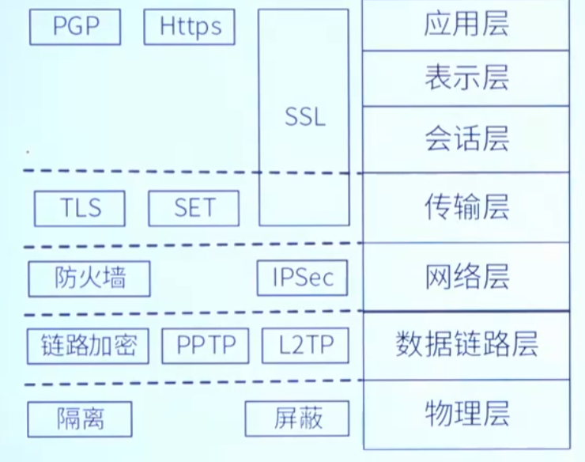
